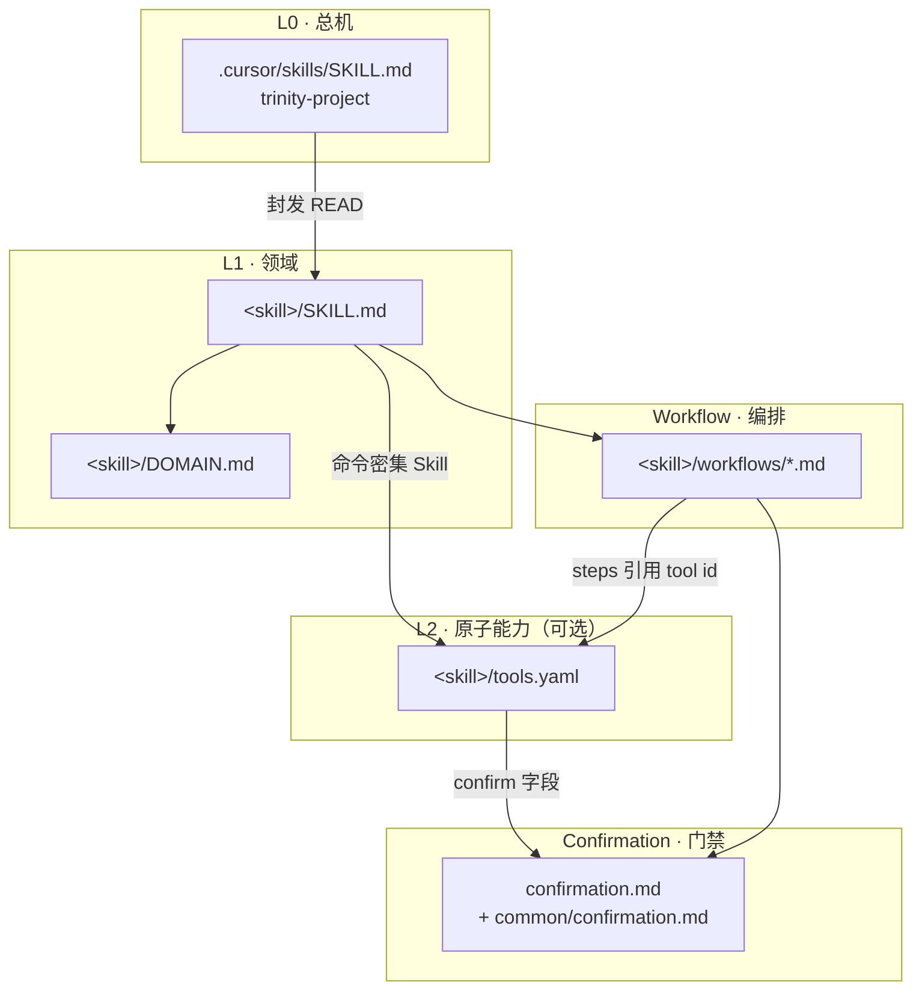

# Trinity Skill 架构设计

> 状态：设计定稿 · 2026-07-02  
> 关联：[trinity-skill-authoring/SKILL.md](../trinity-skill-authoring/SKILL.md) · [README.md](../README.md) · [cursor-skills-全景图](../../apps/trinity-product/docs/cursor-skills-全景图.md)

---

## 1. 背景与目标

Trinity 已将部门 SOP 沉淀为 `.cursor/skills/` 下的 Agent Skill，采用 **L0 总机封发 + 子 Skill 执行** 的混合模式。随着价目治理、API 验收等 **命令密集** 领域成熟，暴露出三类维护问题：

1. **原子能力与流程编排混写** — 同一 `npm run …` 在多个 `workflows/*.md` 重复出现。
2. **能力菜单缺失** — 总机 / 子 Skill 分流时，缺少一份「本领域能做什么」的索引。
3. **确认门禁与命令脱节** — `confirmation.md` 按操作类型列表，未与具体命令一一绑定。

本设计在 **不推翻现有 Markdown-first 体系** 的前提下，引入可选的 **L2 能力清单（`tools.yaml`）**，实现：

- **L2**：能做什么（原子能力 manifest）
- **Workflow**：先做什么、后做什么（编排，引用 L2 id）
- **Confirmation**：重要操作二次确认（与 L2 `confirm` 字段对齐）

> **命名说明**：本文 **Skill 分层** 的 L0–L4 指 Agent 协作架构；`pricing/docs/PRICING-GOVERNANCE-WORKFLOW.md` 中的 L0–L4 指 **价目数据层级**（原厂文档 → 官方种子 → 进货 → 转售 → 刊例）。二者勿混用。

---

## 2. 五层模型



### 2.1 各层职责

| 层 | 文件 | 职责 | Agent 何时 READ |
|----|------|------|-----------------|
| **L0** | `.cursor/skills/SKILL.md` | 全局总分诊、封发表、歧义消解 | 每轮派活（自动匹配） |
| **L1** | `SKILL.md` + `DOMAIN.md` | 领域入口、边界真源、分流到 workflow | 封发后必读 SKILL；边界争议读 DOMAIN |
| **L2** | `tools.yaml`（可选） | 原子能力注册表：命令、读写路径、确认、网络 | 执行 CLI 前；总机检索能力菜单 |
| **Workflow** | `workflows/<task>.md` | 多步编排、业务判断、失败语义 | 按用户意图 READ 一个 |
| **Confirmation** | `confirmation.md` + `common/` | 须用户确认的操作与话术 | 执行 `confirm: required` 能力前 |

### 2.2 组织角色映射（给人看）

| Skill 层 | 组织类比 | 回答的问题 |
|----------|----------|------------|
| L0 总机 | 公司前台 / 总机 | 「这事归哪个部门？」 |
| L1 DOMAIN | 部门规则手册 | 「这事在我们领域管不管？」 |
| L2 tools | 具体岗位 / 原子技能 | 「我能调用哪几个动作？」 |
| Workflow | 业务流程 | 「这件事按什么顺序做？」 |
| Confirmation | 审批 / 二次确认 | 「这一步要不要先问人？」 |

该映射可写入产品手册 [cursor-skills-全景图](../../apps/trinity-product/docs/cursor-skills-全景图.md)，**不必**为对齐组织层级而重构目录树。

---

## 3. L2 能力清单：`tools.yaml`

### 3.1 定位

`tools.yaml` 是 **索引层（manifest）**，不是第二套实现：

- **执行真源**：`package.json` scripts、`pricing/pipeline/*.mjs`、`acceptance/runner/` 等 repo 代码。
- **叙事真源**：例外处理、商务口径、hy3 无国际价等 — 仍写在 `workflows/*.md` 或 `docs/`。
- **manifest 职责**：让 Agent 用 ~30 行结构化信息选型，而非扫 80 行 workflow 里的命令表。

### 3.2 何时必须有 / 可选 / 不需要

| 档位 | 条件 | `tools.yaml` |
|------|------|--------------|
| **必须有** | 命令密集 + ≥5 个 npm/脚本能力 + 多 workflow 复用 | 价目、验收、Monorepo 工程 |
| **可选** | 2～4 个命令、单一主流程 | 可先写在 workflow，成熟后再抽 |
| **不需要** | 纯文档 / UI 规范、几乎无 CLI | handbook、design-tokens、docs |

与现有 **大 / 中 / 小** 体量门禁的关系：

| 体量 | 结构（更新后） |
|------|----------------|
| **大** | `SKILL` + `DOMAIN` + **`tools.yaml`** + `workflows/` + `confirmation` + `references/` |
| **中** | `SKILL` + `DOMAIN` + `workflows/` + `confirmation`；命令 ≥5 时升 `tools.yaml` |
| **小** | `SKILL` + `DOMAIN`；无 `tools.yaml` |

### 3.3 Schema（v1）

文件头声明版本，便于日后 linter 校验：

```yaml
# tools.yaml · trinity.tools/v1
schema: trinity.tools/v1
skill: trinity-official-pricing

tools:
  - id: pricing.gate
    title: 价目门禁 L1→L3
    summary: 官方种子交叉校验 + 供应商覆盖 + 告警 dry-run
    command: npm run pricing:gate
    cwd: trinity-AI
    inputs: []                    # v1 仅文档化；复杂参数留 workflow
    reads:
      - pricing/suppliers/official/output/text/vendor-pricing.json
      - pricing/suppliers/aigc/data/pricing-sheet.mjs
    writes:
      - pricing/output/validate/official-aigc-cross.json
      - pricing/output/validate/official-vs-suppliers.json
      - pricing/output/validate/pricing-alerts.json
    confirm: none                 # none | optional | required
    network: false
    git: false                    # 是否预期改 git 真源
    tags: [validate, gate, L1, L3]

  - id: pricing.validate.official-aigc
    title: L1 官方 ↔ AIGC/TokenHub
    summary: 交叉校验官方种子与进货参照价
    command: npm run pricing:validate:official-aigc
    confirm: none
    network: false
    git: false
    tags: [validate, L1]

  - id: pricing.alert
    title: 推送价目告警
    summary: 合并 validate 报告；有 webhook 时 POST
    command: npm run pricing:alert
    confirm: required
    network: true
    git: false
    env:
      - PRICING_ALERT_WEBHOOK_URL
    tags: [alert]

  - id: pricing.seed.edit
    title: 修改官方种子
    summary: 编辑 seeds/*.mjs；影响 L1 锚点
    command: null                 # 非 npm；文件编辑类能力
    action: edit
    paths:
      - pricing/suppliers/official/data/seeds/
    confirm: required
    network: false
    git: true
    tags: [official, seed, L1]
```

#### 字段说明

| 字段 | 必填 | 说明 |
|------|------|------|
| `id` | ✅ | 全局唯一，建议 `<domain>.<verb>` 或 `<domain>.<noun>.<verb>` |
| `title` | ✅ | 人读标题 |
| `summary` | ✅ | Agent 选型用一句话 |
| `command` | 二选一 | npm 命令；文件编辑类用 `command: null` + `action: edit` |
| `reads` / `writes` | 推荐 | 触及的真源路径（glob 可用） |
| `confirm` | ✅ | `none` / `optional` / `required` |
| `network` | 推荐 | 是否打外网（如 `GET /v1/prices`、webhook） |
| `git` | 推荐 | 是否预期提交 git 真源 |
| `tags` | 可选 | 检索、分层（不与价目 L0–L4 混用时可写 `pricing-L1`） |
| `env` | 可选 | 依赖的环境变量 |

**v1 刻意不做**：复杂 input schema、条件分支、在 yaml 里写 shell 脚本。分支逻辑留在 workflow 正文。

### 3.4 与 `package.json` 的关系

```
package.json scripts  ──真源──▶  实际执行
        ▲
        │ 索引（命令字符串须一致）
        │
   tools.yaml
```

可选远期：`node scripts/gen-tools-from-package.mjs` 从 scripts 生成草稿，人工补 `confirm` / `reads` / `writes`。**禁止** yaml 与 package.json 双处定义不同命令。

---

## 4. Workflow 编排规范

### 4.1 原则

- Workflow **不写长命令表**；用 **tool id 列表** + 叙事（何时跑、失败怎么办）。
- 一个 workflow 对应 **一个用户意图**（与现约定一致）。
- 引用 tools 时使用反引号 id，便于 grep：`pricing.gate`

### 4.2 示例：`workflows/pricing-gate.md`（目标形态）

```markdown
# Workflow · 价目门禁

## 能力引用

| 步骤 | tool id | 说明 |
|------|---------|------|
| 0（按需） | `pricing.supplier.official.text` | 刷新官方价 |
| 0（按需） | `pricing.supplier.aigc` | 刷新 AIGC |
| 1 | `pricing.gate` | L1→L3 一条龙 |

完整字段见 [`../tools.yaml`](../tools.yaml)。

## 何时跑

- 改 `seeds/`、`trinity-map`、`tier-key` 后
- 发刊例 / 商务调价前

## 失败语义

（保留叙事：L1 fail 先修种子；L3 fail 先查 scrape…）

详见 `pricing/docs/PRICING-GOVERNANCE-WORKFLOW.md`。
```

### 4.3 `SKILL.md` 读取顺序（更新）

```text
SKILL.md → workflows/<task>.md → tools.yaml（若存在，执行 CLI 前）
         → references/（按需）→ repo 真源 md
DOMAIN.md、confirmation.md：边界争议或 confirm:required 时再 READ
```

---

## 5. Confirmation 设计

### 5.1 与 L2 绑定

每个 tool 的 `confirm` 字段为 **机器可读门禁**；`confirmation.md` 为 **人读细则与话术**。

| confirm | 含义 | Agent 行为 |
|---------|------|------------|
| `none` | 只读或本地 dev | 直接执行 |
| `optional` | 有影响但可逆 | 简述影响，用户无反对则执行 |
| `required` | 改 git 真源 / webhook / 覆盖报告 | 必须用户明确同意 |

价目示例：

| tool id | confirm | 原因 |
|---------|---------|------|
| `pricing.gate` | none | 只读校验 |
| `pricing.compare.official` | none | 对比可自动拉线上价；产出可不入库 |
| `pricing.seed.edit` | required | 影响 L1 锚 |
| `pricing.alert` | required | 可能推商务 webhook |

### 5.2 `common/confirmation.md`（可选，二期）

路径：`.cursor/skills/common/confirmation.md`

抽取 9 个子 Skill 的共性规则，各 Skill `confirmation.md` 只写 **领域特例**：

```markdown
## 通用（所有 CLI/数据型 Skill 适用）

| 操作 | confirm |
|------|---------|
| git commit 真源 JSON / seeds / 用例 | required |
| POST webhook / 推告警 | required |
| 覆盖已有报告 / 汇总 data.json | required |
| 本地 dev / 只读 validate | none |
```

**收益中等**；可在首个 `tools.yaml` 试点稳定后再抽。

---

## 6. 目录结构

### 6.1 仓库根（不变）

```text
.cursor/skills/
├── SKILL.md                 # L0 总机
├── README.md                # 人类索引
├── common/                  # 可选：通用 confirmation
│   └── confirmation.md
├── docs/
│   └── SKILL-ARCHITECTURE-DESIGN.md   # 本文
└── trinity-<domain>/
    ├── SKILL.md
    ├── DOMAIN.md
    ├── tools.yaml           # 命令密集 Skill 才有
    ├── workflows/
    ├── confirmation.md
    ├── references/
    └── tools/               # 保留：长文说明（非 manifest）
        └── *.md
```

> **区分**：`tools.yaml` = 能力 manifest（L2）；`tools/*.md` = 某能力的详细说明（如验收台预览）。二者可并存，manifest 的 `id` 可链接到 `tools/<name>.md`。

### 6.2 试点：`trinity-official-pricing`（P0）

```text
trinity-official-pricing/
├── SKILL.md
├── DOMAIN.md
├── tools.yaml              # 新增
├── workflows/
│   ├── add-official-model.md
│   ├── compare-pricing.md
│   ├── pricing-gate.md     # 改为引用 tool id
│   └── refresh-official.md
├── confirmation.md         # 新增；与 tools confirm 对齐
└── references/
    └── source-paths.md
```

### 6.3 后续试点（P1–P2）

| 顺序 | Skill | 理由 |
|------|-------|------|
| P0 | `trinity-official-pricing` | 命令多、L1/L3 分层清晰、刚完成 gate |
| P1 | `trinity-api-acceptance` | runner、导出、JSON 真源、confirmation 成熟 |
| P2 | `trinity-vue-prototype-monorepo` | pnpm / dev / 五件套 |

**不上 yaml**：`trinity-product-handbook`、`trinity-design-tokens`、`trinity-docs`、`trinity-admin-ruoyi-list`（除非命令显著增加）。

---

## 7. 落地顺序

| 阶段 | 内容 | 产出 |
|------|------|------|
| **P0** | 本文档评审通过 | `docs/SKILL-ARCHITECTURE-DESIGN.md` |
| **P1** | `trinity-official-pricing/tools.yaml` + `confirmation.md` | ✅ | 价目能力 manifest |
| **P2** | 瘦身 `pricing-gate.md` 等 workflow | ✅ | steps 引用 tool id |
| **P3** | 更新 `trinity-skill-authoring` 模板与评审清单 | ✅ | 新 Skill 可选 tools.yaml |
| **P4** | `trinity-api-acceptance/tools.yaml` | ✅ | 第二份 manifest |
| **P5** | `common/confirmation.md` | ✅ | 去重 |
| **P6** | `scripts/lint-skill-tools.mjs` | ✅ | `npm run skill:lint:tools` |
| **P7** | `trinity-vue-prototype-monorepo/tools.yaml` | ✅ | 第三份 manifest |

---

## 8. 评审与 lint（远期）

`lint-skill-tools.mjs` 可检查：

- [ ] `tools.yaml` 的 `schema` 版本
- [ ] 每个 `command` 在 `package.json` scripts 中存在（`command: null` 除外）
- [ ] `reads` / `writes` 路径在 repo 中存在或是合法 glob
- [ ] workflow 引用的 tool id 在 yaml 中定义
- [ ] `confirm: required` 的 tool 在 `confirmation.md` 有对应条目

纳入 `trinity-skill-authoring` 的 `review-skill` workflow，**不**接入价目 `pricing:gate`（二者无关）。

---

## 9. 禁止项

1. **不要用 yaml 替代 workflow 全文** — 例外、商务口径、失败语义保留 Markdown。
2. **不要用 yaml 替代 package.json** — 执行真源唯一。
3. **不要全仓强制 tools.yaml** — 小 Skill 保持轻量。
4. **不要重建 `domains/` 深层目录** — 扁平 `trinity-xxx/` 已够用。
5. **不要在 tools.yaml 写 secrets** — 只列 `env` 变量名。
6. **Skill L0–L4 与价目 L0–L4 勿混标** — tags 用 `pricing-L1` 或 `validate` 等消歧。

---

## 10. 文档索引

| 文档 | 说明 |
|------|------|
| 本文 | Skill 五层 + tools.yaml 架构 |
| [trinity-skill-authoring/SKILL.md](../trinity-skill-authoring/SKILL.md) | 写 Skill 约定 |
| [trinity-skill-authoring/references/skill-template.md](../trinity-skill-authoring/references/skill-template.md) | 目录模板（待同步 P3） |
| [README.md](../README.md) | 人类场景表 |
| [cursor-skills-全景图](../../apps/trinity-product/docs/cursor-skills-全景图.md) | 产品侧全景 |
| [PRICING-GOVERNANCE-WORKFLOW.md](../../pricing/docs/PRICING-GOVERNANCE-WORKFLOW.md) | 价目数据治理（另一套 L0–L4） |

---

## 11. 结论

| 问题 | 结论 |
|------|------|
| 是否照搬幻灯片 `domains/**/tools/*.yaml`？ | **否** — 保持扁平目录，单 Skill 一个 `tools.yaml` |
| yaml 是否全仓标准？ | **否** — 仅 CLI/数据型大 Skill |
| 最值得先做什么？ | **L2 与 Workflow 分离** + **confirm 与能力绑定**；价目试点 |
| 组织角色映射？ | 写入产品全景图，不改工程结构 |
| common/confirmation？ | 二期，试点后抽共性 |

**推荐路径**：P1–P7 已完成；新 CLI 型 Skill 复制 `trinity-official-pricing` 模式；维护时跑 `npm run skill:lint:tools`。
