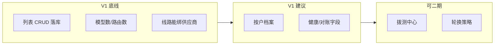

# admin-suppliers · 供应商（P3 · §4.4）

## 1. 一句话

运营后台维护 **API₂ 云厂商 / 转售供应商** 主数据：列表、档案与结算、对接配置（含输入/输出模板）、连通性拨测、密钥轮换说明。原型为 mock + `localStorage`（列表与对接模板），**未接** `/v1/admin/providers`。后端 V1 摘录见 **§8**；详设 IA 见 **§9**。

### 1.1 产品功能（通俗说明）

| 子菜单 | 一句话 | 典型场景 |
|--------|--------|----------|
| **供应商列表** | 查有哪些上游、状态与健康摘要；可增删改供应商主数据。 | 新签一家云、下线一家、看谁家在降级。 |
| **档案与结算** | 法人、税号、结算周期、付款条件、联系人（商务/财务用）。 | 对账、付款、与合同主体核对。 |
| **对接配置** | Base URL、API 类型、**API₂ Profile/JSON**、超时重试；输入/输出 Mapper 模板。 | 换协议版本、改字段映射，网关按契约转发。 |
| **连通性探测** | 拨测任务与最近成功/失败、延迟、失败原因。 | 上游疑似故障时主动探测，联动大盘。 |
| **密钥轮换策略** | 上游凭据何时轮换、与网关注入/KMS 的约定（治理说明）。 | 合规要求定期换 Key、轮换窗口公示。 |

**不要和这些搞混**

| 页面 | 区别 |
|------|------|
| **模型管理 → 供应线路** | 具体 **哪条线路** 绑哪个供应商、Profile、优先级/降级。 |
| **API 密钥 → 平台密钥** | 公司持有的 **上游 API Key** 明文与冻结（不是供应商法人档案）。 |
| **实时大盘 → 供应商健康** | **运行态** 成功率/延迟汇总；供应商模块偏 **主数据 + 配置**。 |
| **原生研发商 API₁** | DeepSeek/OpenAI 等 **官方 API** 主数据多在 **模型主数据**，本节侧重 **API₂ 云供应商**。 |

侧栏二级摘要真源：`admin-shell/moduleSecondaryPages.ts` → `tai-admin-suppliers`。

---

## 2. 路由

| path | name | 入口 | 说明 |
|------|------|------|------|
| `suppliers/list` | `tai-admin-suppliers-list` | `SuppliersPage.vue` | **供应商列表**（默认） |
| `suppliers/profile` | `tai-admin-suppliers-profile` | 同上 | 档案与结算 |
| `suppliers/integration` | `tai-admin-suppliers-integration` | 同上 | 对接配置 |
| `suppliers/probe` | `tai-admin-suppliers-probe` | 同上 | 连通性探测 |
| `suppliers/key-rotation` | `tai-admin-suppliers-key-rotation` | 同上 | 密钥轮换策略 |
| `suppliers` | `tai-admin-suppliers` | redirect | → `tai-admin-suppliers-list` |

---

## 3. 入口与五件套

| 文件 | 职责 |
|------|------|
| `SuppliersPage.vue` | 单入口；`route.meta.stubSecondaryId` 切换五子面板 |
| `suppliers.css` | 列表、徽章、`dl` 档案区、对接双表与弹窗 |
| `suppliersInteractions.ts` | 列表筛选持久化、列表行/对接模板 `localStorage` |
| `mock.ts` | `SupplierListRow`、档案、对接、拨测、轮换种子数据 |
| `README.md` | 本说明 |

交付规范：[`docs/Trinity原型模块目录与交付规范.md`](../../../../docs/Trinity原型模块目录与交付规范.md)  
模块总览：[`doc/后台原型总览.md`](../../../doc/后台原型总览.md)  
若依式列表：[`doc/运营后台-若依式列表规范.md`](../../../doc/运营后台-若依式列表规范.md)

---

## 4. 依赖样式与共享组件

- 全局：`admin-theme.css`、`admin-page.css`、`admin-ruoyi.css`、`admin-element-plus.css`
- 本模块：`suppliers.css`
- 共享：`AdminListQuery`、`AdminSectionHead`（`toolbar-only`）、`AdminTablePagination`、`AdminDialog`、`AdminInternalTip`

---

## 5. `suppliers/list` · 供应商列表（功能 → UI）

> **结论（2026-05-19）**：**原型 P3 列表壳 + CRUD 已可演示**；对照 **后端 V1 §4.2.2** 仍缺 **模型数/路由数**；对照 **详设 §4.4 列表行** 仍缺 **延迟分列、行内进档案/对接/探测**；**若依列宽常量** 未统一。整页不算「详设完整运营」，但 **列表页单独算「原型齐、工程未齐」**。

### 5.1 能力对照表

| 能力 | 作用 | V1 必须？ | 原型 UI | 实现位置 / 备注 |
|------|------|-----------|---------|-----------------|
| 分页列表 | 浏览全部供应商 | 必须 | ✅ | `el-table` + `AdminTablePagination` + `useAdminTablePagination` |
| 关键词搜索 | 按名称/ID/类型/区域/健康搜 | 必须 | ✅ | `AdminListQuery`；字段 `filterByQuery` → name,id,type,region,health |
| 状态下拉筛选 | 仅正常 / 仅异常·降级 | 建议 | ✅ | `#filters` · `el-select` · 与「正常」「非正常」映射 |
| 重置 | 清空筛选回到默认 | 建议 | ⚠️ | `@reset` → `resetSupplierListQuery()` **仅清状态**，搜索框由 `AdminListQuery` 默认清空；若走查要求「筛选+搜索一并清」需补 `listFilter = ''` |
| 新增供应商 | 录入主数据 | 必须 | ✅ | 主按钮 → `AdminDialog` 表单 → `localStorage` `trinity-ai-admin:suppliers-list-rows` |
| 编辑供应商 | 改名称/类型/区域/状态/健康 | 必须 | ✅ | 行内「编辑」→ 同上弹窗 |
| 删除供应商 | 下线台账 | 必须 | ✅ | 行内「删除」→ `dangerConfirm` 二次确认 |
| 导入 Excel | 批量录入 | 二期 | ⚠️ | `#actions` 选文件 → `alert` 未解析 |
| 导出 CSV | 导出台账 | 二期 | ⚠️ | `onExportSuppliersClick` → `alert` 占位 |
| 列：ID / 名称 / 类型 | 主数据识别 | 必须 | ✅ | `el-table-column` |
| 列：状态 | 正常 / 降级等 | 必须 | ✅ | 徽章 `sup-page__badge` |
| 列：健康 | 成功率摘要 | 详设建议 | ✅ | `prop="health"`（如 `99.92%`）；**未单独「延迟」列** |
| 列：区域 | 部署/结算区域 | 建议 | ✅ | `prop="region"` |
| 列：更新时间 | 审计感知 | 建议 | ✅ | `prop="updatedAt"` |
| 列：**模型数** | 删除前影响面、排障 | **V1 必须**（§4.2.2） | ❌ | 需聚合 `model_profile` / 线路或接口字段 |
| 列：**可用路由数** | 同上 | **V1 必须**（§4.2.2） | ❌ | 需聚合 `model_supply_route` 等 |
| 行内：**档案 / 对接 / 探测** | 从该行进该供应商子页 | 详设 §4.4 列表 | ❌ | 仅「编辑/删除」；需 `router.push` 带 `supplierId` query |
| 接真实 API | 落库、多人协作 | 工程必须 | ❌ | 目标 `GET/POST/PATCH/DELETE /v1/admin/providers` |
| 列表写操作审计 | 谁改了供应商 | 工程必须 | ❌ | 写入 `admin_audit_log` |
| 若依列表规范 | 列宽档位、操作列容器 | 原型规范 | ⚠️ | 已有 `toolbar-only`、`admin-ep-row-actions`；列宽 **未** 用 `ADMIN_TABLE_COL` |

### 5.2 UI 骨架（当前实现）

```
sup-page
└─ section [panel=list]
   └─ el-card.admin-ep-card
      ├─ AdminSectionHead [toolbar-only]
      │  ├─ #annot → AdminInternalTip
      │  └─ #tools → AdminListQuery
      │       ├─ 搜索
      │       ├─ #filters → 状态 el-select
      │       └─ #actions → 新增 | 导入 | 导出
      ├─ el-table.admin-ep-table-wrap
      ├─ AdminTablePagination
      └─ p.sup-page__hint（localStorage 说明）
```

弹窗：`AdminDialog`（新增/编辑供应商）、`AdminDialog`（删除确认）。

### 5.3 列表页齐全度判定

| 对照对象 | 是否齐全 | 说明 |
|----------|----------|------|
| **原型 P3（列表 + 筛选 + 分页 + CRUD）** | **是** | 可评审、可演示主流程 |
| **后端文档 V1 §4.2.2** | **否** | 缺模型数、路由数；未接 API |
| **详设 §4.4「供应商列表」一行** | **部分** | 有健康摘要；缺延迟分列、行内下钻入口 |
| **若依式列表规范** | **基本** | 结构对齐；列宽建议改用 `ADMIN_TABLE_COL` |

---

## 6. 其余子页（摘要）

| 子页 | 原型 | 详设 §4.4 | V1 分期 |
|------|------|-----------|---------|
| **档案与结算** | 全局只读 `dl` + 示意保存 | 按户法人/结算字段 | V1 建议（多供应商/对账时当必须） |
| **对接配置** | 模板列表 + 弹窗 CRUD + `localStorage` | Profile/JSON、超时重试 | 业务必须有一条配置通路（也可主要在模型线路） |
| **连通性探测** | 结果表 + 示意拨测/调度 | 任务配置 + 告警联动 | 可二期 |
| **密钥轮换** | 说明型 `dl` | 轮换策略 + KMS | 可二期（平台密钥页先满足 §4.2.3） |

---

## 7. §4.4 缺口 · 作用与是否必须

> 详设真源：[`docs/AI-API聚合平台-后台管理系统-详细设计-v1.md`](../../../../docs/AI-API聚合平台-后台管理系统-详细设计-v1.md) **§4.4**  
> V1 底线真源：[`doc/创建后端需实现页面与功能.md`](../../../doc/创建后端需实现页面与功能.md) **§4.2.2**

| 能力 | 干什么用 | 必须程度 |
|------|----------|----------|
| 列表 **模型数 / 路由数** | 看影响面、防误删 | **V1 必须**（后端 doc 明文） |
| **按供应商** 档案可编辑 | 商务/财务对账、付款 | **V1 建议**（供应商少可 Excel 顶） |
| 对接 **契约中心真 JSON** | 网关按 Profile/Mapper 转发 | **通路必须**（实现位置可在模型线路） |
| **健康 + 对账计量单位** | 值班降级、与用量账单对齐 | 监控建议；按量结算则对账必须 |
| 行内进档案/对接/探测 | 少切 Tab、带对 `supplierId` | 体验项 |
| **拨测任务 + 告警** | 上游故障早发现 | **可二期** |
| **密钥轮换策略页** | 合规轮换治理 | **可二期**（平台密钥维护仍要在 keys） |
| 导入/导出批量 | 多家供应商批量维护 | **可二期** |
| 真实 API + 审计 | 落库与追溯 | **工程 V1 必须** |



---

## 8. 后端 V1 对照（§4.2.2）

| 文档要求 | 原型 `list` | 工程 |
|----------|-------------|------|
| 供应商新增/编辑/删除 | ✅ UI + localStorage | 接 `model_supply_vendor` CRUD |
| 查看模型数量、可用路由数量 | ❌ 无列 | 聚合 API 或列表字段 |

其余子页不在 §4.2.2 单行要求内，见 **§7**。

---

## 9. 数据与交互

### 9.1 `mock.ts`

- `SUPPLIER_LIST_ROWS` / `SupplierListRow`：列表种子（含 `health` 字符串）。
- `SUPPLIER_PROFILE`：档案区 **全局一份**（未按列表 `id` 分户）。
- `DEFAULT_INTEGRATION_BINDINGS`：对接模板默认行。

### 9.2 `suppliersInteractions.ts`

| 键 | 用途 |
|----|------|
| `trinity-ai-admin:suppliers-list-rows` | 列表 CRUD 持久化 |
| `trinity-ai-admin:suppliers-list-filter` | 搜索关键字 |
| `trinity-ai-admin:suppliers-integration-bindings` | 对接模板 JSON 行 |

---

## 10. 接 API 后要动的文件

| 文件 | 改动 |
|------|------|
| `mock.ts` | 改为类型；列表增 `modelCount`、`routeCount` |
| `suppliersInteractions.ts` | 分页参数；去掉列表 localStorage 或仅 UI 偏好 |
| `SuppliersPage.vue` | `list` 接 loading/empty；行内下钻；重置补全；`ADMIN_TABLE_COL` |
| 新建 `suppliersApi.ts`（可选） | 封装 `/v1/admin/providers` |

建议与 **`models/lines`**、**`ops/live`** 联调（路由数、健康摘要）。

---

## 11. 已知缺口（工程期 + 列表待补）

- **列表**：无模型数/路由数列；无行内档案/对接/探测；导出/导入占位；未用 `ADMIN_TABLE_COL`。
- **档案**：非按供应商 ID；编辑为示意按钮。
- **对接**：非契约中心真源；工程见 README 旧 §8（拨测、KMS、权限审计）。
- **探测 / 轮换**：任务配置与策略编辑未做。

---

## 12. 参考

| 文档 | 路径 |
|------|------|
| 详设 §4.4 | `docs/AI-API聚合平台-后台管理系统-详细设计-v1.md` |
| 后端 V1 §4.2.2 | `apps/trinity-ai-admin/doc/创建后端需实现页面与功能.md` |
| 原型 P3 | `docs/AI-API聚合平台-运营后台-原型交付计划.md` |
| 后台原型总览 | `apps/trinity-ai-admin/doc/后台原型总览.md` |

---

## 13. 二次开发补充

| 补充项 | 路由 | 涉及文件 | 备注 |
|--------|------|----------|------|
| 列表 CRUD + localStorage | `suppliers/list` | `SuppliersPage.vue`、`suppliersInteractions.ts` | P3 已落地 |
| README §4.4 分期 + list 功能→UI 表 | — | `README.md` | 2026-05-19 |
| 待做：模型数/路由数列 | `list` | `mock.ts`、`SuppliersPage.vue` | V1 必须 |
| 待做：行内下钻 + 按户档案 | `list` / `profile` | `SuppliersPage.vue` | 详设建议 |

---

*对齐日期：2026-05-19 · 规范 [`Trinity原型模块目录与交付规范.md`](../../../../docs/Trinity原型模块目录与交付规范.md)*
