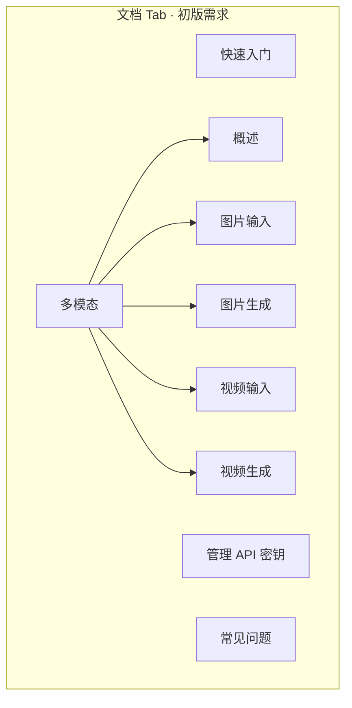
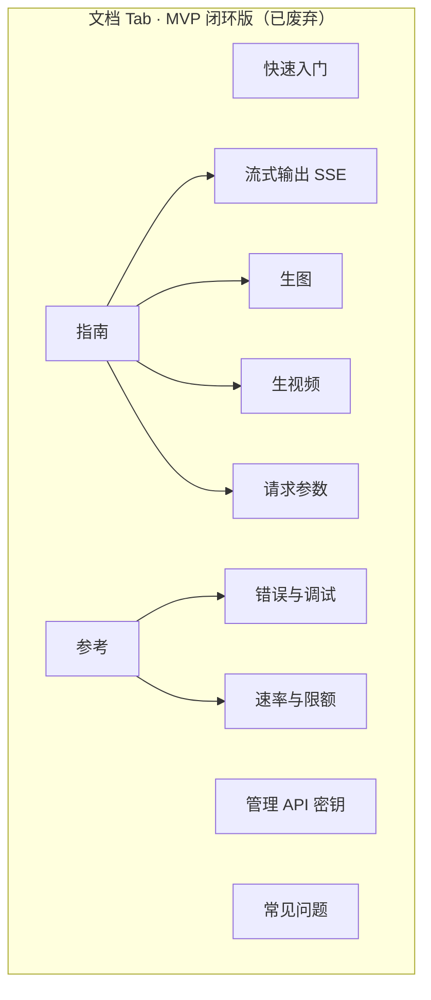
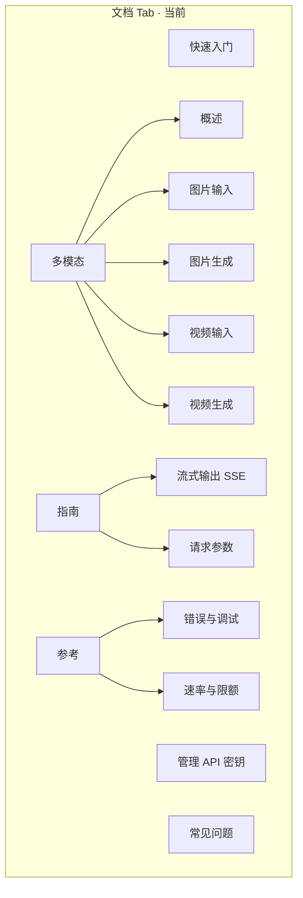

# Trinity AI 文档站（VitePress）

> **维护必读**：[Trinity对外文档站-基本规范.md](../../docs/04-工程与迁移/Trinity对外文档站-基本规范.md)（写什么、用语、三轨、发布检查）  
> 架构与分期：[Trinity文档站方案-VitePress与运营后台.md](../../docs/04-工程与迁移/Trinity文档站方案-VitePress与运营后台.md)  
> 顶栏与目录：[信息架构与顶栏设计.md](../../docs/04-工程与迁移/Trinity文档站-信息架构与顶栏设计.md)  
> 页面清单：[一期 MVP 文档清单.md](../../docs/04-工程与迁移/Trinity文档站-一期MVP文档清单.md)

## 一句话

对外 API 文档静态站：内容真源为 **`docs/**/*.md`**；展示由 VitePress 构建；视觉 token 来自 **`@trinity/tokens`**。

## 中英双语（i18n）

| 语言 | 目录 | 示例 URL（`base=/docs/`） |
|------|------|---------------------------|
| 中文（默认） | `docs/` | `/docs/quickstart` |
| English | `docs/en/` | `/docs/en/quickstart` |

- 顶栏 **中文 / English** 切换（VitePress `locales`）。
- 新增中文页后：在 `docs/en/` 写英文正文，或运行 `npm run docs:en-mirror -w @trinity/app-trinity-docs` 生成占位（勿覆盖已翻译文件）。
- 侧栏：`.vitepress/config/sidebars.ts`（中文树 + 自动 `/en` 与英文标签）。
- 提示块：**`::: info`** = 说明（蓝）；**`::: tip`** = 重要（绿）；默认标题见 `config.ts` → `markdown.container`。

## 本地开发

在仓库根目录：

```bash
npm install
npm run dev:trinity-docs
```

默认开发地址：`http://localhost:5205/docs/quickstart`（`vitepress dev --port 5205`，与 portal `:5173`、GEO `:5203` 错开）。**开发枢纽** FAB / 首页、`trinity-ai` 顶栏链到该地址（`VITE_TRINITY_DOCS_URL` / `VITE_TRINITY_DOCS_DEV_PORT` 可覆盖）。

### 开发环境 · 页内分栏编辑（仅 DEV）

任意文档页右下角 **「编辑本页」**：**左侧** Markdown 源文、**右侧** 当前 VitePress 页面（同页热更新，不用 iframe，避免 dev 下模块 MIME 报错）；保存写入 `docs/**/*.md`。仅 `127.0.0.1` / `localhost` 可用，生产构建不包含此功能。

**粘贴图片 → COS**：在编辑区 **Ctrl/Cmd+V 粘贴截图或图片** 时，开发中间件会上传到腾讯云 COS，并在光标处插入 ``（公开 URL）。在 `apps/trinity-docs/` 复制 [`env.cos.example`](./env.cos.example) 为 **`.env.local`**，填写 `TRINITY_DOCS_COS_SECRET_ID`、`TRINITY_DOCS_COS_SECRET_KEY`、`TRINITY_DOCS_COS_BUCKET`、`TRINITY_DOCS_COS_REGION`；可选 `TRINITY_DOCS_COS_PREFIX`、`TRINITY_DOCS_COS_PUBLIC_BASE`（CDN 域名）。修改后需 **重启** `npm run dev:trinity-docs`。密钥勿提交 Git。

**发布记录（dev · 仅 localhost）**：右下角 **「发布记录」** → 查看 `git` 检测到的 `docs/` 变更 → 填写说明后 **确认发布**。只追加 `docs-meta/dev-changelog.json` 台账（文件列表 + 摘要 + `gitRef`），**不存正文副本**、不触发线上部署；正文仍以 GitHub 为准。发布前请先保存 md；建议随后 `git commit` 以便记录与仓库对齐。

## 构建与预览

```bash
npm run build:trinity-docs
npm run preview -w @trinity/app-trinity-docs
```

产物目录：`apps/trinity-docs/.vitepress/dist`。

### 部署 base 路径

| 场景 | 做法 |
|------|------|
| 主站子路径 `/docs/` | 默认，无需改环境变量 |
| 独立子域（根路径 `/`） | 构建前设置 `VITEPRESS_BASE=/` |

## 目录约定

```text
apps/trinity-docs/
├── docs/                 # Markdown 真源（一期 Git；二期由后台发布写入构建目录）
├── .vitepress/
│   ├── config.ts         # 侧栏、搜索、base
│   └── theme/
│       ├── index.ts
│       └── trinity-docs.css   # --vp-* 映射 Trinity token，禁止业务页魔法色
└── README.md
```

`slug` 与文件路径一致，例如 `quickstart` → `docs/quickstart.md`。

## 设计规范

- Token：`@trinity/tokens/core.css`（与 `assets/trinity-base.css` 同源）
- 主色 / 链接：`var(--blue)`；渐变 CTA：`.tdocs-cta` 使用 `var(--grad)`
- 细则：`.cursor/skills/trinity-design-tokens/SKILL.md`
- **OpenRouter 版式对齐清单（布局 + 代码片段图 2 + 托管决策）**：[docs/04-工程与迁移/Trinity文档站-OpenRouter版式对齐规范.md](../../docs/04-工程与迁移/Trinity文档站-OpenRouter版式对齐规范.md)

## 一期 / 二期边界

| 阶段 | 内容维护 | 用户站 |
|------|----------|--------|
| 一期 | 本目录 Git 内 `.md` | 本 VitePress 构建部署 |
| 二期 | `trinity-ai-admin` · `admin-docs` 上传/发布 md → CI build | 同上，不在 `trinity-ai/views/docs` 写正文 |

## 相关

- 用户站过渡模块：`apps/trinity-ai/src/views/docs/`
- 运营后台文档中心：`apps/trinity-ai-admin/src/views/admin-docs/`
- 静态对照：`TrinityAI/app/docs.html`

## 顶栏与侧栏（当前）

顶栏二级导航：**文档 | API | 应用场景**（见 [信息架构与顶栏设计](../../docs/04-工程与迁移/Trinity文档站-信息架构与顶栏设计.md)）。

下列为 **文档 Tab** 侧栏历史演进（归档参考）。

### 初版需求（扁平 + 多模态二级）

产品最初列出的信息架构：除多模态外均为一级直链。

```text
快速入门
多模态 ▾
  ├ 概述
  ├ 图片输入
  ├ 图片生成
  ├ 视频输入
  └ 视频生成
管理 API 密钥
常见问题
```



### MVP 闭环版（指南 / 参考 Tree，已替换）

按「生文 / 生图 / 生视频 + 错误限额」验收路径临时拆成 **指南**、**参考** 两组，未保留「模块 / 多模态」一级目录。

```text
快速入门
管理 API 密钥
指南 ▾
  ├ 流式输出（SSE）
  ├ 生图
  ├ 生视频
  └ 请求参数
参考 ▾
  ├ 错误与调试
  └ 速率与限额
常见问题
```



### 当前版（产品 IA + 最小闭环合并）— `config.ts`

```text
快速入门
管理 API 密钥
多模态 ▾
  ├ 概述
  ├ 图片输入
  ├ 图片生成
  ├ 视频输入
  └ 视频生成
指南 ▾
  ├ 流式输出（SSE）
  └ 请求参数
参考 ▾
  ├ 错误与调试
  └ 速率与限额
常见问题
```



| 对比 | 初版需求 | MVP 闭环版 | 当前 |
|------|----------|------------|------|
| 多模态 Tree | ✅ | ❌ | ✅ |
| 管理 API 密钥 | ✅ | ✅ | ✅ |
| 指南 / 参考 | ❌ | ✅ | ✅ |
| 常见问题 | ✅ | ✅ | ✅ |
| Tree + Chevron | — | ✅ | ✅ |

**API Tab**（不变）：概述 → 端点 ▾（对话补全 / 图像生成 / 视频生成）。

仍待补的是 **内容**（`multimodal/*` 与 `guides/*` 互链、产品校验 §6），不是侧栏结构。见 [一期 MVP 清单 §4.3](../../docs/04-工程与迁移/Trinity文档站-一期MVP文档清单.md)。
