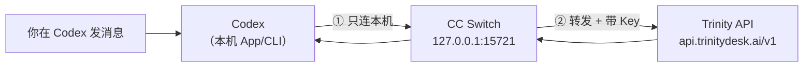
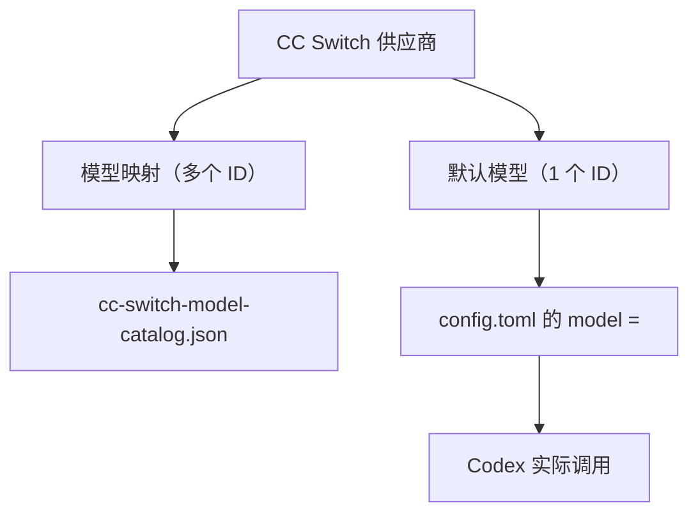

# CC Switch 对接 Codex

用 [CC Switch](https://github.com/farion1231/cc-switch) 把 **Codex App / CLI** 接到 Trinity：在 CC Switch 里添加 Trinity 供应商并开启 **本地路由** 后，Codex 会把请求先发到你**本机**的转发地址，再由 CC Switch 转到 Trinity 云端（`https://api.trinitydesk.ai/v1`），并完成 Key 注入。

| 地址 | 是否固定 | 说明 |
| --- | --- | --- |
| `https://api.trinitydesk.ai/v1` | **是**（Trinity 对外端点） | 在 CC Switch 供应商里填写 |
| `http://127.0.0.1:15721/v1` 等 | **否**（本机默认，非 Trinity 提供） | CC Switch **本地路由**默认端口；`127.0.0.1` 表示本机。若你在 CC Switch 改过端口，以 **设置 → 路由 → 本地服务地址** 为准，Codex 会自动写入，一般无需手填 |

- **首次接入**：见下方 [快速开始](#快速开始)
- **CC Switch 通用步骤**：[CC Switch](./cc-switch)
- **不用 CC Switch、手写配置**：[Codex CLI](./codex-cli)
- **CC Switch 官方说明**：[用户手册](https://github.com/farion1231/cc-switch/tree/main/docs/user-manual/zh) · [路由服务](https://github.com/farion1231/cc-switch/blob/main/docs/user-manual/zh/4-proxy/4.1-service.md)

---

## Codex 是什么？

[Codex](https://github.com/openai/codex) 是 OpenAI 的编程 Agent（终端 CLI 与 Desktop App）。配置 OpenAI 兼容提供方后，可将对话路由到 Trinity，使用 `xh-...` Key 与 [模型广场](https://trinity.ai/models) 中的**模型 ID**。

---

## 快速开始

### 步骤 1：获取 Trinity API Key

1. 在 [控制台 · API 密钥](https://trinitydesk.ai/account/keys) 创建 Key（`xh-...`）。
2. 见 [管理 API 密钥](../../manage-api-keys.md)。

### 步骤 2：开启 CC Switch 本地路由

**设置 → 路由 → 本地路由**

| 项 | 要求 |
| --- | --- |
| 路由总开关 | **运行中** |
| 路由启用 | 勾选 **Codex** |

本地服务地址：以 CC Switch **设置 → 路由** 界面显示为准（默认为 `http://127.0.0.1:15721`）；保存供应商后由 CC Switch 写入 Codex，一般无需手改。

### 步骤 3：添加 Trinity 供应商

**主界面 → Codex → 添加供应商 → 自定义**

| 字段 | 填写 |
| --- | --- |
| 供应商名称 | 如 `Trinity` |
| API Key | `xh-...` |
| 请求地址 / 端点 | `https://api.trinitydesk.ai/v1`（**勿**末尾 `/`） |
| 需要本地路由映射 | **开启** |
| 模型 / 模型映射 | [模型广场](https://trinity.ai/models) 的 **模型 ID** |
| 默认模型 | 新对话使用的模型（可先填 1 个；多模型见 [日常使用](#日常使用换模型)） |

保存后在列表中 **启用** 该供应商。

### 步骤 4：重启 Codex 并验收

1. **完全退出** Codex App（macOS：`Cmd+Q`，勿只关窗口）。
2. 确认 CC Switch 路由仍为 **运行中**。
3. 重新打开 Codex，开**新对话**发送短消息（如 `你好`）。
4. 若 [控制台](https://trinitydesk.ai/account/keys) 用量中出现 `POST /v1/chat/completions` 或 `/v1/responses`，且 `model` 与配置一致，即表示接通。

::: tip 终端自检（可选）
确认本机代理在监听：`lsof -i :15721` 应看到 `cc-switch`。
:::

**到这里，首次接入要做的操作就完成了。** 下文不再要求你按顺序配置；需要时再翻对应小节即可。

| 下文章节 | 类型 | 何时读 |
| --- | --- | --- |
| [理解请求路径](#理解请求路径) · [配置文件说明](#配置文件说明-cc-switch-自动生成) · [模型怎么配](#模型怎么配) · [模型选择器说明](#codex-desktop-模型选择器说明) · [与手写直连的区别](#与手写直连的区别) | **理解 / 参考** | 想搞懂原理，或核对 CC Switch 生成了什么文件 |
| [日常使用：换模型](#日常使用换模型) | **可选操作** | 接入成功后要增删模型、切换默认模型 |
| [故障排除](#故障排除) | **排障** | 连不上、无用量、下拉异常等 |

---

## 理解请求路径

::: info 本节是「理解」，不是「配置」
**接入时只要完成上文 [快速开始](#快速开始) 四步即可**，不必手填 `127.0.0.1:15721` 或改 `config.toml` 里的 `base_url`——CC Switch 保存供应商后会自动写入 Codex。

读这一节的目的：搞懂「数据怎么走」、排障时知道该查 CC Switch 还是 Trinity、避免和 [手写直连](./codex-cli) 混用。
:::

你在 Codex 里发一条消息时，请求会经过 **两段**，中间多了一层 **本机上的 CC Switch**（不是 Codex 直接访问互联网上的 Trinity）。

### 用一句话理解

**Codex 只认本机地址** `http://127.0.0.1:15721`；**CC Switch 再替 Codex 去访问** `https://api.trinitydesk.ai/v1`，并带上你在 CC Switch 里填的 `xh-...` Key。

### 分步说明

| 步骤 | 谁发起 | 请求发到哪里 | 做什么 |
| --- | --- | --- | --- |
| ① | **Codex**（你电脑上的 App 或 CLI） | `http://127.0.0.1:15721/v1` | 把对话发给**本机**正在运行的 CC Switch（`127.0.0.1` = 本机，`15721` = CC Switch 监听的端口） |
| ② | **CC Switch** | `https://api.trinitydesk.ai/v1` | 按你在供应商里配的 Trinity 端点转发请求，**注入 API Key**，必要时做协议转换 |
| ③ | **Trinity** | — | 调用你选的模型，把结果沿原路返回：Trinity → CC Switch → Codex |

```text
你在 Codex 输入「你好」
        ↓
Codex  →  本机 CC Switch（127.0.0.1:15721）
        ↓
CC Switch  →  Trinity 云端（api.trinitydesk.ai/v1）
        ↓
回答回到 Codex 显示
```



### 和「手写直连」有何不同？（对照理解）

| 方式 | 你要配什么 | Codex 里的地址谁写 |
| --- | --- | --- |
| **经 CC Switch（本文）** | 只在 CC Switch 里：开路由、加 Trinity 供应商、填 Key 与模型 | **CC Switch 自动写入** `127.0.0.1:15721`，你一般不用改 |
| **手写直连** | 自己编辑 `~/.codex/config.toml` 或环境变量 | 你自己写 `https://api.trinitydesk.ai/v1`（见 [Codex CLI](./codex-cli)） |

经 CC Switch 时，**不必**在 Codex 里填真实的 `xh-...`；Key 只在 CC Switch 供应商界面维护。

::: info 和「系统代理 / Clash」无关
`127.0.0.1:15721` 是 CC Switch 的**本地路由服务**，不是浏览器代理。只要 CC Switch 路由显示 **运行中**，且 Codex 路由已勾选，这段链路就会工作。
:::

---

## 配置文件说明（CC Switch 自动生成）

::: info 供核对，一般不必手改
完成 [快速开始](#快速开始) 后，CC Switch 会自动维护这些文件。只有排障或 [换模型](#日常使用换模型) 时才可能需要打开查看。
:::

启用 Codex 供应商后，CC Switch 会维护 `~/.codex/` 下三类文件：

| 文件 | 作用 |
| --- | --- |
| `config.toml` | 提供方、`base_url`、**默认** `model`、`model_catalog_json` 路径 |
| `auth.json` | 鉴权占位；CC Switch 模式下须为 `{"OPENAI_API_KEY":"PROXY_MANAGED"}` |
| `cc-switch-model-catalog.json` | **模型列表**（catalog），供 Codex 加载可用模型 |

### `config.toml` 示例

```toml
model_provider = "custom"
model = "gemini-3.1-pro-preview"   # 默认模型，只能写 1 个 ID
model_catalog_json = "/Users/<你>/.codex/cc-switch-model-catalog.json"

[model_providers.custom]
name = "custom"
wire_api = "responses"
requires_openai_auth = true
base_url = "http://127.0.0.1:15721/v1"   # 指向 CC Switch，不是 Trinity
```

### `auth.json`

```json
{
  "OPENAI_API_KEY": "PROXY_MANAGED"
}
```

表示 Key 由 CC Switch 注入，**不要**在此填写真实 `xh-...`。

::: warning 勿留空 auth.json
若曾为「手写直连 Trinity」将 `auth.json` 清空为 `{}`，改回 CC Switch 后须恢复 `PROXY_MANAGED`，否则 Codex 可能显示未连接。
:::

---

## 模型怎么配

最容易混淆的是 **默认模型** 与 **模型列表**（概念说明；首次接入在快速开始步骤 3 已可填好 1 个默认模型）：

| 配置 | 位置 | 数量 | 含义 |
| --- | --- | --- | --- |
| **默认模型** | `config.toml` → `model =` | **1 个** | 新对话默认调用的模型 ID |
| **模型列表** | `cc-switch-model-catalog.json` | **多个** | 在 CC Switch「模型映射」中添加的全部 ID |



::: info CC Switch 预览只显示一个 model？
预览展示的是 `config.toml` 里的 **默认** `model =`，不是完整列表。完整列表在 `cc-switch-model-catalog.json`。
:::

---

## 日常使用：换模型

接入成功后，若要**增加**可用模型或**更换**默认模型，按下面操作（不属于首次快速开始）。

### 添加多个模型

1. **Codex → Trinity 供应商 → 编辑**
2. **模型 / 模型映射**：逐个添加 [模型广场](https://trinity.ai/models) 的模型 ID
3. **默认模型**：选择新对话要用的那一个
4. **保存** 并 **启用** 供应商
5. **完全退出** Codex 后重开

### 切换当前要用的模型

| 情况 | 做法 |
| --- | --- |
| 模型在 App **下拉里有** | 新对话输入框底部模型菜单直接点选 |
| 模型在 catalog 里、**下拉没有** | 改 `~/.codex/config.toml` 的 `model =`（**1 个** ID），或在 CC Switch 改 **默认模型** → 保存启用 → **Cmd+Q** 重启 → 开新对话 |

以 [控制台](https://trinitydesk.ai/account/keys) 用量中的 `model` 字段验收。模型 ID 须来自 [模型广场](https://trinity.ai/models)。

::: info 换模型时注意
- 避免同时在 CC Switch 与 Codex App 设置里改 `config.toml`，以免互相覆盖
- `model =` 管**新对话默认**；与下拉当前选中可以不一致
:::

---

## Codex Desktop 模型选择器说明

经 CC Switch 配置多个模型后，通常会出现：

- **模型映射 / catalog** 中有多个模型 ID
- **App 模型下拉**只显示其中一部分（常见为少数 GPT 系列 slug）

这**多数情况下不是配置错误**。Codex 会从 `model_catalog_json` 加载完整列表，但 Desktop **模型选择器会按内部规则过滤显示**（参见 [openai/codex#19694](https://github.com/openai/codex/issues/19694)）。

| 现象 | 说明 |
| --- | --- |
| catalog 有条目、下拉条数更少 | UI 过滤，链路仍可能正常 |
| 对话有回复、控制台有用量 | 表示 CC Switch → Trinity 已接通 |
| 下拉没有的模型 | 通过改 `config.toml` 的 `model =` 切换默认（须重启） |

操作步骤见 [日常使用：换模型](#日常使用换模型)。

---

## 与手写直连的区别

| 模式 | `base_url` | Key |
| --- | --- | --- |
| **CC Switch（推荐）** | `http://127.0.0.1:15721/v1` | `auth.json` = `PROXY_MANAGED`；Key 在 CC Switch 供应商 |
| **手写直连** | `https://api.trinitydesk.ai/v1` | `env_key` 或 `http_headers` 中的 `Bearer xh-...` |

两种模式**不要混用**（例如 `127.0.0.1` + 空 `auth.json`，或 Trinity `base_url` + `PROXY_MANAGED`）。手写示例见 [Codex CLI](./codex-cli)。

---

## 故障排除

| 现象 | 处理 |
| --- | --- |
| 路由已开但无 Trinity 用量 | **Codex** 已勾选路由启用；Trinity 供应商 **启用**；完全重启 Codex |
| 连接被拒绝 | CC Switch 路由 **运行中**；`lsof -i :15721` 有 `cc-switch` |
| Codex 未连接 / 无响应 | `auth.json` 为 `PROXY_MANAGED`（勿 `{}`）；供应商开启 **本地路由映射** |
| 401 | Key 为有效 `xh-...`；在 CC Switch 供应商中核对 |
| 404 / model not found | 模型 ID 与 [模型广场](https://trinity.ai/models) 一致 |
| 模型下拉为空或条数少于映射表 | 多为 Desktop UI 过滤；下拉有的点选，没有的改 `model =` 后重启 |
| `model =` 与下拉选中不一致 | 正常；`model =` 管新对话默认；以控制台 `model` 验收 |
| CC Switch 与 App 的 model 不一致 | 以 `~/.codex/config.toml` 为准；在 CC Switch 保存启用后重启，勿双边手改 |
| `config.toml` 解析失败 | 检查 TOML 引号是否闭合 |
| 环境变量冲突 | 勿 `export OPENAI_BASE_URL` 等与 CC Switch 冲突的变量 |

更多路由类问题见 [CC Switch · 故障排除](./cc-switch#故障排除)；Codex 手写配置见 [Codex CLI · 故障排除](./codex-cli#故障排除)。

---

## 相关资源

- [CC Switch](./cc-switch) · [Codex CLI](./codex-cli)
- [CC Switch 用户手册](https://github.com/farion1231/cc-switch/tree/main/docs/user-manual/zh)
- [Codex CLI 仓库](https://github.com/openai/codex)
- [快速入门](../../quickstart) · [错误与调试](../../reference/error-codes.md)
