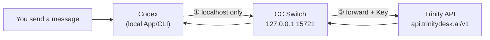
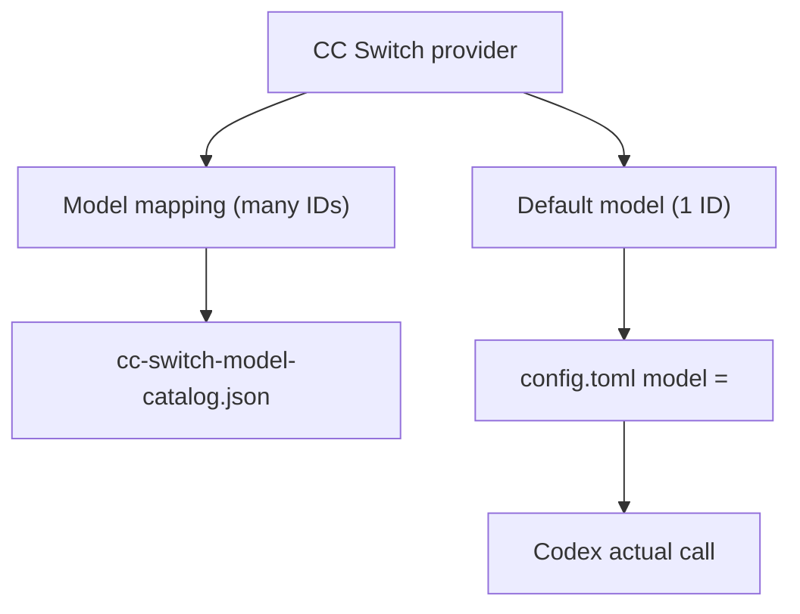

# CC Switch with Codex

Use [CC Switch](https://github.com/farion1231/cc-switch) to connect the **Codex App / CLI** to Trinity: add a Trinity provider in CC Switch and turn on **local routing**. Codex sends requests to a **local** forwarder on your machine first; CC Switch then forwards to Trinity (`https://api.trinitydesk.ai/v1`) and injects your API key.

| Address | Fixed? | Notes |
| --- | --- | --- |
| `https://api.trinitydesk.ai/v1` | **Yes** (Trinity public endpoint) | Set in the CC Switch provider |
| `http://127.0.0.1:15721/v1`, etc. | **No** (local default; not provided by Trinity) | CC Switch **local routing** default port; `127.0.0.1` is localhost. If you changed the port in CC Switch, use **Settings → Routing → Local service address**. Codex is usually updated automatically—no manual edit |

- **First-time setup**: [Quick start](#quick-start) below
- **General CC Switch steps**: [CC Switch](./cc-switch)
- **Without CC Switch (manual config)**: [Codex CLI](./codex-cli)
- **CC Switch docs**: [User manual](https://github.com/farion1231/cc-switch/tree/main/docs/user-manual/en) · [Routing service](https://github.com/farion1231/cc-switch/blob/main/docs/user-manual/en/4-proxy/4.1-service.md)

---

## What is Codex?

[Codex](https://github.com/openai/codex) is OpenAI’s coding agent (terminal CLI and Desktop App). With an OpenAI-compatible provider profile, you can route chat to Trinity using an `xh-...` key and **model IDs** from the [model catalog](https://trinity.ai/models).

---

## Quick start

### Step 1: Get a Trinity API key

1. Create a key at [API keys](https://trinitydesk.ai/account/keys) (`xh-...`).
2. See [Manage API keys](../../manage-api-keys.md).

### Step 2: Enable CC Switch local routing

**Settings → Routing → Local routing**

| Item | Requirement |
| --- | --- |
| Routing master switch | **Running** |
| Enable routing | Check **Codex** |

Local service address: use what CC Switch shows under **Settings → Routing** (default `http://127.0.0.1:15721`). After you save the provider, CC Switch writes Codex config—usually no manual edit.

### Step 3: Add a Trinity provider

**Main screen → Codex → Add provider → Custom**

| Field | Value |
| --- | --- |
| Provider name | e.g. `Trinity` |
| API Key | `xh-...` |
| Request URL / endpoint | `https://api.trinitydesk.ai/v1` (**no** trailing `/`) |
| Requires local routing map | **On** |
| Model / model mapping | **Model ID** from [model catalog](https://trinity.ai/models) |
| Default model | Model for new chats (start with one; multiple models: [Daily use](#daily-use-switching-models)) |

Save and **Enable** the provider in the list.

### Step 4: Restart Codex and verify

1. **Fully quit** the Codex App (macOS: `Cmd+Q`, not just close the window).
2. Confirm CC Switch routing is still **Running**.
3. Reopen Codex, start a **new chat**, send a short message (e.g. `Hello`).
4. If [API keys](https://trinitydesk.ai/account/keys) usage shows `POST /v1/chat/completions` or `/v1/responses` with the configured `model`, you are connected.

::: tip Optional terminal check
Confirm the local proxy is listening: `lsof -i :15721` should show `cc-switch`.
:::

**That completes first-time setup.** Sections below are reference and troubleshooting—not required in order.

| Section | Type | When to read |
| --- | --- | --- |
| [Understand the request path](#understand-the-request-path) · [Config files](#config-files-cc-switch-managed) · [Model setup](#how-models-are-configured) · [Desktop model picker](#codex-desktop-model-picker) · [vs manual Trinity](#vs-manual-trinity-connection) | **Reference** | Understand the flow or verify generated files |
| [Daily use: switching models](#daily-use-switching-models) | **Optional** | Add/remove models or change default after setup |
| [Troubleshooting](#troubleshooting) | **Support** | No connection, no usage, empty dropdown, etc. |

---

## Understand the request path

::: info Reference—not setup steps
**For integration, complete the four [Quick start](#quick-start) steps only.** You do not need to hand-edit `127.0.0.1:15721` or change `base_url` in `config.toml`—CC Switch writes Codex config when you save the provider.

Read this section to see how traffic flows, know whether to debug CC Switch or Trinity, and avoid mixing with [manual Trinity](./codex-cli) setup.
:::

When you send a message in Codex, traffic goes through **two hops** with **CC Switch on your machine** in the middle (Codex does not call Trinity on the internet directly).

### In one sentence

**Codex only talks to localhost** `http://127.0.0.1:15721`; **CC Switch calls** `https://api.trinitydesk.ai/v1` for Codex and attaches the `xh-...` key from your provider.

### Step by step

| Step | Who | Destination | What happens |
| --- | --- | --- | --- |
| ① | **Codex** (App or CLI on your machine) | `http://127.0.0.1:15721/v1` | Sends the chat to **local** CC Switch (`127.0.0.1` = localhost, `15721` = CC Switch listen port) |
| ② | **CC Switch** | `https://api.trinitydesk.ai/v1` | Forwards per your Trinity provider, **injects API key**, protocol conversion if needed |
| ③ | **Trinity** | — | Runs the model; response returns Trinity → CC Switch → Codex |

```text
You type in Codex
        ↓
Codex  →  local CC Switch (127.0.0.1:15721)
        ↓
CC Switch  →  Trinity (api.trinitydesk.ai/v1)
        ↓
Reply shows in Codex
```



### vs manual direct connection

| Mode | You configure | Who sets Codex `base_url` |
| --- | --- | --- |
| **Via CC Switch (this doc)** | Routing on, Trinity provider, key, models in CC Switch | **CC Switch auto-writes** `127.0.0.1:15721` |
| **Manual direct** | Edit `~/.codex/config.toml` or env vars | You set `https://api.trinitydesk.ai/v1` ([Codex CLI](./codex-cli)) |

With CC Switch, you **do not** put a real `xh-...` key in Codex—only in the CC Switch provider UI.

::: info Not the same as system proxy / Clash
`127.0.0.1:15721` is CC Switch’s **local routing service**, not a browser proxy. As long as routing shows **Running** and **Codex** is checked under routing, this path works.
:::

---

## Config files (CC Switch managed)

::: info For verification—usually no manual edits
After [Quick start](#quick-start), CC Switch maintains these files. Open them only for troubleshooting or [switching models](#daily-use-switching-models).
:::

With a Codex provider enabled, CC Switch maintains three files under `~/.codex/`:

| File | Role |
| --- | --- |
| `config.toml` | Provider, `base_url`, **default** `model`, path to `model_catalog_json` |
| `auth.json` | Auth placeholder; in CC Switch mode must be `{"OPENAI_API_KEY":"PROXY_MANAGED"}` |
| `cc-switch-model-catalog.json` | **Model catalog** Codex loads |

### `config.toml` example

```toml
model_provider = "custom"
model = "gemini-3.1-pro-preview"   # default model—one ID only
model_catalog_json = "/Users/<you>/.codex/cc-switch-model-catalog.json"

[model_providers.custom]
name = "custom"
wire_api = "responses"
requires_openai_auth = true
base_url = "http://127.0.0.1:15721/v1"   # CC Switch—not Trinity
```

### `auth.json`

```json
{
  "OPENAI_API_KEY": "PROXY_MANAGED"
}
```

The key is injected by CC Switch—**do not** put a real `xh-...` here.

::: warning Do not leave auth.json empty
If you cleared `auth.json` to `{}` for manual Trinity direct connect, restore `PROXY_MANAGED` when switching back to CC Switch—or Codex may show disconnected.
:::

---

## How models are configured

The common confusion is **default model** vs **model list** (concepts; step 3 in Quick start can start with one default):

| Config | Location | Count | Meaning |
| --- | --- | --- | --- |
| **Default model** | `config.toml` → `model =` | **1** | Model ID used for new chats by default |
| **Model list** | `cc-switch-model-catalog.json` | **Many** | All IDs you add under **Model mapping** in CC Switch |



::: info CC Switch preview shows one model?
The preview shows the **default** `model =` in `config.toml`, not the full list. The full list is in `cc-switch-model-catalog.json`.
:::

---

## Daily use: switching models

After setup, to **add** models or **change** the default:

### Add more models

1. **Codex → Trinity provider → Edit**
2. **Model / model mapping**: add IDs from the [model catalog](https://trinity.ai/models)
3. **Default model**: pick the one for new chats
4. **Save** and **Enable**
5. **Fully quit** Codex and reopen

### Switch the model in use

| Situation | Action |
| --- | --- |
| Model appears in the App **dropdown** | Pick it in the new-chat model menu |
| Model is in catalog but **not in dropdown** | Edit `model =` in `~/.codex/config.toml` (**one** ID), or change **Default model** in CC Switch → save, enable → **Cmd+Q** restart → new chat |

Verify with `model` in [API keys](https://trinitydesk.ai/account/keys) usage. IDs must come from the [model catalog](https://trinity.ai/models).

::: info When switching models
- Avoid editing `config.toml` in both CC Switch and Codex App settings at once
- `model =` sets the **new-chat default**; it may differ from the dropdown selection
:::

---

## Codex Desktop model picker

After mapping multiple models via CC Switch, you often see:

- **Many IDs** in mapping / catalog
- **Fewer entries** in the App model dropdown (sometimes only a subset of GPT-style slugs)

This is **usually not a misconfiguration**. Codex loads the full list from `model_catalog_json`, but the Desktop **picker filters what it displays** (see [openai/codex#19694](https://github.com/openai/codex/issues/19694)).

| Observation | Meaning |
| --- | --- |
| Catalog has more entries than the dropdown | UI filtering; path may still work |
| Replies and console usage appear | CC Switch → Trinity is connected |
| Model not in dropdown | Change default via `config.toml` `model =` (restart required) |

Steps: [Daily use: switching models](#daily-use-switching-models).

---

## vs manual Trinity connection

| Mode | `base_url` | Key |
| --- | --- | --- |
| **CC Switch (recommended)** | `http://127.0.0.1:15721/v1` | `auth.json` = `PROXY_MANAGED`; key in CC Switch provider |
| **Manual direct** | `https://api.trinitydesk.ai/v1` | `env_key` or `http_headers` with `Bearer xh-...` |

**Do not mix** (e.g. `127.0.0.1` + empty `auth.json`, or Trinity `base_url` + `PROXY_MANAGED`). Manual examples: [Codex CLI](./codex-cli).

---

## Troubleshooting

| Symptom | What to try |
| --- | --- |
| Routing on but no Trinity usage | **Codex** checked under routing; Trinity provider **Enabled**; fully restart Codex |
| Connection refused | CC Switch routing **Running**; `lsof -i :15721` shows `cc-switch` |
| Codex disconnected / no response | `auth.json` is `PROXY_MANAGED` (not `{}`); **Requires local routing map** on |
| 401 | Valid `xh-...` key in CC Switch provider |
| 404 / model not found | Model ID matches [model catalog](https://trinity.ai/models) |
| Empty dropdown or fewer items than mapping | Often Desktop UI filter; pick from dropdown if listed, else edit `model =` and restart |
| `model =` differs from dropdown selection | Normal; `model =` is new-chat default; verify via console `model` |
| CC Switch vs App model mismatch | Treat `~/.codex/config.toml` as source of truth; save in CC Switch, enable, restart—avoid editing both sides |
| `config.toml` parse error | Check TOML quotes |
| Env var conflict | Do not `export OPENAI_BASE_URL` etc. that bypass CC Switch |

More routing issues: [CC Switch · Troubleshooting](./cc-switch#troubleshooting). Manual Codex: [Codex CLI · Troubleshooting](./codex-cli#troubleshooting).

---

## Related

- [CC Switch](./cc-switch) · [Codex CLI](./codex-cli)
- [CC Switch user manual](https://github.com/farion1231/cc-switch/tree/main/docs/user-manual/en)
- [Codex CLI repository](https://github.com/openai/codex)
- [Quickstart](../../quickstart) · [Errors & debugging](../../reference/error-codes.md)
