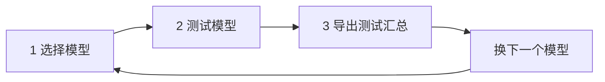

# 生文验收台（MVP）

## 流程

| 步骤 | 做什么 | 在哪 |
|------|--------|------|
| **1 选择模型** | 顶栏选 **测试模型**（可点 **新增** 临时加如 `gpt-5.4`），填 **API Key** / **BASE_URL** | 验收台顶栏 |
| **2 测试模型** | 点 **运行全部**，看表格里每条用例的结果 | 用例表格 |
| **3 记录汇总** | 点 **导出测试汇总**，得到该模型的 Markdown 报告 | 顶栏按钮 |

每个模型跑完导出一份；多模型就重复 1～3。

::: tip 启动
1. 本机运行 `npm run dev -w @trinity/app-trinity-product`（端口 **5206**）
2. API Key 仅填 `xh-…`（勿带 `Bearer`），或设置环境变量 `TRINITY_API_KEY`
3. 内测网关默认 `http://43.159.57.43`，可在顶栏修改
:::

> **用例真源**：`acceptance/cases/chat-completions.json` · **模型列表**：`acceptance/config/models.mvp.json`

<ApiAcceptanceConsole />

## 当前覆盖

| 类别 | 用例 ID |
|------|---------|
| API | T-API-01、T-MSG-01、T-MSG-02 |
| 参数 | T-STREAM-01、T-PARAM-01～04 |

共 **8 条**通用用例；`model` 由顶栏注入，不写死在 JSON 里。

## 测试汇总（Markdown）

导出文件命名：`{model}-api-validation-{日期}.md`。版式样例：

| 模型 | 样例 |
|------|------|
| GPT-5.5 | [API 验证 · gpt-5.5](./reports/gpt-5.5) |
| Claude Opus 4.7 | [API 验证 · claude-opus-4-7](./reports/claude-opus-4-7) |

结果列为 Tag；悬停 Tag 可查看原始响应摘要，可直接纳入对外 API 参考文档。

## 修订

| 日期 | 说明 |
|------|------|
| 2026-05-27 | 首版 MVP |
| 2026-05-27 | 流程收敛为：选模型 → 测模型 → 导出汇总 |
