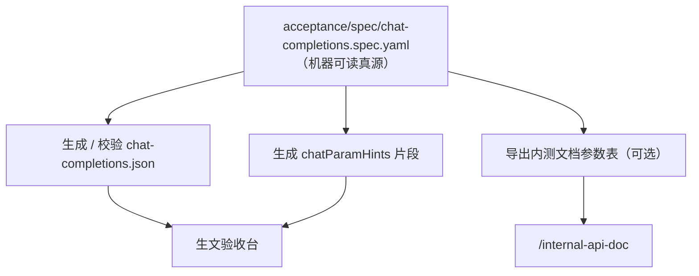

# 生文 API 验收路线图

对内生文 API 验收分 **一期 MVP** 与 **二期文档驱动** 两阶段。当前执行一期：先保证基础链路可用；二期在参数表稳定、多模型长期回归需求明确后再建设自动化真源。

## 真源与职责（现状）

| 资产 | 路径 / 入口 | 职责 |
|------|-------------|------|
| 参数说明（给人看） | [API 内测文档](./internal-api-doc) ← `docs/00-协作与工作流/工程师/API对外接口支持参数.md` | 对外可传参数、类型、约束、模型差异 |
| 可执行用例 | `acceptance/cases/chat-completions.json` | 验收台实际跑的 8 条用例 |
| 参数悬停 | `acceptance/config/chatParamHints.ts` | 表格与详情里的字段说明 |
| 汇总报告 | [Chat API Test](./reports/chat-api-test) ← `reports/chat-api-test.data.json` | 按模型导出、进 git、对外展示 |

一期为 **双份维护**：改工程师文档后，需人工对照 JSON / hint 是否仍一致。这是 MVP 的有意取舍，不是疏漏。

---

## 一期：维持 MVP（当前）

**目标**：基础正常可用——能选模型、跑通用例、看清结果、导出汇总，不追求参数全覆盖。

### 范围

**在范围内**

- 端点：`POST /v1/chat/completions`
- 流程：选模型 → 运行全部 → 导出 [Chat API Test](./reports/chat-api-test)
- 8 条通用用例（`model` 由顶栏注入，不写死在 JSON）
- 机器断言 + 人工确认（两列独立；重跑清空人工状态）
- Dev 环境：localhost 代理真实网关、`localStorage` 24h 工作区缓存、自动/手动导出

**不在范围内（一期不做）**

- 生图、生视频（见内测文档 §二、§三）
- 文档中的高级参数：`stream_options`、`tools`、`response_format`、`max_completion_tokens` 等
- 从 Markdown 自动生成用例
- 静态构建站上的「写报告」能力（仍依赖 dev + git 提交 JSON）

### 8 条用例与文档的关系

用例覆盖内测文档 **§一、生文** 的**核心子集**，不是把文档完整示例 JSON 原样跑一遍：

| 用例 ID | 标题（建议表述） | 文档参数意图 |
|---------|------------------|--------------|
| T-API-01 | 常用参数组合 · 生文 | `messages`、`stream`、`temperature`、`top_p`、`max_tokens`、`modalities` |
| T-STREAM-01 | stream 流式 | `stream: true` |
| T-MSG-01 | messages 多轮 | `messages` 多轮上下文 |
| T-MSG-02 | messages 省略 role | `messages[].role` 可省略 |
| T-PARAM-01 | max_tokens | `max_tokens` |
| T-PARAM-02 | temperature · top_p | `temperature`、`top_p` |
| T-PARAM-03 | 省略 modalities | 默认生文（不传 `modalities`） |
| T-PARAM-04 | thinking_enabled 深度思考 | `thinking_enabled`、`reasoning_effort` |

**验收策略（非 API 契约）**：提示词压到「十字内」、`max_tokens: 16`，用于省 token、加快内测；与内测文档示例中的 `1024` 等不同，属一期固定策略。

### 一期完成标准（可用性）

- [ ] 顶栏选模型 + Key + BASE_URL，**运行全部** 8/8 有结果
- [ ] **机器结果** 与 **人工验收** 含义清晰（不混用「未通过」）
- [ ] 跑满 8/8 后可 **导出** 至 Chat API Test；重复导出有 fingerprint 提示
- [ ] 刷新页面可从 **localStorage** 或历史 JSON **回填** 表格
- [ ] 内测文档新增/修改生文参数时，一期流程：**人工**检查 JSON 与 hint 是否要跟进

### 一期维护约定

1. 改 `API对外接口支持参数.md` 时，在 PR 中自检：8 条用例是否仍与文档矛盾。
2. 用例标题避免「文档完整参数」等易误解表述，改为「常用参数组合」。
3. 新增模型：顶栏 **新增** 或改 `acceptance/config/models.mvp.json`；不必为每个模型复制用例文件。
4. 断言变更（如流式 `has_delta_content`）单独评审，不随文档字段自动变更。

---

## 二期：文档驱动（规划）

**触发条件（满足其一再立项）**

- 生文参数表变更频繁，双份维护漂移明显
- 需覆盖 `stream_options`、`tools` 等更多字段
- 多模型矩阵回归成为常态，需要「文档声明了就必须有用例」的硬性约束

**目标**：**一份机器可读的真源** 驱动内测文档展示、用例骨架、参数 hint；减少人工同步，避免「文档有、用例无」。

### 不推荐：直接从 Markdown 解析

`API对外接口支持参数.md` 适合阅读，表格与示例 JSON 混排，解析脆弱。二期宜采用 **结构化 spec + 导出 Markdown**，而非硬解析现有 md。

### 推荐架构

### 二期分档实施

| 档位 | 内容 | 产出 |
|------|------|------|
| **2a 校验** | CI 对照 spec 检查用例是否覆盖已声明参数 | 漂移即失败，仍手写 JSON |
| **2b 生成骨架** | spec 定义字段、用例 ID、request 含哪些键；人补 prompt、断言、`max_tokens` | 半自动生成 `chat-completions.json` |
| **2c 全链路** | spec 含模型矩阵、`expectByModel`、负例；导出内测文档与生图/生视频分表 | 真源唯一，md 为展示层 |

### 仍由人配置（二期也不全自动）

| 项 | 原因 |
|----|------|
| 断言规则（`has_assistant_content`、`has_delta_content` 等） | 属验收策略，不是参数 schema |
| 省 token 的 prompt / `max_tokens: 16` | 测试成本策略 |
| 按模型的 `expectByModel`、跳过项 | 能力矩阵需产品/工程判断 |
| Chat API Test 导出与 git 流程 | 交付物格式，与参数定义正交 |

### 二期迁移路径（自一期平滑升级）

1. 从现有 `chat-completions.json` **反推** 首版 `chat-completions.spec.yaml`（字段列表 + 用例 ID 映射）。
2. 上 **2a**：CI `npm run acceptance:check-spec`（只读，不阻断一期使用）。
3. 验收台改为读生成后的 JSON；生成脚本进 `acceptance/scripts/`。
4. 内测文档改为「构建时从 spec 注入参数表」或保留 md 手写但 CI 对照 spec。
5. 生图 / 生视频：新增 `image.spec.yaml`、`video.spec.yaml`，复用同一套工具链。

### 二期不在首期交付

- 在线编辑 spec 的 UI
- 生产环境验收台（仍建议 dev + git 报告）
- 替代 Postman / 自动化性能测试

---

## 阶段对照

| 维度 | 一期 MVP（当前） | 二期文档驱动 |
|------|------------------|--------------|
| 真源 | 工程师 md + 手写 JSON | YAML/JSON spec |
| 同步方式 | 人工对照 | 生成 + CI 校验 |
| 参数覆盖 | 8 条核心子集 | 可扩展至文档全集 |
| 投入 | 低，已可用 | 中高，需工具链 |
| 成功标准 | 基础链路可用 | 文档与用例不漂移 |

---

## 修订

| 日期 | 说明 |
|------|------|
| 2026-05-27 | 初稿：一期维持 MVP，二期文档驱动 |
