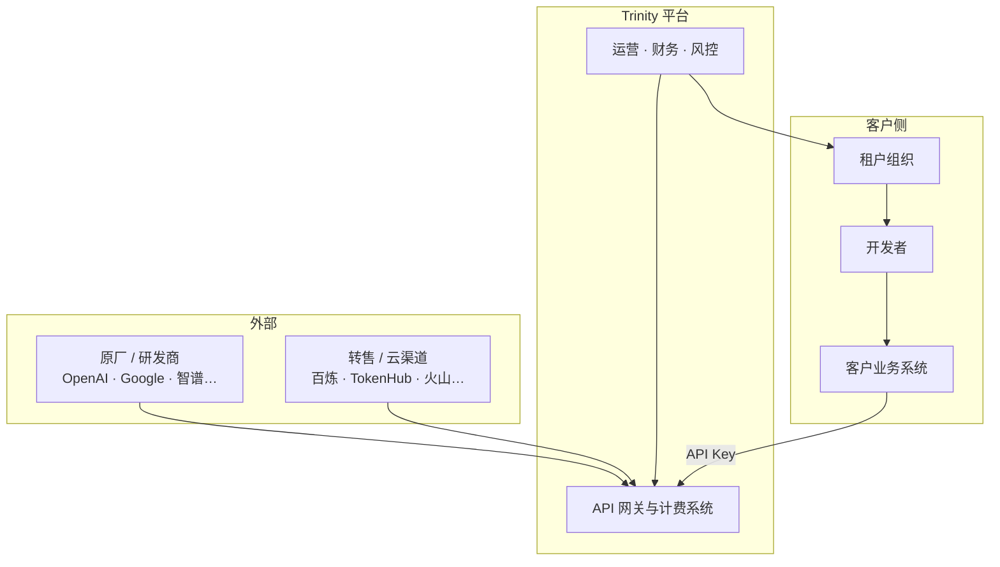
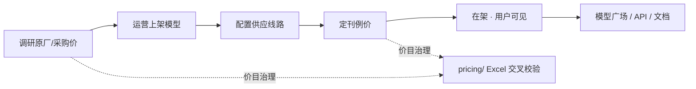
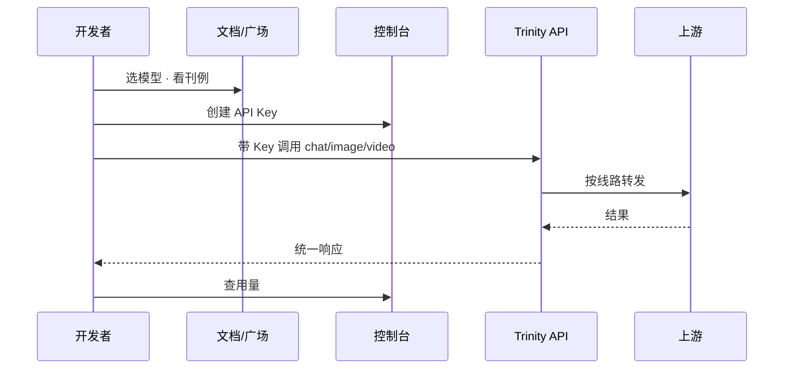
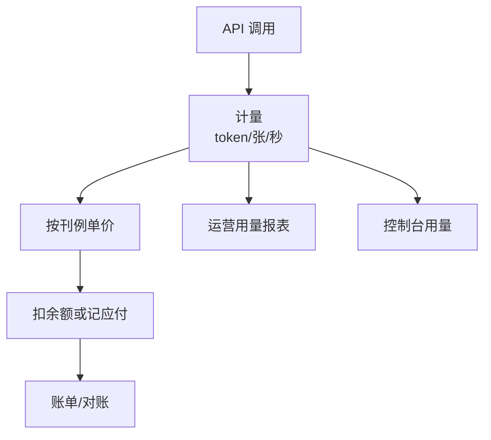

# AI API 聚合产品 · 业务全景

> **文档说明**：本产品 **商业怎么运转** 的 PM 必读真源——角色、对象、主流程、钱怎么流、与手册各模块的对应关系。  
> **读者**：产品、商务、售前、运营、研发（理解业务再拆系统）。  
> **技术/runtime 补充**：[产品核心与架构](./product-core) · **进度与排期**：[产品总览](./index.md)  
> **长 PRD**：`docs/05-产品与PRD/AI-API聚合平台-产品全景与介绍.md`

---

## 1. 我们卖什么、卖给谁

### 1.1 一句话

Trinity 向 **企业客户（租户）** 售卖 **「多模型 AI 能力的统一 API 接入」**：客户不必分别签约、对接每家模型厂商；按 **刊例价 + 合同** 调用，平台负责 **供给整合、稳定路由、计量扣费与运营治理**。

### 1.2 目标客户（ICP）

| 角色 | 要什么 | 典型场景 |
|------|--------|----------|
| **企业开发者 / 技术负责人** | 稳定 API、统一 SDK、可预期账单 | 产品内嵌大模型、Agent、批处理 |
| **采购 / 财务** | 一份合同、可对账、成本可控 | 多模型比价、部门分摊 |
| **平台运营（我方）** | 可上架、可调价、可风控 | 转售多家上游、毛利管理 |

**非目标**：自研基座大模型训练；纯 C 端聊天 App（Chat 是 **体验与获客**，主收入是 **API 调用**）。

### 1.3 与 OpenRouter 的商业差异

| | OpenRouter | Trinity |
|---|------------|---------|
| 客户关系 | 开发者注册 + Credits | **B2B 租户** + 合同/授信 |
| 运营形态 | 几乎无公开运营台 | **运营后台** 管供给与客户 |
| 定价 | 平台一口价 | **刊例价** + [价目治理](./pricing-sources/)（成本锚定） |
| 供给 | 平台统一接入 | **供应商档案 + 供应线路** 可配置 |

---

## 2. 业务角色（谁参与）



| 角色 | 做什么 | 用什么系统 |
|------|--------|------------|
| **上游 · 原厂** | 提供模型能力与官方价目 | 外部 API |
| **上游 · 转售** | 提供打包线路、采购价 | 外部 API + [供应商管理](./operations/suppliers) |
| **平台运营** | 上架、定价、客户、风控、对账 | [运营后台](./operations/) |
| **租户** | 签约、授信、组织管理 | [客户与合同](./operations/customers) |
| **开发者** | 创建 Key、集成、看用量 | [身份与组织 · 总览](./user/identity-org/) |
| **终端应用** | 带 Key 调 API | 客户自建系统 |

**两类账号、两套界面**：**平台员工** → 运营后台；**租户用户** → 用户站 + 控制台。不可混用。

---

## 3. 核心业务对象（名词表）

理解业务先统一这些对象；**model id** 是全链路主键。

| 对象 | 含义 | 谁维护 | 手册 |
|------|------|--------|------|
| **供应商** | 上游商务与对接主体（原厂或转售） | 运营 | [suppliers](./operations/suppliers) |
| **模型（Model）** | 对外售卖的 SKU，含模态与能力描述 | 运营上架 | [models-routes](./operations/models-routes) · [模型域](./user/models/) |
| **供应线路（Route）** | 某模型走哪条上游、用什么模板/密钥 | 运营 | [models-routes](./operations/models-routes) · [routing](./platform/routing-fallback) |
| **刊例价（Listing）** | 对客户展示的扣费单价 | 运营 + 价目流程 | [pricing-sources](./pricing-sources/) · `GET /v1/prices` |
| **采购/成本价** | 上游进货价（AIGC/百炼/官方等） | 价目治理 | [pricing-sources](./pricing-sources/) |
| **租户 / 客户** | 签约企业 | 运营 | [customers](./operations/customers) |
| **合同 / 授信** | 套餐、折扣、额度上限 | 运营 | [customers](./operations/customers) |
| **用户 API Key** | 租户开发者调用凭证 | 租户创建；平台可治理 | [identity-org · API 密钥](./user/identity-org/api-keys) · [keys](./operations/keys) |
| **平台上游 Key** | 调用供应商用的密钥 | 运营 | [keys](./operations/keys) |
| **调用流水** | 每次 API 请求记录 | 系统自动 | [errors-observability](./platform/errors-observability) |
| **用量** | 聚合后的 Token/张/秒 | 系统 | [metering](./platform/metering-billing) |
| **余额 / 账单** | 预付费或后付费结算单元 | 系统 + 财务 | [commercial-billing](./commercial-billing/) |

---

## 4. 五条主业务流程

### 4.1 供给链：把模型「摆上架」

**目标**：平台 **有可卖、可调、有价** 的模型目录。



| 步骤 | 业务动作 | 负责 | 手册 |
|:----:|----------|------|------|
| 1 | 确认官方价、AIGC/百炼等采购价 | 运营 + 商务 | [pricing-sources](./pricing-sources/) |
| 2 | 创建模型、绑定供应商、模态 | 运营 | [models-routes](./operations/models-routes) |
| 3 | 配置线路（上游 URL、模板、解析器） | 运营 + 研发 | [models-routes](./operations/models-routes) |
| 4 | 设定刊例价（可来自官方+L2 补齐规则） | 运营 | [pricing-sources](./pricing-sources/) · [billing](./operations/billing) |
| 5 | 在架 → 用户广场与 `GET /v1/models` 可见 | 系统 | [user/models/](./user/models/) |

**铁律**：对用户展示的 **model id** = 网关识别 id = 文档示例 id（见 [模型域 · 真源](./user/models/#领域模型与真源)）。

---

### 4.2 获客与开户：租户能买、能用

**目标**：合法租户获得 **授信或预付费能力**。


| 步骤 | 业务动作 | 手册 |
|:----:|----------|------|
| 注册 | 用户注册、企业信息 | [users](./operations/users) |
| 审核 | 通过/拒绝、黑白名单 | [users](./operations/users) |
| 商业 | 合同、折扣、授信额度 | [customers](./operations/customers) · [commercial-billing](./commercial-billing/) |
| 开通 | 租户可登录、可建 Key | [identity-org/](./user/identity-org/) |

---

### 4.3 集成与调用：客户系统真正用起来

**目标**：开发者 **创建 Key → 调通 API → 看到用量**（5.30 成败线）。



| 环节 | 业务含义 | 手册 |
|------|----------|------|
| 发现模型 | 广场、文档、排名 | [models/](./user/models/) · [developer-docs](./user/developer-docs) |
| 试玩 | Chat 预填 model（体验转化） | [chat-experience](./user/chat-experience) |
| 鉴权 | Key 有效、租户有额度、模型允许 | [auth-rate-quota](./platform/auth-rate-quota) |
| 调用 | OpenAI 兼容 API | [unified-api](./platform/unified-api) · [chat-completions](./platform/chat-completions) |
| 多模态 | 生图/生视频按张或秒 | [multimodal-api](./platform/multimodal-api) |

---

### 4.4 计量与收钱：每次调用可算、可扣、可对账

**目标**：**可变成本（上游）** 与 **客户收入（刊例）** 在系统里可追溯；三处口径一致（docs · 控制台 · 运营）。



| 概念 | 说明 | 手册 |
|------|------|------|
| 计量单位 | 生文：token；生图：张；生视频：秒 | [metering-billing](./platform/metering-billing) |
| 扣费时机 | 调用成功/流式结束等（按模态规则） | [commercial-billing MVP](./commercial-billing/commercial-billing-mvp-prd) |
| 充值/支付 | Stripe 等（6.30 范围） | [commercial-billing/](./commercial-billing/) |
| 运营对账 | 用量明细、调账、与上游成本对照 | [operations/billing](./operations/billing) |

**毛利视角**：`客户刊例收入 − 上游采购成本 − 渠道/infra` → 需 [价目治理](./pricing-sources/) 与运营报表支撑，不是单点功能。

---

### 4.5 治理与风控：可持续、可审计

**目标**：异常可发现、操作可追溯、价格变更可控。

| 治理域 | 业务问题 | 手册 |
|--------|----------|------|
| **价目** | 刊例是否对齐官方/采购？乱调价？ | [pricing-sources/](./pricing-sources/) |
| **密钥** | 盗 Key、跨租户滥用？ | [operations/keys](./operations/keys) · [monitoring-risk](./operations/monitoring-risk) |
| **权限** | 谁能改价、谁能看客户数据？ | [access-audit](./operations/access-audit) |
| **监控** | 上游挂了、错误率飙升？ | [monitoring-risk](./operations/monitoring-risk) · [ops](./operations/dashboard) |
| **文档发布** | 对外 API 说明与线上一致？ | [docs-publish](./operations/docs-publish) · `trinity-docs` |

---

## 5. 业务分层（不是工程分层）

从 **商业价值** 看三层，与 [产品总览 · 三层分工](./index.md#三层分工怎么读这张图) 一致：

| 层 | 业务问题 | 核心产出 |
|----|----------|----------|
| **运营层** | 卖什么、什么价、给谁用、风险如何控 | 在架模型、刊例、客户、策略 |
| **平台层** | 怎么稳定交付、怎么算钱 | API、计量、账单流水 |
| **用户层** | 怎么发现、怎么集成、怎么自助 | 广场、文档、控制台、Chat |

**依赖方向**：运营配置 → 平台执行 → 用户消费。用户层 **不能** 绕过平台直接连上游。

---

## 6. 业务模块地图（按价值链）

不是进度表，而是 **「这块业务管什么」**。能力域全景见 **[能力地图](./capability-map)**。

| 价值链环节 | 业务模块 | 入口 |
|------------|----------|------|
| **卖什么（供给）** | 供应商、模型上架、线路 | [operations/](./operations/) |
| **定什么价** | 价目治理、刊例、商用计费 | [pricing-sources/](./pricing-sources/) · [commercial-billing/](./commercial-billing/) |
| **谁可以买** | 客户、合同、用户审核 | [customers](./operations/customers) · [users](./operations/users) |
| **怎么接入** | 文档、广场、Key、组织 | [user/](./user/) · [identity-org/](./user/identity-org/) |
| **怎么交付** | 统一 API、鉴权、路由、多模态 | [platform/](./platform/) |
| **怎么收钱** | 计量、扣费、充值、对账 | [metering-billing](./platform/metering-billing) · [operations/billing](./operations/billing) |
| **怎么控风险** | 监控、密钥、审计 | [monitoring-risk](./operations/monitoring-risk) · [access-audit](./operations/access-audit) |
| **二期增值** | Agent SDK | [agent/](./agent/) |

---

## 7. 端到端业务闭环（商用最小集）

6.30 / 商用验收常用 **一条主链**（与 [产品总览 · 5.30 主链](./index.md#530-能力主链) 同类，业务表述）：

```text
运营上架至少 1 个在架模型并定刊例
  → 对外文档 Quickstart 可引用该 model
  → 租户注册/开通 → 控制台创建 Key
  → POST /v1/chat/completions（或 image/video）成功
  → 控制台可见用量 · 运营可见调用/计费流水
  → （6.30）充值/扣费闭环可演示
```

任何一步不通，都是 **业务断点**，不只是「某个页面没做完」。

---

## 8. 怎么读手册（业务优先）

| 你的问题 | 先读 |
|----------|------|
| **整个生意怎么转** | **本页** |
| **能力域全景（ToB 模块）** | **[能力地图](./capability-map)** |
| **某条流程细节（上架/计费）** | §4 对应链 + 模块地图 §6 |
| **某一屏产品怎么做** | [user/models/](./user/models/) 等 L2 规格 |
| **技术怎么实现** | [product-core](./product-core) |
| **本周交付什么** | [产品总览 · 周计划](./index.md#周计划与验收看板) |
| **价怎么定、怎么校验** | [pricing-sources/](./pricing-sources/) |

---

## 9. 修订

| 日期 | 说明 |
|------|------|
| 2026-07-06 | 链能力地图；identity-org 取代 account-console 为主入口 |
| 2026-07-06 | 初版：角色、对象、五条主流程、价值链模块地图 |
