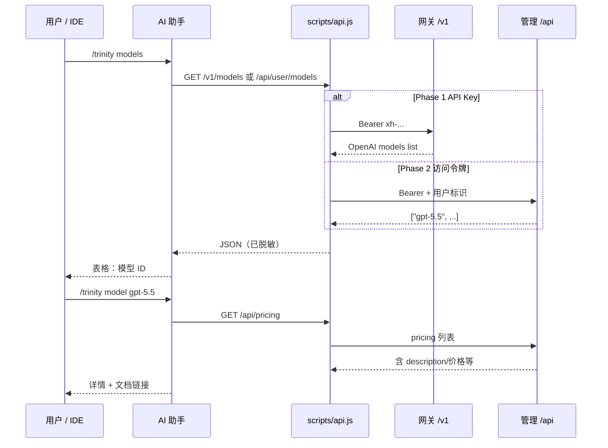

# New API · newapi Skill 友商调研与 Trinity 落地方案

> **说明**：聚焦友商 [newapi Skill](https://docs.newapi.pro/zh/docs/skills/newapi)（源码 [QuantumNous/skills](https://github.com/QuantumNous/skills)）的 **IDE 用户侧 Skill 层**；Trinity 网关、模型广场、文档站已具备，**当前主要缺口在自有 `trinity-skills`**。
>
> **深度附录**：[Skill 设计要点](./new-api-skill-design) · [模型列表与详情 API](./new-api-skill-model-info) · **[P0 实施规格](./new-api-skill-p0-spec)**（研发照着实现）

## 1. 结论（一句话）

Trinity 缺的不是「再写一份 Cookbook」，而是 **在 Cursor / Claude Code 等 IDE 里可安装的 `trinity` Skill**：用自然语言查模型、管 Key、安全写配置，密钥不进 AI 对话。

| Trinity 已有 ✅ | 本次补齐 ❌（Skill 层） |
|----------------|------------------------|
| OpenAI 兼容 `/v1/*`、`xh-` Key | `trinity-skills` 仓库与安装入口 |
| 渠道 vs 模型/定价分离（运营） | IDE 内 `/trinity models` 等指令 |
| [模型广场](https://trinitydesk.ai/models)、[doc.trinitydesk.ai](https://doc.trinitydesk.ai) | 脚本化 Key（copy / apply / scan） |
| [应用场景 Cookbook](https://doc.trinitydesk.ai/cookbook/) 手动配置 | `help` 拉文档 + 与 Cookbook 闭环 |

## 2. 友商 newapi Skill 是什么

**不是** New API 的 Admin 后台，而是给 **AI 编码助手**用的插件：

```
用户说 /newapi models
  → AI 读 SKILL.md + docs/*.md
  → 执行 scripts/*.js（禁止 AI 直接 curl 带密钥）
  → 调 New API 管理 API / 网关 API
  → 返回脱敏结果
```

| 层次 | 格式 | 作用 |
|------|------|------|
| 元数据 | `SKILL.md` 顶部 YAML + 安全铁律 | Skills 协议识别、约束 AI |
| 说明书 | `docs/actions-*.md` | 每个指令调哪个 API |
| 执行层 | `scripts/*.js`（Node/Bun，零依赖） | HTTP、掩码、`xh-`/`sk-` 脱敏、剪贴板、写 `.env` |

**不必用 YAML 定义 actions**；Markdown + JS 即可（友商已验证）。

### 2.1 友商指令一览

| 指令 | 作用 |
|------|------|
| `models` | 列出可用模型 ID |
| `groups` / `balance` | 分组、余额 |
| `tokens` / `create-token` | API Key 列表与创建（列表掩码） |
| `copy-token` / `apply-token` / `exec-token` | 密钥不进对话的三种安全通道 |
| `scan-config` | 脱敏查看配置文件结构 |
| `help` | Skill 用法 + 拉官方文档 |

官方文档：[docs.newapi.pro/zh/docs/skills/newapi](https://docs.newapi.pro/zh/docs/skills/newapi)

## 3. 与 Trinity 手册模块对照

| newapi Skill | Trinity 手册 / 工程 | Skill 落地时对接 |
|--------------|---------------------|------------------|
| `models` | [模型广场 · 列表](../user/models/list) | `GET /v1/models` 或管理 API |
| `model` 详情 | [模型详情需求](../user/models/model-detail-requirements) | `GET /api/pricing` 按 `model_name` 过滤 |
| Key 管理 | [用户控制台](../user/account-console) · 运营 [密钥](../operations/keys) | 管理 API + `xh-` 前缀 |
| IDE 配置 | [开发者文档](../user/developer-docs) · 对外 Cookbook | `apply-key` + Cookbook 对照表 |
| 安全脱敏 | [鉴权 · 限流 · 配额](../platform/auth-rate-quota) | `sanitize.js` 覆盖 `xh-` |

与 [New API（开源）总览](./new-api) 的关系：该页看**全栈产品**；本页只看 **DX · Skill 层**。

## 4. 数据流（列表 + 详情）



单模型详情 **不能**只靠 `GET /v1/models/{id}`（无价格/描述）；见 [模型列表与详情 API](./new-api-skill-model-info)。

## 5. 可落地执行方案（分优先级）

### P0 — 4 周内可上线（最少后端依赖）

**目标**：开发者 `npx skills add ... --skill trinity` 后，在 Cursor 内完成「查模型 + 问文档」，不依赖管理 API。

| # | 任务 | 产出 | 负责建议 |
|---|------|------|----------|
| P0-1 | 新建仓库 `trinity-skills`，目录 `skills/trinity/` | `SKILL.md`、`docs/setup.md`、`docs/help.md`、`docs/actions-query.md` | 研发 + 文档 |
| P0-2 | `scripts/gateway.js` + `env.js` | `TRINITY_BASE_URL`、`TRINITY_API_KEY`；`GET /v1/models` | 研发 |
| P0-3 | `scripts/sanitize.js` | 脱敏 `xh-`、`Bearer` | 研发 |
| P0-4 | 指令 `/trinity models`、`/trinity help` | `help` 链 [doc.trinitydesk.ai](https://doc.trinitydesk.ai/quickstart?lang=zh) | 研发 + 文档 |
| P0-5 | 对外 [开发者文档](../user/developer-docs) + Cookbook 增「安装 Skill」 | 安装命令、环境变量、验收步骤 | 文档 |
| P0-6 | 内部 dogfood | 产品/研发用 Cursor 走通一遍 | 全员 |

**验收**：

- [ ] `npx skills add <repo> --skill trinity` 安装成功  
- [ ] `/trinity models` 返回与当前 Key 可见模型一致  
- [ ] 对话与日志中无完整 `xh-` Key  

### P1 — 6–8 周（模型详情 + 文档 AI 索引）

**目标**：IDE 内查单价/能力描述；文档可被 Skill 检索。

| # | 任务 | 依赖 | 产出 |
|---|------|------|------|
| P1-1 | 定价与模型广场 **同源 API**（`GET /api/pricing` 或等价） | 后端 | 广场与 Skill 共用 `model_name`、价格、标签 |
| P1-2 | 指令 `/trinity model <id>` | P1-1 | `docs/actions-model.md` |
| P1-3 | `doc.trinitydesk.ai` 提供 `llms.txt`（或同类索引） | 文档站 | `help` 自动抓页 |
| P1-4 | Cookbook 每工具页增加「Skill 等效命令」表 | P0 完成 | 与 [应用场景](https://doc.trinitydesk.ai/cookbook/) 互链 |

**验收**：

- [ ] 广场某模型 ID 在 pricing API 可查到且字段一致  
- [ ] `/trinity model gpt-5.5` 含描述、计费、端点类型 + 文档链接  

### P2 — 8–12 周（对齐 newapi 全量 Key 体验）

**目标**：IDE 内创建/复制 Key、写入 `.env` / Cursor 配置，无需打开控制台。

| # | 任务 | 依赖 | 产出 |
|---|------|------|------|
| P2-1 | 控制台「系统访问令牌」+ 管理 API 文档 | 后端 | `TRINITY_ACCESS_TOKEN` |
| P2-2 | `scripts/api.js`、`copy-key.js`、`inject-key.js`、`exec-key.js` | P2-1 | 占位符 `__TRINITY_KEY_{id}__` |
| P2-3 | 指令 `keys`、`create-key`、`copy-key`、`apply-key`、`scan-config` | P2-2 | 对标 newapi `actions-token.md` / `actions-config.md` |
| P2-4 | 安全评审 | P2-2 | 密钥路径审计通过 |

**验收**：

- [ ] 全程无明文 Key 出现在 AI  transcript  
- [ ] Cursor Override Base URL + `apply-key` 端到端录屏  

### P3 — 后续（可选）

| 项 | 说明 |
|----|------|
| `balance` / `groups` | 依赖管理 API 与计费展示规则 |
| `trinity-admin` Skill | 运营侧，与用户对 Skill 分离 |
| OpenAPI 生成 SDK | 非 Skill 主线 |

## 6. 仓库与文件结构（目标态）

```
trinity-AI/apps/trinity-skills/    # monorepo 内；发布时可推独立 GitHub 仓
├── README.md
└── skills/trinity/
    ├── SKILL.md
    ├── docs/
    │   ├── setup.md
    │   ├── help.md
    │   ├── actions-query.md       # models, balance…
    │   └── actions-model.md       # model <id>（P1）
    └── scripts/
        ├── env.js
        ├── gateway.js             # P0：/v1/*
        ├── api.js                 # P2：/api/*
        ├── sanitize.js
        ├── copy-key.js
        └── inject-key.js
```

安装形态（对标友商）：

```bash
npx skills add https://github.com/<org>/trinity-skills --skill trinity
```

环境变量（建议）：

```bash
export TRINITY_BASE_URL="https://api.trinitydesk.ai/v1"
export TRINITY_API_KEY="xh-..."              # P0 起
export TRINITY_ACCESS_TOKEN="..."            # P2 起
export TRINITY_ADMIN_URL="https://api.trinitydesk.ai"  # 管理 API 基址，若与网关分离
```

## 7. 风险与依赖

| 风险 | 缓解 |
|------|------|
| 无管理 API，P2 阻塞 | P0 先上 gateway-only Skill |
| pricing 与广场不同源 | P1 前禁止 Skill 展示价格，仅列 ID |
| AI 绕过脚本直接 curl | `SKILL.md` 写死安全铁律（照抄友商 6 条） |
| 与仓内 `.cursor/skills` 混淆 | 对外 **用户 Skill** = `trinity-skills`；对内协作 Skill 见 [Cursor Skills 全景图](../../cursor-skills-全景图) |

## 8. 参考资料

| 资源 | 链接 |
|------|------|
| 友商 Skill 文档 | [docs.newapi.pro · newapi](https://docs.newapi.pro/zh/docs/skills/newapi) |
| 友商 Skill 源码 | [github.com/QuantumNous/skills](https://github.com/QuantumNous/skills) |
| New API 工程 | [github.com/QuantumNous/new-api](https://github.com/QuantumNous/new-api) |
| Trinity 官网 | [trinitydesk.ai](https://trinitydesk.ai/) |
| Trinity 对外文档 | [doc.trinitydesk.ai](https://doc.trinitydesk.ai/quickstart?lang=zh) |
| 本页附录 | [Skill 设计要点](./new-api-skill-design) · [模型 API 实现](./new-api-skill-model-info) |

## 修订

| 日期 | 说明 |
|------|------|
| 2026-06-12 | 首版：友商 newapi Skill 调研 + Trinity P0–P3 落地方案 |
