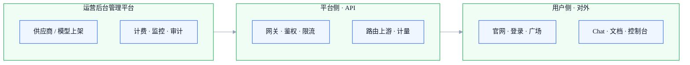

# AI API 聚合产品 · 总览

> **一句话介绍**：上游多家大模型 → 平台统一 API 出口 → 客户用 Key / 控制台调用；内部运营负责上架、定价、计量与风控。  
> **工程**：`apps/trinity-ai`（用户面）· `apps/trinity-ai-admin`（运营后台）· `apps/trinity-docs`（对外文档）  
> **体验地址**：用户面 [http://127.0.0.1:5201](http://127.0.0.1:5201) · 运营 [http://127.0.0.1:5204](http://127.0.0.1:5204) · 文档 [http://127.0.0.1:5205/docs/](http://127.0.0.1:5205/docs/) · 门户 [http://127.0.0.1:5173/trinity-ai/](http://127.0.0.1:5173/trinity-ai/)  
> **在线地址**：[http://43.159.57.43/trinityai/](http://43.159.57.43/trinityai/)（用户面；运营/文档部署待补）

## 三层分工（怎么读这张图）

平台按**用户侧 / 平台侧 / 运营后台管理平台**拆分。调用链：**运营后台先配好供给与规则 → 平台侧对外暴露 API → 用户侧使用产品**。

| 分层 | 包含什么 | 手册入口 | 整体 |
|------|----------|----------|:----:|
| **用户侧模块** | 官网、登录、广场、Chat、文档、控制台 | [进入](./user/) | 🟡 |
| **平台侧模块** | 统一 API、鉴权、路由、计量（给系统调用） | [进入](./platform/) | ⬜ |
| **运营后台管理平台** | 上架、供应商、密钥、计费、监控、审计 | [进入](./operations/) | 🟡 |

日常查厂商文档等外链，见 **[上游资料索引](./upstream-references)**；**采购价 / 渠道价 / Excel** 见 **[模型价格真源](./pricing-sources/)**。竞品调研见 **[友商产品调研](./competitor-research/)**。**商用计费与充值** → **[总览](./commercial-billing/)** · **[全球化美金支付与 KYC](./commercial-billing/global-payment)**。**二期 · Agent（规划期）** 见 **[Agent · 总览](./agent/)**（[战略 L0](./agent/positioning-and-architecture) · [SDK P0](./agent/agent-sdk-product-design) · [预研](./agent/agent-landing-report)）。每周发布见 **[产品迭代版本](./release-notes)**。

::: tip 和「OpenRouter」怎么对照
OpenRouter 官网主要是 **Models + Docs + Account**（≈ 用户侧）+ **统一 API**（≈ 平台侧）。**运营后台管理平台**为 B2B 自建，工程在 `trinity-ai-admin`。
:::

## 周计划与验收看板

::: tip 维护规则
真源 **`week-progress-index.yml`** + 每月独立 **`week-progress-N.yml`**（如 `-7` 当前月、`-6` 归档）。看板手风琴：**一文件一月一表**。同月 **`goal`** 与下方 [月度能力主链](#月度能力主链) 对齐。字段见 [更新规范](../产品手册更新规范.md)。
:::

<ProductWeekProgress rel="ai-api-platform/week-progress" />

## 产品待办池

::: tip 维护规则 · 待办池归属
**模块**：本页 **AI API 聚合产品 · 产品总览**（非叶子、非子总览）。真源 `ai-api-platform/product-backlog.yml`。跨用户/平台/运营事项放这里；每条 **`module`** + 可选 **`leaf`** 标归属模块。不写状态/负责人；**要排期时迁入上方周计划**。字段见 [更新规范 §四 · 待办池](../产品手册更新规范.md)。
:::

<ProductBacklog rel="ai-api-platform/product-backlog.yml" />

## 月度能力主链

::: tip 维护规则
按月折叠；**当前月默认展开**，历史月默认收起。跨模块闭环（主路径串讲），**不是**模块清单；模块级 ✅🟡⬜ 在子总览 / 叶子 / roadmap。新月 **prepend** 到下方列表顶部，上月改折叠归档。
:::

<strong>2026-07</strong> · 7 月 Agent SDK · 智能平台 · 商用与工具接入

**跨模块闭环**（草案，周会迭代）：

W27 商用底座（支付 · 测试 · 企业文档）→ W28–W29 Agent SDK P0 设计与原型 · 智能平台 IA · 内部工具接入 → W30 P0 验收 · 商用复盘 · 8 月范围拍板

**四条主线**：Agent SDK · 智能平台 · 商业化支持 · 应用 / 工具接入与需求。

是否纳入 7 月，在对应模块 **当前已做** 与周计划 **focus** 中标注。

<strong>2026-06</strong> · 6.30 二期收口 归档

**跨模块闭环**：

模型批量自动化上架 → 生图 / 生视频验收扩展 → 应用对接说明 → 对外文档站建设 → 6.30 商用范围产品拍板

是否纳入 6.30，在对应模块 **6.30 能力** / **6.30 商用** 列填写。

<strong>5.30</strong> · 一期闭环 归档

**跨模块闭环**：

对外文档 Quickstart → 创建 Key → `POST /v1/chat/completions` 成功 → 运营上架至少 1 个模型 → 控制台可见用量

各步是否已达，在子总览 / 叶子 **当前已做**、**5.30 能力** 列填写；不在此页铺模块表。

走查与 Bug 明细：[5.30 产品测试体验 / Bug 表](https://qcn81yhei1l2.feishu.cn/sheets/PjnVs7bmphodaKtOkkycpvxmnne)（手册不抄表）。

## 相关链接

- 产品全景 PRD：`docs/05-产品与PRD/AI-API聚合平台-产品全景与介绍.md`
