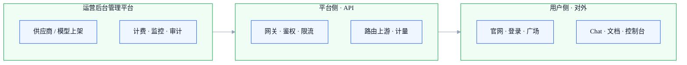

# AI API 聚合产品 · 总览

> **一句话介绍**：上游多家大模型 → 平台统一 API 出口 → 客户用 Key / 控制台调用；内部运营负责上架、定价、计量与风控。  
> **工程**：`apps/trinity-ai`（用户面）· `apps/trinity-ai-admin`（运营后台）· `apps/trinity-docs`（对外文档）  
> **体验地址**：用户面 [http://127.0.0.1:5201](http://127.0.0.1:5201) · 运营 [http://127.0.0.1:5204](http://127.0.0.1:5204) · 文档 [http://127.0.0.1:5205/docs/](http://127.0.0.1:5205/docs/) · 门户 [http://127.0.0.1:5173/trinity-ai/](http://127.0.0.1:5173/trinity-ai/)  
> **在线地址**：[http://43.159.57.43/trinityai/](http://43.159.57.43/trinityai/)（用户面；运营/文档部署待补）

## 三层分工（怎么读这张图）

平台按**用户侧 / 平台侧 / 运营后台管理平台**拆分。调用链：**运营后台先配好供给与规则 → 平台侧对外暴露 API → 用户侧使用产品**。

| 分层 | 包含什么 | 手册入口 | 整体 |
|------|----------|----------|:----:|
| **用户侧模块** | 官网、登录、广场、Chat、文档、控制台 | [进入](./user/) | 🟡 |
| **平台侧模块** | 统一 API、鉴权、路由、计量（给系统调用） | [进入](./platform/) | ⬜ |
| **运营后台管理平台** | 上架、供应商、密钥、计费、监控、审计 | [进入](./operations/) | 🟡 |

::: tip 和「OpenRouter」怎么对照
OpenRouter 官网主要是 **Models + Docs + Account**（≈ 用户侧）+ **统一 API**（≈ 平台侧）。**运营后台管理平台**为 B2B 自建，工程在 `trinity-ai-admin`。
:::

## 周计划与验收看板

::: tip 维护规则
真源 `ai-api-platform/week-progress.yml`，仅此一处。字段与符号见 [更新规范](../产品手册更新规范.md)。
:::

<ProductWeekProgress rel="ai-api-platform/week-progress.yml" />

## 半月众测记录

::: tip 模板说明
明细在飞书；本表只保留摘要。见 [更新规范 §六](../产品手册更新规范.md)。
:::

| 周期 | 范围 | 结论 | Top 问题 | 责任人 | 截止时间 | 复盘 |
|------|------|------|----------|--------|----------|------|
| _待填写_ | 例：模型广场、Chat、控制台 | 通过 / 有条件通过 / 不通过 | 链飞书或简述 | — | — | [飞书表](https://qcn81yhei1l2.feishu.cn/sheets/PjnVs7bmphodaKtOkkycpvxmnne) |

**执行表（明细）**：[5.30 产品测试体验 / Bug 表](https://qcn81yhei1l2.feishu.cn/sheets/PjnVs7bmphodaKtOkkycpvxmnne)

## 5.30 能力主链（草案）

对外文档 Quickstart → 创建 Key → `POST /v1/chat/completions` 成功 → 运营上架至少 1 个模型 → 控制台可见用量

（各步是否已达，在对应模块 **当前已做** 列填写。）

### 体验测试与 Bug 跟进

走查明细与缺陷状态以 **飞书表** 为准（体验结果、截图、指派、修复版本）：

**[5.30 产品测试体验 / Bug 表](https://qcn81yhei1l2.feishu.cn/sheets/PjnVs7bmphodaKtOkkycpvxmnne)**

本手册只保留模块级 **✅🟡⬜** 与验收勾选；不在 Markdown 里复制整张测试表。

## 6.30 能力主链（草案）

模型批量上架表格维护 → 生图 / 生视频验收扩展 → 内部应用对接说明 → 6.30 商用范围产品拍板

（各步是否纳入 6.30，在对应模块 **6.30 能力** / **6.30 商用** 列填写。）

## 相关链接

- 产品全景 PRD：`docs/05-产品与PRD/AI-API聚合平台-产品全景与介绍.md`
