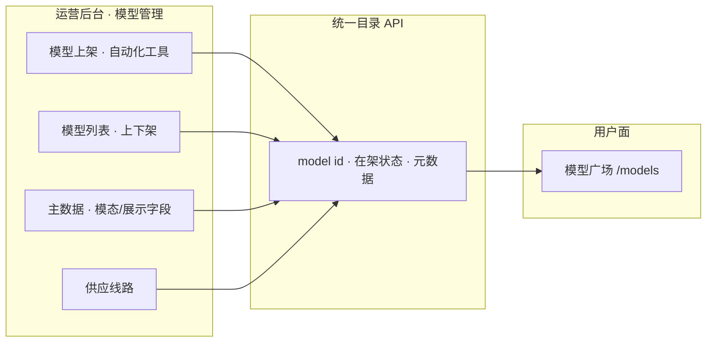

# 模型上架与供应线路

> **说明**：运营后台 **模型管理**：上架、在架目录、供应线路；用户面 [模型广场 · 列表](../user/models/list) 只读消费同一套 `model id`。对标 OpenRouter Model catalog · Routes。

> **工程**：`apps/trinity-ai-admin/src/views/admin-models/`（五件套：`ModelsPage.vue` · `models.css` · `modelsInteractions.ts` · `mock.ts` · `README.md`）· API `/v1/admin/models` · 规划 `/models/onboarding`

> **体验 / 在线**：见 [AI API 聚合产品 · 总览](../)（运营 `http://127.0.0.1:5204/models` · 用户面广场 `http://127.0.0.1:5173/models`）

## 运营任务说明

### 定位

运营在后台完成 **模型上架** → 写入目录并 **在架**；用户面广场接 live 目录 API，无需改 `ModelsPage` mock。

| 原则 | 说明 |
|------|------|
| **真源在运营后台** | 在架、名称、模态、定价、供应商绑定以 admin 为准 |
| **用户面自动展示** | `status=在架` 的模型出现在 `/models` |
| **id 一致** | 上架 `model id` = 网关 `model` = 文档 Quickstart = 广场 slug |

### 侧栏（模型管理）

| 子菜单 | 路由（规划） | 职责 |
|--------|--------------|------|
| **模型上架** | `/models/onboarding` | 自动化上架、统计看板 |
| 模型列表 | `/models/list` | 上下架、检索（**已有原型**） |
| 主数据 | `/models/master` | 展示名、模态、文档锚点 |
| 供应线路 | `/models/lines` | API₁/API₂、Profile |
| 路由绑定 | `/models/bindings` | 模型与平台密钥 |
| 刊例与成本 | `/models/pricing` | 刊例、采购成本 |

### 模型上架要点

- **自动化工具**：批量同步、元数据补全、设为在架。  
- **统计看板**：在架总数、按模态分布。  
- **与用户面**：上架后广场自动出现；下架则不可见（以产品规则为准）。

## 子能力清单

<ProductRoadmap rel="ai-api-platform/operations/models-routes.roadmap.yml" />

## 附录

### 验收（5.30 / 6.30）

走查、体验测试与 Bug 真源：[**5.30 产品测试体验 / Bug 表**](https://qcn81yhei1l2.feishu.cn/sheets/PjnVs7bmphodaKtOkkycpvxmnne)（在飞书按 **时间**、**产品/模块** 筛选；本页对应 **模型上架与供应线路** / 运营后台）。子能力进度与节点列以 **`models-routes.roadmap.yml`** 为准，手册不抄验收 checklist。

### 关联

| 模块 | 关系 |
|------|------|
| [模型广场 · 列表](../user/models/list) | 上架后在架可见 |
| [平台侧 · 路由](../platform/routing-fallback) | 线路与网关 |

### 工程待办（摘）

| 项 | 位置 |
|----|------|
| 侧栏「模型上架」 | `moduleSecondaryPages.ts` |
| 上架页 UI | `admin-models/` 或独立 Onboarding |
| 用户面接 live | `apps/trinity-ai/src/views/models/` |

### 修订

| 日期 | 说明 |
|------|------|
| 2026-06-02 | 对齐标准叶子；运营说明 + 子能力表 + 飞书验收 |
| 2026-06-02 | 子能力迁入 `roadmap.yml`；本页只嵌 `<ProductRoadmap />` |
| 2026-06-02 | 明确运营后台归属与上架子菜单 |
| 2026-05-26 | 首版 |
