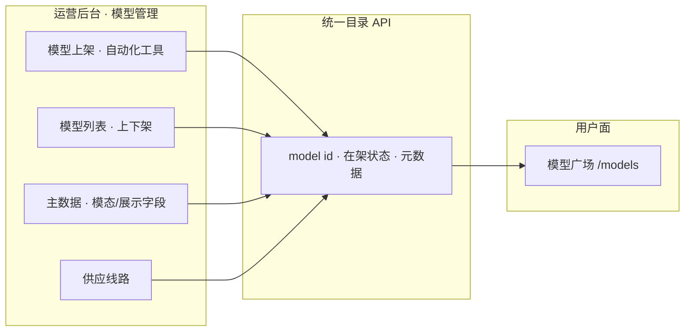

# 模型上架与供应线路

> **归属**：**运营管理后台**（`apps/trinity-ai-admin`）· 一级模块 **模型管理**（§4.5 / §4.5.1）  
> **对标**：Model catalog · Routes（OR 模型目录能力域）  
> **工程**：`admin-models/` · API 契约 `/v1/admin/models`  
> **用户面联动**：[模型广场 · 列表](../user/models/list)（只读展示，**不**在本页做上架操作）

## 原型与体验

| | 链接 |
|--|------|
| **运营后台** | [http://127.0.0.1:5204/models](http://127.0.0.1:5204/models)（模型管理，默认进模型列表） |
| **用户面广场** | [http://127.0.0.1:5173/models](http://127.0.0.1:5173/models)（上架后在架模型 **自动展示**） |

---

## 1. 定位（运营管理任务）

本页描述的能力全部在 **运营后台** 完成：运营/研发通过 **模型上架** 把模型写入平台目录并设为 **在架**；用户面 **模型广场** 仅消费同一套 `model id`，**无需**在 `ModelsPage.vue` 里手工改 mock 才能「多一个模型」。

| 原则 | 说明 |
|------|------|
| **真源在运营后台** | 是否在架、名称、模态、定价、供应商绑定均以 admin 配置为准 |
| **用户面自动展示** | 广场列表接 live / 准 live 目录 API；`status=在架` 的模型出现在 `/models` |
| **id 一致** | 运营上架的 `model id` = 网关路由 `model` = 用户文档 Quickstart 示例 = 广场卡片 slug 体系 |

---

## 2. 侧栏信息架构（模型管理 · 二级子菜单）

与 `admin-shell/moduleSecondaryPages.ts` 中 `tai-admin-models` 对齐；**「模型上架」为本模块新增子菜单**（规划路由 `/models/onboarding`，工程待建）。

| 子菜单 | 路由（规划） | 职责 |
|--------|--------------|------|
| **模型上架** | `/models/onboarding` | **自动化上架工具**、上架进度、**已上架数量统计**（含多模态分布）；批量从上游/导入同步 |
| 模型列表 | `/models/list` | 在架/下架筛选、单条上下架、检索、线路数摘要（**已有原型**） |
| 主数据 | `/models/master` | 展示名、能力标签、文档锚点、模态等主数据 |
| 供应线路 | `/models/lines` | API₁/API₂、Profile、成本与区域 |
| 路由绑定 | `/models/bindings` | 模型与平台密钥绑定 |
| 刊例与成本 | `/models/pricing` | 对外刊例、采购成本 |

> 用户面 **「模型广场」** 无「模型上架」子菜单；广场只有 **列表/详情** 等浏览能力。上架工作统一在本运营文档与后台 **模型管理** 下完成。

---

## 3. 模型上架（子模块说明）

### 3.1 自动化上架工具

| 能力 | 说明 |
|------|------|
| 批量导入 / 同步 | 从供应商目录、OpenRouter 类源或配置文件拉取候选模型，去重后进入待上架队列 |
| 元数据补全 | 自动或半自动写入：平台 `model id`、展示名、**模态**（文本 / 图像 / 音频 / 视频 / 多模态组合）、上下文档位、默认定价字段 |
| 上架动作 | 确认后写入目录并设为 **在架**；失败可重试、可记录原因 |
| 与列表联动 | 上架成功后在 **模型列表** 可见；可跳转 **主数据 / 供应线路** 继续配置 |

### 3.2 上架统计（「上了多少个模型」）

上架页或模块顶部提供 **只读看板**（数据来自目录 API 或运营库聚合）：

| 指标 | 示例 |
|------|------|
| 已上架总数 | 如「在架 128 个」 |
| 按模态 | 文本 / 图像 / 音频 / 视频 / 多模态 各多少 |
| 本期新增 | 近 7 日 / 本次任务新上架数量（可选） |
| 待处理 | 同步队列中待确认、失败条数（可选） |

### 3.3 多模态

- **模态**作为模型主数据必填或强校验维度，驱动用户面广场 **模态筛选**（与用户面 `MODALITY_ORDER` 口径一致）。
- 自动化工具从上游 metadata 推断模态，运营可人工覆写后再上架。

### 3.4 与用户面模型广场的关系

| 运营后台操作 | 用户面结果 |
|--------------|------------|
| 模型 **上架**（在架） | 广场列表 **自动出现**该模型卡片（live 数据接通后） |
| 模型 **下架** | 广场列表不再展示（或展示为不可用，以产品规则为准） |
| 改主数据 / 定价 | 广场卡片字段更新（同一 `model id`） |

验收口径见下文 **§5.30**：上架 1 个模型后，用户面广场可见。

---

## 4. 子能力清单

| 子能力 | 5.30 验收 | 6.30 商用 | 当前已做 | 说明 |
|--------|:---------:|:---------:|:--------:|------|
| **模型上架 · 自动化工具** | ⬜ | ⬜ | ⬜ | **P0**；本子模块新增 |
| **模型上架 · 统计看板（总数 / 多模态）** | ⬜ | ⬜ | ⬜ | **P0**；与上架工具同页或同模块 |
| 模型列表 / 上下架 | ⬜ | ⬜ | 🟡 | 原型 `models/list` |
| 模型元数据（名称、模态、定价） | ⬜ | ⬜ | 🟡 | 主数据 + 列表 |
| 绑定供应商 / 上游 | ⬜ | ⬜ | 🟡 | 供应线路 |
| 用户面广场 live 一致 | ⬜ | ⬜ | ⬜ | 广场改接目录 API，弃纯 mock |
| 供应线路 / 路由策略页 | ➖ | ✅ | ⬜ | §4.6 独立页，商用再做 |

---

## 5. 5.30 验收（草案）

- [ ] **模型上架**：通过自动化或半自动流程上架 ≥1 个模型（含模态元数据）
- [ ] **统计**：上架页可看到在架总数（及多模态分布至少一项）
- [ ] **用户面**：上架后 [模型广场 · 列表](../user/models/list) 可见该 `model id`（live 或准 live）
- [ ] **网关**：Chat / API 使用的 `model` 与上架 id 一致

## 6. 6.30 商用（草案）

- [ ] 纳入 6.30 商用范围的子能力达标（对照 roadmap **6.30 商用** 列）
- [ ] 自动化上架覆盖主要供应商来源；多模态统计与筛选口径统一
- [ ] §4.6 路由策略独立页（若启用）与线路优先级一致
- [ ] 与 5.30 已交付能力衔接，无文档 / 数据口径冲突

---

## 7. 工程待办（摘）

| 项 | 位置 |
|----|------|
| 侧栏增加「模型上架」 | `moduleSecondaryPages.ts` → `id: onboarding` |
| 上架页 UI | `admin-models/ModelsPage.vue` 或独立 `OnboardingPanel` |
| 目录 / 上架 API | `/v1/admin/models` 批量同步、在架状态 |
| 用户面接 live | `apps/trinity-ai/src/views/models/` 替换 `CATALOG_MODELS` mock |

---

## 修订

| 日期 | 说明 |
|------|------|
| 2026-06-02 | 明确归属运营后台；增加「模型上架」子菜单、自动化工具、多模态统计、与用户面自动展示关系 |
| 2026-05-26 | 首版：模型上架与供应线路总述 |
