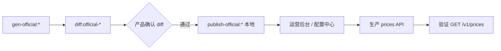

# 刊例上线部署

> **范围**：工程侧 `draft/` 刊例 JSON → **生产环境** `GET /v1/prices` 对用户生效。  
> **勿混**：[商用计费](../commercial-billing/)（Credits · 套餐）· 本页只管 **模型单价刊例**。

---

## 三层价格（再强调）

| 层 | 是什么 | 本页是否涉及 |
|----|--------|--------------|
| 采购/官方价 | `pricing/suppliers/` | ❌ 进货治理 |
| **刊例价（Listing）** | 对客户展示的模型单价 | ✅ **本页** |
| 运行时扣费 | 网关计量 · 402 | ❌ 见 [计量与计费](../platform/metering-billing) |

---

## 当前工程产物

| 模态 | 上架源 JSON | 本地 L4 缓存 |
|------|-------------|--------------|
| 生文 | `draft/0.65_prices-api.json` 等 | `online/prices-api.json` |
| 生图 | `draft/official-prices-api-image.json` | `publish-official:image` → `prices-api-image.json` |
| 生视频 | `draft/official-prices-api-video.json` | `publish-official:video` → `prices-api-video.json` |

格式与线上一致：`GET /v1/prices` 同构（`data[]` · `price_unit` · tiers）。

---

## 部署流程（推荐）



### 1. 工程侧确认

```bash
npm run pricing:diff:official-video    # 或 image
npm run pricing:publish-official:video # 更新仓库 online 缓存
```

- 阅读 `draft/official-prices-api-*-diff.md`
- `pricing:gate` 绿（L1–L3）
- commit `pricing/output/` 变更（若团队约定仓库跟踪刊例）

### 2. 运营 / 后端部署

> 具体入口以实际环境为准；规划路由见 [模型上架 · 刊例与成本](../operations/models-routes)。

| 步骤 | 负责 | 动作 |
|------|------|------|
| 导入刊例 | 运营 / 后端 | 将 `official-prices-api-*.json` 或 diff 核准价写入配置 |
| 发布 | 后端 | 部署 prices 服务 / 刷新配置中心 |
| 验证 | 研发 + 运营 | `GET /v1/prices?modality=video` 抽样对比 draft |
| 三处一致 | 产品 | 对外 docs · 控制台 · 运营刊例口径一致（见 [user/docs](../user/docs/)） |

### 3. 发布后

```bash
npm run pricing:fetch              # 拉生产刊例回 local online 对照
npm run pricing:upstream:video     # 更新 Excel「刊例对比」
```

---

## 已知限制（待优化）

| 项 | 说明 | 跟踪 |
|----|------|------|
| 单文件 `prices-api.json` | legacy 回退 | 新写入用 `prices-api-{modality}.json` |
| 生图 publish | ✅ `publish-official:image` | — |
| 仓库 online ≠ 生产 | 本地 publish 是参考缓存，不自动推生产 | 本流程 Step 2 |

---

## 关联

| 页 | 用途 |
|----|------|
| [生视频刊例发布 SOP](./video-rollout) | gen → diff → publish |
| [三模态索引](./modality-index) | 命令对照 |
| [模型上架与供应线路](../operations/models-routes) | 运营后台 |

## 修订

| 日期 | 说明 |
|------|------|
| 2026-07-07 | 初版 |
