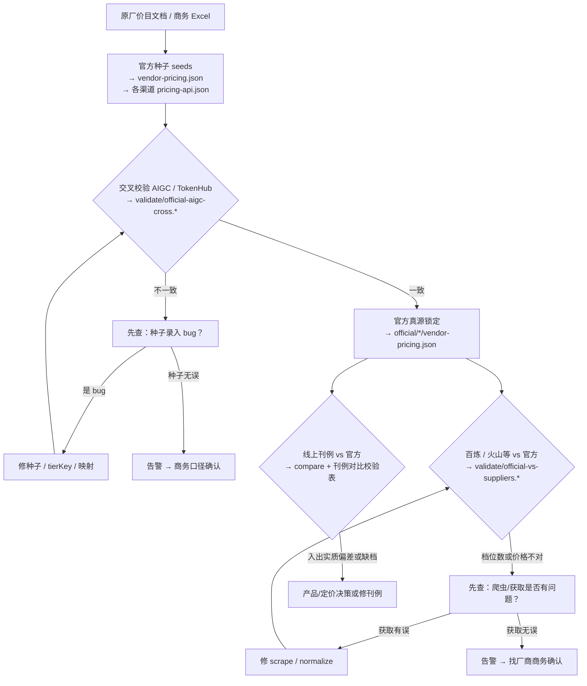

# 价目全流程

> **一页看懂**：价从哪来 → 怎么判对 → 产出什么 → 发布前卡什么。  
> **工程细则**：`pricing/docs/PRICING-GOVERNANCE-WORKFLOW.md` · `PRICING-DISCREPANCY-RULES.md`  
> **渠道路径 / 链接**：[采购渠道真源](./suppliers) · [原厂定价页](./official-pricing-urls) · [命令速查](./operations)

进货价以 `pricing/` 产出为准；**对客户卖价**见 [商用计费与充值](../commercial-billing/)（勿与本流程混）。

---

## 主流程图

（与工程文档 §2 同拓扑；**成功路径节点**标注关键产出，完整命令与路径见下表。）



改价后 **`pricing:refresh`** → `trinity-pricing-text.xlsx` · `upstream/*/pricing.md`；**`pricing:gate`** 通过后方可发刊例（见下表「汇总」行）。

---

## 阶段说明（含获取命令与产出）

<div class="product-handbook-cap-wrap pricing-workflow-stages-wrap">

| 阶段 | 输入 → 输出 | 失败时 | 命令 · 产出 |
|------|-------------|--------|-------------|
| **A→B** | 原厂网页/PDF、商务 Excel → `seeds` + `vendor-pricing.json` | 补 catalog / seed / map | **命令**<br>`pricing:supplier:official:{text,image,video}`<br>`bailian:doc` · `volcengine:all` · `tokenhub:console`<br>改 `aigc/pricing-sheet.mjs`<br><br>**产出**<br>`suppliers/official/output/{modality}/`<br>各渠道 `output/pricing-api.json` |
| **B→C** | 官方 + AIGC + TokenHub → 交叉校验报告 | 修录入 → 重跑；或告警商务 | **命令**<br>`pricing:validate:official-aigc`<br>`pricing:validate:aigc-excel`<br><br>**产出**<br>`output/validate/official-aigc-cross.*`<br>`aigc-excel-vs-sheet.*` |
| **C→G** | 第一层全绿（或已登记例外）→ **官方真源锁定** | 不得进入下游对比 | **命令**<br>`pricing:gate`（含上两步）<br><br>**产出**<br>`official/.../vendor-pricing.json`（`fetchedAt` 即版本） |
| **G→H** | 官方 + 百炼 / 火山等 → 供应商覆盖/价差报告 | 修 scrape → 重跑；或告警商务 | **命令**<br>`pricing:validate:official-suppliers`<br><br>**产出**<br>`output/validate/official-vs-suppliers.*` |
| **G→L** | 官方 + 线上 API → 刊例对比校验表 | 修刊例或登记产品例外 | **命令**<br>`pricing:compare:official` · `pricing:fetch`<br><br>**产出**<br>`output/official/{modality}.*`<br>Excel「刊例对比校验-生文」 |
| **汇总** | 各渠道 JSON 已更新 → 商务 Excel + 渠道分表 | refresh 失败看日志 | **命令**<br>`pricing:refresh`<br><br>**产出**<br>`output/trinity-pricing-text.xlsx`<br>`output/upstream/*/pricing.md` |

</div>

**改价后固定顺序**：改 `suppliers/` 或 seeds → **`npm run pricing:refresh`** → **`npm run pricing:gate`**。

### 价源类型（A→B 怎么进仓库）

| 类型 | 渠道 | 说明 |
|------|------|------|
| 原厂 | official | 国际 live 解析 + 国内 seeds |
| 爬公开文档 | 百炼、火山方舟 | Playwright，一次爬整页 |
| 爬控制台 | TokenHub | 需腾讯云登录 |
| 商家给表 | AIGC | 唯一手填 `pricing-sheet.mjs` |
| 价=official | 网聚、中转站-cust | `official-direct`，无独立挂牌 URL |

明细 → [采购渠道真源](./suppliers)。

---

## 五条原则

- **P1** 官方种子 = 原厂**最完整**分档；不得用百炼少档反推减官方档。
- **P2** 先锁 L1（B→C→G），再比转售渠道与线上刊例。
- **P3** 同档用 `tierKey` 对齐；禁止只比「input 最接近」。
- **P4** 不一致先查 seed / map / scrape，再告警商务。
- **P5** 渠道档少于官方必须显式报错，不能静默 ✅。

偏差阈值等同档 ±0.5% → `pricing/docs/PRICING-DISCREPANCY-RULES.md`。

---

## Gate（`pricing:gate`）

```
1. pricing:supplier:official:text
2. validate-aigc-excel          ← B→C（商务表 ↔ sheet）
3. validate-official-aigc       ← B→C（官方 ↔ AIGC/TH）
4. validate-official-suppliers  ← G→H
5. emit-pricing-alerts --dry-run
```

发刊例前另确认 L（G→L）：`compare:official` + 刊例对比表无未登记 `listing_*` 告警。  
命令说明 → [日常操作](./operations)。

---

## 用 Agent 执行

对 Cursor 说「加官方模型」「加采购渠道」「跑价目 gate」→ 封发 Skill **`trinity-official-pricing`**（`.cursor/skills/trinity-official-pricing/`）。  
设计稿：`pricing/docs/OFFICIAL-PRICING-SKILL-DESIGN.md` · [Cursor Skills 全景图](/cursor-skills-全景图)。

---

## 修订

| 日期 | 说明 |
|------|------|
| 2026-07-03 | 合并原 engineering / governance / skill-design 为一页 |
