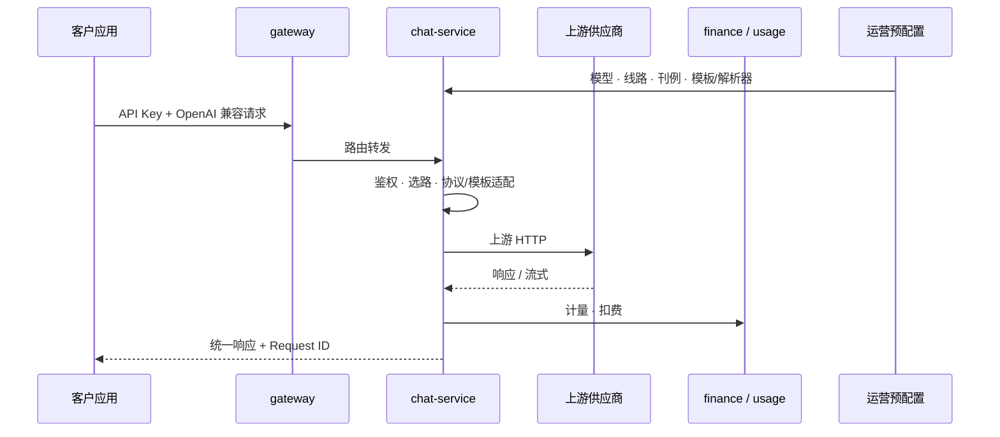

# AI API 聚合产品 · 核心与架构

> **文档说明**：**技术/runtime 补充**——工程映射、API 调用时序、平台能力清单。  
> **业务怎么运转（请先读）** → **[业务全景](./business-overview)**  
> **进度与排期** → [产品总览](./index.md) · 子模块见 [用户侧](./user/) / [平台侧](./platform/) / [运营后台](./operations/)

---

## 海报级一句话

**上游多家大模型 → Trinity 统一 API 出口 → 企业用 Key / 控制台接入**；平台内部用运营后台管供给、刊例价、计量与风控。对标 [OpenRouter](https://openrouter.ai/) 的 **统一 API 体验**，叠加 **B2B 租户、合同与运营后台**（OpenRouter 无公开运营台）。

---

## 解决什么问题（ToB 典型场景）

| 场景 | 平台作用 |
|------|----------|
| 多模型、多厂商 | 一次对接 Trinity，按需选模型，减少自建路由与协议适配 |
| 稳定性与成本 | 同模型可配多条供应线路，主备 / 降级（路线图中） |
| 企业采购与对账 | 按组织、项目、合同看用量与账单，支撑内部分摊与对客结算 |
| 安全与合规 | Key 生命周期、跨租户治理、注册审核、操作审计 |
| 运营与销售 | 上下架、刊例价、客户授信；[模型价格真源](./pricing-sources/) 支撑定价决策 |

**边界**：聚焦 **聚合调用与商业化配套**，不是自研大模型训练平台；Chat 等体验面与「企业调 API」可同品牌、不同产品线。

---

## 三层分工 + 工程映射

与 [产品总览 · 三层分工](./index.md#三层分工怎么读这张图) 一致；下表补上 **Backend / Web 落点**（Monorepo 相对路径）。

| 分层 | 产品职责 | Web | Backend |
|------|----------|-----|---------|
| **运营后台** | 供应商、模型/线路、客户、Key、计费、风控、审计 | `TrinityAI-web/apps_ui/trinity-ai-admin` | `TrinityAI-backend/trinityai-admin` |
| **平台侧 · API** | 网关、OpenAI 兼容 API、路由、计量、扣费 | 对外叙述：`apps/trinity-docs` | `trinityai-gateway` · `trinityai-chat-service` · `trinityai-finance-service` · `trinityai-usage-service` |
| **用户侧** | 官网、模型广场、Chat、文档、Account 控制台 | `TrinityAI-web/apps_ui/trinity-ai` | `trinityai-iam-service`（Auth / Key / Workspace） |

**云转售线**（可选产品线）：Web `apps/trinity-ai-cloud` ↔ Backend `trinityai-cloud-service`。

**价目治理**（运营定价真源，非运行时）：仓库 `trinity-AI/pricing/` → 手册 [模型价格真源](./pricing-sources/)。

---

## 运行时主链（一次 API 调用）

1. **运营后台** 预先配置：模型目录、供应线路、平台 Key、刊例价、请求模板与响应解析。  
2. **租户** 在 [身份与组织 · API 密钥](./user/identity-org/api-keys) 创建 **API Key**。  
3. **网关** 入站；**chat-service** 鉴权、选路、适配上游（含生文 / 生图 / 生视频）。  
4. **finance / usage** 记量、扣余额或写账单流水。  
5. 全链路 **Request ID** 与调用日志，供 [监控与风控](./operations/monitoring-risk) 追溯。

---

## 平台侧 · 八大核心能力

对外「能卖、能调、能算」的能力域；进度符号在 [平台侧总览](./platform/) 与各叶子 `roadmap.yml`。

| # | 能力域 | 说明 | 手册入口 |
|---|--------|------|----------|
| 1 | **统一 API 基座** | OpenAI 兼容基址与协议形态 | [unified-api](./platform/unified-api) |
| 2 | **生文 + 流式** | `chat/completions`、`responses`、SSE | [chat-completions](./platform/chat-completions) |
| 3 | **多模态** | 生图 / 生视频异步任务 | [multimodal-api](./platform/multimodal-api) |
| 4 | **鉴权 · 限流 · 配额** | API Key、Workspace、余额与 RPM | [auth-rate-quota](./platform/auth-rate-quota) |
| 5 | **路由与 Fallback** | 多线路、主备、降级 | [routing-fallback](./platform/routing-fallback) |
| 6 | **计量与计费** | Token / 张 / 秒 · 账单 | [metering-billing](./platform/metering-billing) |
| 7 | **错误与可观测** | 标准错误体、Request ID、调用日志 | [errors-observability](./platform/errors-observability) |
| 8 | **数据策略** | 数据去向、留存（可先合同约定） | [data-policies](./platform/data-policies) |

---

## ToB 共性能力（本产品的对应关系）

几乎所有 ToB SaaS / API 产品都具备下列能力；AI 聚合是在此底座上增加 **多模型统一出口**。

| ToB 共性 | Trinity 落点 | 手册 |
|----------|--------------|------|
| 租户与组织 | Workspace、客户/合同 | [identity-org/](./user/identity-org/) · [客户与合同](./operations/customers) |
| IAM · 审计 | 登录、RBAC、操作日志 | [权限与审计](./operations/access-audit) · IAM 服务 |
| 商业化 | 套餐、刊例、授信、支付 | [商用计费](./commercial-billing/) · [用量与计费](./operations/billing) |
| 计量与账单 | 用量 API、账单行、对账 | [metering-billing](./platform/metering-billing) |
| 接入与安全 | Key 轮换、风控、限流 | [密钥管理](./operations/keys) · [鉴权](./platform/auth-rate-quota) |
| 租户控制台 | 自助 Key、用量、组织 | [identity-org/](./user/identity-org/) |
| 运营后台 | 上架、供应商、监控 | [operations/](./operations/) |
| 可观测 | 调用日志、监控大盘 | [monitoring-risk](./operations/monitoring-risk) |
| 文档与支持 | 对外 API 文档 | [developer-docs](./user/developer-docs) · `trinity-docs` |
| 模型供给治理 | 官方 / 采购 / 刊例交叉校验 | [pricing-sources/](./pricing-sources/) |

---

## 与 OpenRouter 的差异（一句话表）

| 维度 | OpenRouter | Trinity AI API 聚合产品 |
|------|------------|-------------------------|
| 受众 | 开发者为主、Credits 消费 | **企业租户**、合同与授信 |
| 运营 | 几乎无公开运营台 | **完整运营后台**（模型/线路/客户/风控） |
| 定价 | 平台刊例 | 刊例 + **[价目治理](./pricing-sources/)**（官方 ↔ 采购 ↔ 线上） |
| API | 统一 OpenAI 兼容 | 同向兼容 + **多模态任务** + 线路/template 可配置 |
| 二期 | — | [Agent SDK](./agent/)（规划） |

---

## 怎么读手册（避免只看进度表）

| 想弄清… | 读哪里 |
|---------|--------|
| **整个业务怎么运转** | **[业务全景](./business-overview)** · **[能力地图](./capability-map)** |
| **技术/runtime** | [产品核心与架构](./product-core) |
| **模型域（页面/数据/路径）** | [用户侧 · 模型域总览](./user/models/) |
| **模块树与 ✅🟡⬜** | [产品总览](./index.md) → 用户 / 平台 / 运营 **子总览** |
| **每一屏怎么做** | 模型 [列表](./user/models/list) · [详情](./user/models/model-detail-requirements) 等 **L2 规格** |
| **本周在做什么** | 产品总览 **周计划看板** |
| **对外 API 怎么调** | `apps/trinity-docs`（非本手册） |
| **完整 PRD 叙述** | `docs/05-产品与PRD/AI-API聚合平台-产品全景与介绍.md` |

---

## 修订

| 日期 | 说明 |
|------|------|
| 2026-07-06 | 初版：三层 + 工程映射、运行时主链、ToB 共性、OpenRouter 对照 |
