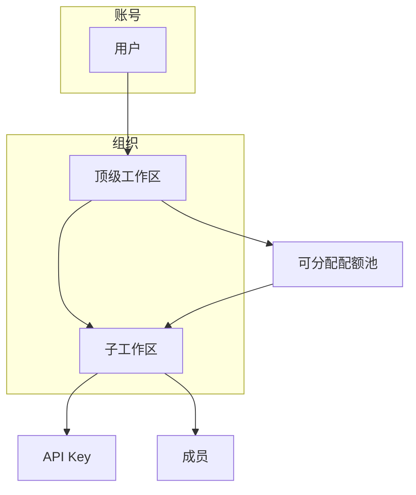

# 身份与组织 · 总览

> **能力域 A**：企业租户的 **组织边界、成员协作、角色与 API 密钥**；顶级工作区与子工作区的 **配额隔离与分配**。  
> **工程**：`TrinityAI-web/apps/web`（`AccountLayout` · `/account/workspace/:link/*`）· Backend `trinityai-iam-service`  
> **业务上下文** → [业务全景 · 获客与开户 §4.2](../../business-overview#42-获客与开户租户能买能用) · [集成与调用 §4.3](../../business-overview#43-集成与调用客户系统真正用起来)

---

## 页面树（租户控制台）

```text
/account/workspace/:link/          工作区首页
/account/workspace/:link/members   成员 · 邀请 · 创建子工作区
/account/workspace/:link/keys      API 密钥
/account/workspace/:link/balance   额度 · 子区配额池 · 分配/收回
/account/workspace/:link/usage     用量日志
/account/workspace/:link/activity    活动
/account/workspace/:link/billing     账单（仅顶级工作区）
/account/workspace/:link/settings    工作区设置
/account/workspace/:link/guardrails  护栏（模型 entitlement）
/account/profile                     账号资料
/invite/:token                       接受工作区邀请
```

| 主题 | 路由 | L2 规格 |
|------|------|---------|
| **工作区** | `/account/workspace/:link` | [workspace.md](./workspace) |
| **成员** | `…/members` | [members.md](./members) |
| **API 密钥** | `…/keys` | [api-keys.md](./api-keys) |
| **配额与余额** | `…/balance` | [quota.md](./quota) |
| **用量与活动** | `…/usage` · `…/activity` | [usage-logs.md](./usage-logs) |

旧版单页 hash 控制台（`#keys` · `#credits`）见 [用户控制台（归档入口）](../account-console)。

---

## 领域模型



| 对象 | 含义 | 真源 |
|------|------|------|
| **账号** | 登录主体（邮箱 / Google 等） | IAM |
| **顶级工作区** | 签约租户根；持有账户余额与可分配池 | `lastLink=default` 等 |
| **子工作区** | 部门/项目隔离；可持有 **专属配额** | 成员页创建 |
| **成员** | 被邀请进入某工作区的用户 | 各工作区 members |
| **API Key** | 调用凭证；归属 **当前工作区** | keys 页 |
| **配额** | 顶级 → 子区 **allocate / reclaim** 的 USD 额度 | balance 页 |

**铁律**：API 调用计量与扣费归属 **Key 所在工作区**；子区配额用尽后不再从顶级池自动透支（除非产品另行配置）。

---

## 与运营 / 平台的关系

| 租户面 | 运营面 | 平台面 |
|--------|--------|--------|
| 创建工作区、邀请成员 | [用户注册与审核](../../operations/users) | Workspace 上下文头 `X-Workspace-Last-Link` |
| 分配子区配额 | [客户与合同](../../operations/customers) 授信 | [鉴权限流](../../platform/auth-rate-quota) |
| 创建 Key | [密钥管理](../../operations/keys) 平台 Key | Key 鉴权 |
| 查看用量 | [用量与计费](../../operations/billing) | [metering-billing](../../platform/metering-billing) |

---

## 主路径（企业客户）

1. 租户注册 / 开通 → 进入 **顶级工作区**。  
2. **成员** 页创建 **子工作区**（可选）→ 邀请成员。  
3. **额度** 页从顶级池 **分配配额** 到子区。  
4. 在目标工作区 **创建 API Key** → 集成 [开发者文档](../developer-docs) 调 API。  
5. **用量** 页按工作区查看调用；顶级 **账单** 页对账。

---

## 范围：P0 / P1 / P2

| 优先级 | 能力 |
|:------:|------|
| **P0** | 工作区切换 · 子区创建 · Key CRUD · 顶级充值/余额 · 5.30 调通 API |
| **P0** | 子区配额 allocate/reclaim · 成员邀请 · 用量可见 |
| **P1** | 护栏 / 模型 entitlement · guardrails 页 |
| **P1** | 账单明细导出 |
| **P2** | SSO · 细粒度 RBAC · 跨工作区报表 |

---

## 关联

| 模块 | 关系 |
|------|------|
| [能力地图](../../capability-map) | 域 **A** 真源 |
| [商用计费](../../commercial-billing/) | 充值 · Credits 口径 |
| [模型域](../models/) | Key 调用的 model id |
| [developer-docs](../developer-docs) | Quickstart |

---

## 修订

| 日期 | 说明 |
|------|------|
| 2026-07-06 | 初版：工作区路由树 · 领域模型 · 子区配额主路径 |
