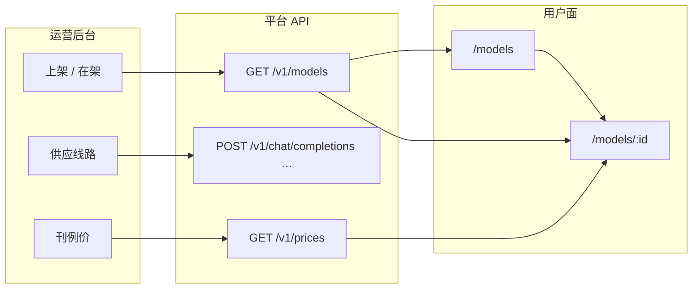

# 模型域 · 总览（PM 必读）

> **说明**：用户侧 **模型广场** 整条产品线的 L1 地图：有哪些页、数据从哪来、与运营/网关如何对齐。  
> **工程**：用户面 `TrinityAI-web/apps_ui/trinity-ai/src/views/models/` · 运营 [模型上架与供应线路](../../operations/models-routes) · 网关 `GET /v1/models` · `GET /v1/prices`  
> **先读**：[产品核心与架构](../../product-core) · 运营 [模型上架](../../operations/models-routes)

---

## PM 文档怎么读（本域试点）

手册其他模块仍可用 `roadmap.yml`；**模型域改为「产品规格优先」**，因为子能力清单长期无人维护、也无法回答「这页做什么」。

**业务上下文** → 先读 [业务全景 · 供给链 §4.1](../../business-overview#41-供给链把模型摆上架) 与 [§4.3 集成调用](../../business-overview#43-集成与调用客户系统真正用起来)。

| 层级 | 文档 | 回答什么 | 评审时用 |
|:----:|------|----------|----------|
| **业务** | [业务全景](../../business-overview) | 全产品怎么卖、怎么供、怎么调、怎么收钱 | **先读** |
| **L0** | 运营 [models-routes](../../operations/models-routes) | 模型从供应到在架 | 立项 / 跨模块对齐 |
| **L1** | **本页** | 用户侧模型域有哪些页、怎么串 | 模块评审入口 |
| **L2** | [列表](./list) · [详情](./model-detail-requirements) · [排名](./rankings) | 每一屏：问题、范围、字段、路径、验收 | **迭代评审主文档** |
| **L3** | [产品总览 · 周计划](../../#周计划与验收看板) · 飞书 Bug 表 | 本周做什么、是否达标 | 周会 |

**不再作为主文档**：各页附录里的 `roadmap.yml` / `<ProductRoadmap />` — 仅作可选进度表，**与周计划重复且易过期**；有新交付时优先改 L2 验收节 + 周计划 `focus`。

---

## 页面树（用户侧）

```text
/models                    列表 · 搜索筛选排序 · 卡片
/models/:modelId           详情 · 定价/上下文/试玩/API 链（6.30 最小集）
/rankings                  排名 · 按用量维度（P1，6.30 后）
         ↘
/chat?model=…              试玩
/docs/…                    API 文档锚点
/account/console           创建 Key（可选入口）
```

| 页面 | 路由 | 优先级 | L2 规格 |
|------|------|:------:|---------|
| **列表** | `/models` | **P0** | [list.md](./list) |
| **详情** | `/models/:modelId` | **P0**（6.30 商用最小集） | [model-detail-requirements.md](./model-detail-requirements) |
| **排名** | `/rankings` | **P1** | [rankings.md](./rankings) |

---

## 领域模型与真源

**一个 model id 贯穿全链路**（禁止用户面单独 mock 一套 id）：



| 原则 | 说明 |
|------|------|
| **真源在运营** | 在架、展示名、模态、线路绑定以 admin 为准 → 见 [models-routes](../../operations/models-routes) |
| **用户面只读** | 列表/详情接 live catalog，不在 Vue 里写死长期演示数据 |
| **id 一致** | 卡片 slug = 网关 `model` = Quickstart = 文档示例 |
| **定价口径** | 广场展示价来自 **刊例 API**（`prices`），与 [模型价格真源](../../pricing-sources/) 治理链对齐 |

---

## 用户主路径（Happy path）

1. 访客 / 开发者打开 **列表**，按模态、提供商、上下文筛选。  
2. 点击卡片 → **详情**（或 P0 直接 Chat / 文档）。  
3. 详情确认定价与能力 → **试玩 Chat** 或复制 **API 示例**。  
4. 无 Key 时 → **控制台** 创建 Key → 应用集成。

**运营侧前置**：模型已上架且在架，否则列表不可见、详情 404。

---

## 范围：P0 / P1 / P2

| 优先级 | 用户侧 | 说明 |
|:------:|--------|------|
| **P0** | 列表接 live catalog · 筛选/排序 · 卡片字段与 API 一致 | 已有原型，差 live 数据切换 |
| **P0** | 详情 6.30 最小集：概览、价、上下文、试玩、文档链 | 见 [详情 L2](./model-detail-requirements) |
| **P1** | 排名页 + 计量聚合 | 依赖 [metering-billing](../../platform/metering-billing) |
| **P2** | Providers 全 Tab · Compare · 页内 API 实验室 | 对标 OpenRouter 长板，不阻塞商用 |

---

## 竞品对照（广场域）

| 能力 | OpenRouter | Trinity（本域） |
|------|------------|-----------------|
| 模型列表 + 筛选 | ✅ | P0 对齐 |
| 单模型详情 | ✅ 多 Tab | **轻量一屏**（6.30） |
| Rankings | ✅ | P1 |
| 试玩 | Chat | Chat 预填 model |
| 定价展示 | 平台刊例 | 刊例 + 内部 [价目治理](../../pricing-sources/) |

---

## 关联模块

| 模块 | 关系 |
|------|------|
| [运营 · 模型上架](../../operations/models-routes) | 供给与在架真源 |
| [平台 · 统一 API](../../platform/unified-api) | `models` / `prices` 端点 |
| [Chat 体验](../chat-experience) | 试玩出口 |
| [开发者文档](../developer-docs) | API 链出 |
| [用户控制台](../account-console) | Key 创建 |

---

## 修订

| 日期 | 说明 |
|------|------|
| 2026-07-06 | 初版：PM 分层试点；L2 规格为主、roadmap 降为附录 |
