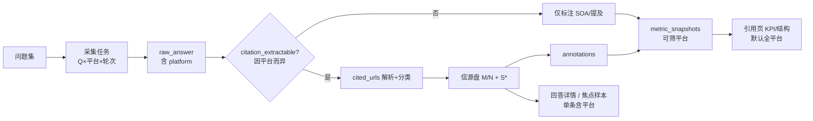

# GEO · 产品设计分析报告

> **说明**：GEO 产品 **战略与框架** 真源。分析结论供立项、PRD、原型对齐；**全站页面树以 [原型页面清单](./v1-prototype-pages) 为准**（六环完整全貌，实现节奏用 P0/P1/P2 表达，不按版本删减设计）。  
> **工程**：`（待定）` · **体验 / 在线**：`（待定，见 [GEO 总览](./)）`

> 基于清华大学《2026 GEO（生成式引擎优化）研究报告》解读 + 全球竞品调研（2026-06-15）

---

## 0. 产品定位与边界 {#product-scope}

### 0.1 目标用户（ICP）

| 项 | 共识 |
|----|------|
| **首要用户** | **出海品牌**的内容 / SEO / 营销负责人（需在同一个产品里看海外与国内 AI 答案） |
| **次要用户** | 代理商多客户管理（首期账户级单品牌或多品牌；完整多租户见 P2） |
| **非目标** | 纯国内服务商交付型 GEO、大企业纯定制项目（首期不做） |

### 0.2 产品一句话

**唯一在可承受价格带内，同时监测海外与国内主流 AI 平台、并用 SOA + 竞品对比讲清「有没有进答案」的 GEO SaaS。**

差异化不靠功能数量，靠 **双市场平台覆盖** + **平价全功能**（相对 Tier 1 竞品）。

### 0.3 定价与平台（草案 · 待商用拍板）

| 项 | 假设 |
|----|------|
| **定价** | **$79/月** 专业版 + **14 天免费试用**（对标 [Tier 1 竞品深度分析](./competitor-research/tier1-deep-dive#33-定价带分布) 中 $59–99 真空区） |
| **目标监测平台** | **海外 5 + 国内 5 = 10 个**（每日自动采集；具体名单由采集层确认，下表为产品目标） |

| 海外市场（目标 5） | 国内市场（目标 5） |
|-------------------|-------------------|
| ChatGPT | 豆包 |
| Gemini | DeepSeek |
| Claude | 通义千问 |
| Perplexity | 文心一言 |
| Microsoft Copilot | Kimi |

> 备选/轮换：Grok、Google AI Mode 等海外引擎；元宝、智谱等国内引擎。首期 **不追求** Profound 式 8+ 海外全覆盖，优先 **出海品牌双市场最小闭环**。

### 0.4 六大模块与优先级 {#module-priority}

终局能力见 §三；**设计按全貌展开**，实现节奏用 **P0 / P1 / P2** 表达（排期可随时调整，不在设计文档里按版本删减模块）：

| 模块 | 核心能力（全貌） | 优先级 | 依赖 / 备注 |
|------|------------------|:------:|-------------|
| **一、监测与测量** | 多平台采集、SOA、竞品对比、情感/位置；**③ 信源链接** `cited_urls[]`；**② CCR** | P0：采集+SOA+竞品 · P1：信源盘+CCR · P2：提示词量、多轮对话旅程 | 信源归因依赖可提取平台 |
| **二、诊断与审计** | 规则诊断 D1–D5；**④ 信源缺口 S1–S6**；页面审计、证据密度 | P0：D* 规则 · P1：S* 绑信源、单页审计 · P2：批量审计、合规健康检查 | S* 依赖 `cited_urls[]` |
| **三、内容优化与生成** | 优化待办（**D* + S* + 对标 URL**）；证据块重构、Schema、内容 Agent | P0：待办列表+状态 · P1：LLM 草稿、目录对标 · P2：证据块编辑器、Schema 自动化、多平台发文 | 见 [Agent 发文方案](./agent-multi-platform-publishing) |
| **四、策略与规划** | 关键词/问题集、竞品别名 | P0 · P2：主题地图、用户旅程建模 | — |
| **五、自动化运营** | 邮件告警；报告 PDF、定时周报；监测→诊断→优化→验证闭环 | P0：告警 · P1：报告 · P2：全自动闭环 | verify 样本已原型化 |
| **六、治理与合规** | 合规审查、幻觉检测、证据链回溯 | P2 | 高合规行业场景 |

**产品能力三角**（与原型一致）：多平台 AI 监测 · SOA 答案份额 · 竞品对比；**商用最小可信闭环**还须包含诊断、优化待办、效果验证的最薄实现（见 [MVP 实践 §七](./mvp-practice#七从实践-mvp-到商用产品映射表)）。完整 **测量→归因→优化→验证** 分层见 **[§0.6](#visibility-layers)**；**大模型在系统中的位置**见 **[§0.7](#industry-ai-in-geo)**（计分与 D/S 标签以规则为主，LLM 用于解读与起草）。

> **模块与分层关系**：§0.4 按「六大模块」列全貌与优先级；§0.6 按「单次回答下钻」分层。二者互补——模块表回答「有哪些产品块」，分层表回答「指标与优化依据怎么串」。

### 0.5 姊妹文档关系

| 文档 | 职责 |
|------|------|
| **本文** | 为什么做 GEO、终局六层能力、竞品格局、差异化与 **P0/P1/P2 优先级**；**可见性分层**见 [§0.6](#visibility-layers)；**业界 AI 应用**见 [§0.7](#industry-ai-in-geo) |
| [原型页面清单](./v1-prototype-pages) | **完整页面树**（官网 / 控制台 / 运营后台） |
| [技术架构分析](./tech-architecture) | 采集管线、指标计算、技术选型 |
| [友商调研](./competitor-research/) | 竞品官网、Tier 1 深度打分 |
| [PM 手册](./pm-handbook) | PM 工作流与交付标准（工程链接占位） |
| [GEO 业界计费](./geo-billing-industry) | 采集周期、SaaS 套餐维度、竞品价位、Trinity 套餐建议 |
| [MVP 实践手册](./mvp-practice) | MVP 样本全链路；诊断 D*、优化动作、R2 验证 |

### 0.6 可见性分层模型 {#visibility-layers}

> **真源**：从「答案里有没有我」追到「信源盘里为什么没有我」，再落到可执行优化与 R2 验证。  
> **工程落点**：[技术架构 · 测量与标注](./tech-architecture#measurement-soa)、`cited_urls` 采集；**样本**：[MVP 实践手册](./mvp-practice) 阶段 ④⑤⑥；**界面**：[回答详情](../../../trinity-geo/marketing/console/answer-detail.md)、[诊断列表](../../../trinity-geo/marketing/console/diagnosis.md)、[优化待办](../../../trinity-geo/marketing/console/optimize.md)。

#### 0.6.1 为什么需要分层

用户常问的不只是「SOA 为什么是 0」，而是：

- 豆包这道题**参考了哪些链接**？
- 这些依据里**为什么没有我们**？
- 我该改官网、文档，还是去争取第三方评测？

若产品只停在 **① 答案层**（SOA、竞品首推），优化很容易退化成空泛的「补一篇 FAQ」。  
分层模型的目的：**优化动作必须落在 ③④ 层（信源 + 归因），验证必须看 ⑤ 层**，而不是从 ① 直接跳处方。

**MVP 样本（Q00 · 豆包）**：问法「推荐两款 API 聚合平台」时，回答列出 **16 条参考链接**（OpenRouter 官方 6 + TokenHub 官方 5 + 第三方评测 5），**我方域 0 条**——正文无声失与信源盘缺席同时成立，归因应指向 S1–S3，而非仅贴 D1 标签。

#### 0.6.2 分层总览（⓪–⑤）

```
⓪ 策略/问题层 ── 打哪道题、值不值得打（上游）
① 答案层      ── 正文有没有我、排第几
② 引用层      ── 有没有把我当「证据源」（CCR）
③ 信源层      ── 整道题参考了哪些 URL（证据盘）
④ 归因层      ── 信源里为什么没有我们（缺口类型 → 动作）
⑤ 验证层      ── R2：①②③ 是否一起改善（下游）
```

| 层 | 用户问题 | 产品应展示 | 主要指标/对象 | 优先级 |
|:--:|----------|------------|---------------|:------:|
| **⓪ 策略/问题** | 这道题重要吗？我们在打吗？ | 问题类型、启用状态、同题竞品 SOA | 问题集、P0 权重 | P0 |
| **① 答案** | 答案里有没有我？ | SOA、位置、竞品首推 | SOA、提及位置 | **P0** |
| **② 引用** | 有没有把我当信源？ | 我方 URL/域是否出现在依据角色 | CCR | P1 |
| **③ 信源** | 平台参考了哪些来源？ | 全部参考链接 + 分类 + 我方 M/N | `cited_urls[]` | P1（可提取平台必采）；样本可手工 |
| **④ 归因** | 信源里为什么没有我们？ | 缺口类型 S*、对标 URL、待办 | D* + S* | P0（D*）· P1（S* 绑信源） |
| **⑤ 验证** | 改完有效吗？ | R1 vs R2：SOA、信源盘、CCR | Δ 指标 | P0 闭环 · P1 自动 R2 |

**② 与 ③ 不可混读**：② 只看「我方是否作为证据源」；③ 看「整盘证据链构成」（含竞品官方、第三方评测）。Q00 为：③ 有 16 链、② 我方为 0。

#### 0.6.2a 采集 → 引用页数据流 {#citation-data-pipeline}

> **原子单位**：一条 `raw_answer` = `question_id` × **`platform`** × `round`。  
> **平台维度**：自采集任务起**每条链路都绑定平台**；引用页读口在「单条下钻」与「跨平台 rollup」之间切换，**不是整条流程都不分平台**。工程字段见 [技术架构 · 参考来源采集](./tech-architecture#cited-sources)；控制台落点见 [引用与信源 PRD](../../../trinity-geo/marketing/console/citations.md)。



**哪些区分平台、哪些不区分**

| 阶段 | 是否带 `platform` | 说明 |
|------|:-----------------:|------|
| 问题集文案 | 否 | 同一问法；与平台无关 |
| 采集任务调度 | **是** | 任务 = 启用问题 × **启用平台** × 轮次（R1/R2/日采） |
| `raw_answer` | **是** | 主键维度之一；豆包与 ChatGPT 各一条，**不可合并** |
| `citation_extractable` | **是** | **按平台/渠道**配置或探测；豆包 App 可 16 链 ≠ API 直连无链 |
| 解析 `cited_urls`、M/N、S* | **是** | 挂在该条 `raw_answer` 上；Q00 豆包 0/16 ≠ Q00 ChatGPT（若有采） |
| `annotations`（SOA、CCR、D*） | **是** | 与 `raw_answer` 同行；CCR 分母也是「该平台该条是否提及」 |
| `metric_snapshots` 写入 | **是** | 落库时带 `platform` 维；聚合时可 `GROUP BY platform` 或 `all` |
| 引用页 **KPI / 来源结构条** | **可选** | **展示层**默认近 7 日 **全平台 rollup**；用户可筛「仅豆包」等 |
| 引用页 **按问题表** | **是** | 每行 = 一题 + **一平台**（同题多平台 = 多行） |
| 引用页 **焦点样本** | **是** | 钉死一条，如 Q00×豆包×R1；**不受**页头平台筛选 |
| **平台可提取性**表 | **是** | 渠道元数据（配置表），非时序指标 |
| 品牌别名 / 竞品库 | 否* | 全品牌共用；*双市场叙事（S6）在**解读**时按平台对比 |

**读口口诀**：**采、存、标、单行展示 — 都分平台；顶栏 KPI 与结构条 — 默认不分，可筛成单平台。**

| 节点 | 对应分层 | 产品说明 |
|------|----------|----------|
| 问题集 → 采集任务 | ⓪ 策略/问题 | 监测问法、启用状态；任务展开为 **平台×轮次** |
| `raw_answer` | ①②③ 输入 | 全文存档；**`platform` 字段**决定可观测性与信源形态 |
| `citation_extractable?` | ③ 可观测性 | **平台/渠道属性**；否则本页 M/N 标「—」 |
| 解析 + 分类 | ③ 信源 | 单条回答内的竞品/第三方/我方域 → **M/N** |
| 信源盘 + S* | ③④ | 单条缺口；S6 常需跨平台对比才显现 |
| `annotations` | ①②④ | 单条 SOA、CCR、D* |
| `metric_snapshots` | ①②③ 聚合 | 带平台维度的时序；引用页 KPI 可 **all / 单平台** |
| 引用页 / 回答详情 | ②③ 读口 | 汇总（可筛平台）vs 单条下钻（必含平台） |

#### 0.6.3 ⓪ 策略 / 问题层

| 子类 | 描述 | 产品展示 |
|------|------|----------|
| 问题类型 | 品类 / 品牌 / 对比 / 场景 | 标签；决定失声代价 |
| 问题集覆盖 | 是否在监测分母内 | 启用 / 暂停 |
| 同题竞品 SOA | 谁在抢同一道题的答案份额 | 竞品矩阵、概览 |

不产生优化正文，但决定 **P0/P1** 与资源投入。品类词 + 竞品官方文档独占 → P0。

#### 0.6.4 ① 答案层

| 子类 | 描述 | 产品展示 |
|------|------|----------|
| 品牌提及 | 正文是否出现别名 | 是 / 否 |
| 进答案正文 | 是否进入推荐或论述段 | **SOA** 分子 |
| 提及位置 | 首推 / 前列 / 末段 / 备选 | 位置标签 |
| 竞品首推 | 同题竞品谁占推荐位 | 竞品对比表 |

控制台落点：可见性总览、关键词详情、回答详情侧栏。

#### 0.6.5 ② 引用层

| 子类 | 描述 | 产品展示 |
|------|------|----------|
| 被引为信源 | 我方域名/URL 出现在「依据、参考、引用」角色 | **CCR** |
| 引用形态 | 脚注链 / 文中「据…文档」/ 仅点名无链 | 标注类型 |

与 ① 关系：可「提及且进正文」但参考盘仍无我方域；亦可参考盘有链但正文未点名——故 **提及 / 进正文 / 参考盘含我方域** 建议三列并列展示。

#### 0.6.6 ③ 信源层

| 子类 | 描述 | 产品展示 |
|------|------|----------|
| 参考链接全集 | 平台返回的全部 URL（能采则采） | 列表 + 总数 N |
| 竞品官方 | 竞品官网、文档、控制台等 | 分类计数 |
| 第三方评测 | 榜单、测评、媒体稿 | 分类计数 |
| 我方官方 | 品牌官网、文档站等 | **我方域命中 M/N** |
| 中立技术文档 | 非竞品非我方的权威文档 | 可选分类 |
| 不可提取 | 平台未返回链接或仅正文 | `citation_extractable=false` |

**采集原则**：若消费端回答显式列出「官方依据」「第三方参考」等链接，**必须整表入库** `cited_urls[]`，不可只存 `answer_full` 文本。平台差异见 [技术架构](./tech-architecture#cited-sources)。

信源层级（与 [业务全景 · 信源分层](./business-landscape) 一致）：**T1 官方 > T2 媒体 > T3 案例 > T4 软文**——优化优先级随层级而变。

#### 0.6.7 ④ 归因层（优化依据落点）

**症状标签 D1–D5**（规则引擎，见 [MVP §④](./mvp-practice)）描述「答案侧出了什么问题」；**信源缺口 S1–S6** 描述「证据盘侧为什么缺我们」。优化待办应写 **`D* + S* + 对标 URL`**，避免仅写「D1 → 补 FAQ」。

| 缺口 ID | 描述 | 典型动作方向 | 可观测性 |
|---------|------|--------------|----------|
| **S1 信源盘缺席** | 参考链接中无我方域 | 新建可对标的官方文档树（目录对标竞品 `/docs`） | 高 |
| **S2 竞品官方独占** | 证据链以竞品官网+文档为主 | 同构选型页：定义、模型列表、API、计费 | 高 |
| **S3 公域评测固化** | 第三方横向文定型品类叙事 | 运营：评测渗透/投稿；系统**提示缺口、不承诺上榜** | 中 |
| **S4 有页不可引** | 有 URL 但 SPA/抓取/证据块差 | 页面审计、证据密度修复 | 高（审计） |
| **S5 有页未入盘** | 页面存在但未被检索/RAG 召回 | 标「待验证」；不承诺因果 | 低 |
| **S6 市场割裂** | 国内/海外平台信源结构显著不同 | 中文可引用事实页、双市场叙事 | 中 |

**D 与 S 关系示例**：

| D（症状） | 常伴 S（根因） | Q00 样本 |
|-----------|----------------|----------|
| D1 品类失声 | S1 + S2 + S3 | 正文无 Trinity；16 链全为竞品/评测 |
| D4 叙事落后 | S2 + S3 | 对比词下竞品文档+评测占叙事 |
| D2 品牌未识别 | S4 或 S5 | 需审计与别名排查 |
| D5 市场割裂 | S6 | 豆包 vs ChatGPT 信源结构对比 |

#### 0.6.8 ⑤ 验证层

| 子类 | 描述 |
|------|------|
| SOA Δ | R1→R2 是否进答案正文 |
| 信源盘 Δ | 我方域是否从 0/N 变为 >0（往往早于 SOA 变化） |
| CCR Δ | 是否被当作信源引用 |
| 关联动作 | `linked_action_id` → 优化待办 |

实践要求：完成 P0 优化后，对**动过手的题目**做 R2 采集；验收时 **信源盘与 SOA 同时看**（见 [MVP §⑥](./mvp-practice)）。

#### 0.6.9 横向切分轴（每层可用）

| 轴 | 说明 |
|----|------|
| 平台 | 豆包可显式 16 链 ≠ 部分 API 无链 |
| 市场 | 海外 / 国内；对应 S6 |
| 轮次 | R1 / R2 |
| 信源层级 | T1–T4 |
| 可观测性 | 可提取 / 不可提取 / 链接待核验 |

#### 0.6.10 产品边界（不承诺算清）

| 现象 | 产品态度 |
|------|----------|
| 平台不返回参考链接 | ③ 标「不可提取」；归因依赖 ①② + 内容对标 |
| 链接是否为模型事后编造 | 标「待核验」；支持抽检 |
| 预训练记忆 vs 实时检索 | 标「不可区分」；动作仍落在可改的公开页与公域信源 |
| 第三方评测能否进入榜单 | ④ 给运营类建议；系统不承诺自动搞定 |

#### 0.6.11 与六环、控制台页面的映射

| 分层 | 六环 | 控制台主要落点 |
|------|:----:|----------------|
| ⓪ | ① 策略 | 问题集、竞品管理、品牌设置 |
| ①②③ | ③ 测量 | 总览、关键词/回答/竞品详情 |
| ④ | ④ 诊断 + ⑤ 优化 | 诊断列表、优化待办、页面审计（P1） |
| ⑤ | ⑥ 验证 | 效果验证、报告 |

### 0.7 业界 GEO 系统中 AI 的应用 {#industry-ai-in-geo}

> **用途**：回答「诊断/优化要不要接大模型」——对齐 [友商调研 · Tier 1](./competitor-research/tier1-deep-dive)、[业务全景 · 程序化 vs AI](./business-landscape#哪些环节是程序化哪些常接-ai)。  
> **结论先行**：成熟 GEO 产品普遍采用 **「规则与数据发现问题，LLM 解释与起草，人/Agent 执行，再监测验证」**；几乎无「全程由一个模型诊断并自动优化」的商用主线。

#### 0.7.1 行业共识：AI 用在闭环后半段，不用在打分主路径

```text
  ② 监测采集          ③ 测量 / ④ 诊断归因           ⑤ 优化 / ⑥ 验证
  ───────────        ─────────────────────        ───────────────────
  API·调度·存档   →    规则·统计·信源解析      →     任务队列·LLM 草稿·Agent
  （工程自动化）       （可复现、可审计）              （降本·加速执行）
                              │
                              └── LLM 可选：弱提及/情感、解读文案、机会排序
```

| 环节 | 业界主流实现 | 是否依赖 LLM | 代表产品做法 |
|------|-------------|:------------:|--------------|
| 多平台提问与存档 | 调度 + API / 浏览器采集 | 否 | Peec、Profound、Otterly 等每日复测 |
| SOA / 提及 / 位置 | 规则引擎 + 别名库 + 聚合 | **否**（主路径） | 份额、首推、情感趋势；不用模型直接「打可见性分」 |
| Citation / 信源追踪 | 解析回答中的来源 + 统计缺口 | 部分 NLP | **Peec**：区分 visibility vs source；多数产品有 citation gap，少做全量 URL 盘 |
| 页面可引用性审计 | 规则清单 + 爬虫（因子打分） | 规则为主 | **Otterly GEO Audit**（25+ 因子 + SWOT 式建议） |
| 机会发现 / 诊断排序 | 统计 + 启发式 + **有时 LLM** | 混合 | **Profound Opportunities**：弱项 + ROI 排序 + 动作类型 |
| 优化待办 | Gap → **任务队列** | 模板为主 | **Peec Actions**（2026）：citation gap → owned / earned 任务 |
| 内容起草 / 改写 | **LLM 主战场** | 是 | **Profound Agents**、Goodie 内容写作、Athena Schema |
| 自动发布 + 再测 | Agent / 工作流 | 高阶 | 企业版 $300–400+/月；国内全栈多为项目制 Agent |
| R1 vs R2 验证 | 指标 Δ 对比 | 否 | SOA、引用、可见性趋势；**信源盘 Δ 公开叙事较少** |

详见 [Tier 1 功能热力图](./competitor-research/tier1-deep-dive#31-功能覆盖热力图)（优化建议、自动内容生成、引用区分等维度）。

#### 0.7.2 三类产品形态（监测 → 建议 → 执行）

| 形态 | 典型产品 | 诊断怎么做 | 优化怎么做 | LLM 重心 |
|------|----------|-----------|-----------|----------|
| **A. 监测型** | Otterly、早期 Peec | 可见性、基础提及 | 弱；审计报告带建议 | 审计文案 |
| **B. 监测 + 机会** | **Peec**、Semrush AI Toolkit | 引用缺口、竞品、情感 | **Actions 任务队列**；Peec **不做**原生写稿 | 策略与排序；执行靠人 |
| **C. 监测 + 机会 + 执行** | **Profound**、Goodie AI | Prompt 量 + Opportunities | **Agents** 写简报/文章/着陆页 | 机会面板 + 内容 Agent |
| **D. 服务 / 全栈** | 国内头部服务商、智推等 | 多 Agent 分工 | 代运营 + 分发 + 创生 | Agent 闭环重，非自助 SaaS 默认 |

**定价与 AI 深度正相关**：$49–99 档多为 **B 类**（监测 + 任务建议）；**C 类** 真实起点多在 **$300+/月**（Profound Growth、Scrunch 等）。Trinity 目标带 **$79/月** 应对齐 **B 类全功能 + 双市场**，LLM 用于 **降本** 而非替代规则地基。

#### 0.7.3 诊断层：业界怎么做 vs Trinity

| 维度 | 业界常见 | Trinity（§0.6 + 原型） | 差异 |
|------|----------|------------------------|------|
| 症状标签 | 失声、弱可见、低份额、低 citation | **D1–D5** 规则 + 证据句 | 同类，我们更绑 `question_id` |
| 信源归因 | 「缺 citation」告警为主 | **`cited_urls[]` + S1–S6 + 对标 URL** | **更细**：竞品官方 / 第三方 / 我方 M/N |
| 优先级 | Prompt 量（Profound 独家）、ROI 面板 | P0/P1 + 问题类型 + 同题竞品 SOA | P2 可接 prompt 量 |
| LLM 角色 | 解读、机会文案、内容方向 | **规则为主**；**P1 AI 解读**侧栏 | 不令 LLM 改 D/S 标签 |

**行业教训（Q00 样本）**：若只有 LLM 读回答摘要，易停在「D1 → 补 FAQ」；**必须先有 ③ 信源盘**，再谈模型增强 ④ 归因。这与 Peec / Profound 强调 citation gap 的方向一致，但 Trinity 将 **整表 URL 入库 + S* 缺口类型** 产品化得更硬。

#### 0.7.4 优化层：业界怎么做 vs Trinity

| 阶段 | 业界 | Trinity |
|------|------|---------|
| **任务化** | Peec Actions、Profound Opportunities | **P0**：`D* + S* + 对标 URL` 行动清单（如 openrouter.ai/docs） |
| **LLM 起草** | 简报、FAQ、对比表、着陆页结构 | **P1**：从 P0 诊断一键生成待办草稿、doc 目录对标大纲（**人审后发布**） |
| **Agent 执行** | 自动写稿 → CMS → 再测 | **P2**；合规与品牌风险高，默认人审或企业版 |
| **验收** | 多为 SOA / 可见性 Δ | **⑤ 验证**：**信源盘 Δ 先于 SOA Δ**（见 [效果验证 PRD](../../../trinity-geo/marketing/console/verify.md)） |

[MVP 实践手册 §⑤](./mvp-practice) 明确：实践版求 **「1 小时内改完 1–2 项」**，不求 AI 自动生成一堆空泛建议——与 Peec Actions 的「可执行任务」哲学一致，但须绑定 **信源依据链**。

#### 0.7.5 业界仍普遍薄弱的能力（Trinity 差异化输入）

与 [§6.1 能力空白](#differentiation)、[Tier 1 盲区](./competitor-research/tier1-deep-dive#32-竞品盲区--我们的机会) 一致：

| 能力 | Tier 1 竞品热力图 | Trinity |
|------|-------------------|---------|
| 中国 AI 平台监测 | 均为 ❌ | **主差异化（P0）** |
| 引用 vs 提及（CCR）产品化 | 多为 ❌/⚠️ | SOA + CCR + 信源 M/N 三列并列 |
| 完整参考链接盘 + 分类 | 少见公开做到 Q00 级 | `cited_urls[]`、回答详情信源层 |
| 优化绑定对标 URL | 多为「写一篇内容」 | 竞品 `/docs`、第三方评测文硬对标 |
| R2 信源盘验收 | 公开叙事偏 SOA | verify：0/16 → 1/17 先于 SOA |

#### 0.7.6 Trinity 对 AI 的接入原则（与 §0.4 对齐）

| 优先级 | AI 接入点 | 不接入（任何阶段） |
|--------|-----------|-------------------|
| **P0** | 无（或仅边缘实验标注） | SOA/CCR 计分；S1–S6 判定（有信源盘时规则化）；R2 指标 Δ 由规则与数据产出 |
| **P1** | 诊断 **AI 解读**（输入=规则结果 + `cited_urls`）；优化 **待办草稿**、目录对标大纲；页面审计叙述 | 自动发布；LLM 改 D/S 标签 |
| **P2** | 证据块重构、Schema 生成、内容 Agent（人审或企业版） | — |

**工程原则**（与 [技术架构](./tech-architecture#measurement-soa)、[业务全景](./business-landscape) 一致）：

1. **测量与归因标签**——程序化、可回放（原始回答 + 规则版本 + 标注结果）。  
2. **LLM 输出**——默认进「建议/草稿」态，**人审或勾选后**才进优化待办。  
3. **验收**——用 R1/R2 指标 Δ，不用「模型觉得好了」。

#### 0.7.7 姊妹文档索引

| 主题 | 文档 |
|------|------|
| 竞品功能打分与 Opportunities/Agents | [Tier 1 深度分析](./competitor-research/tier1-deep-dive) |
| 架构分层（规则 vs LLM） | [业务全景 · 系统分层](./business-landscape) |
| SOA 主实现 | [技术架构 · 测量](./tech-architecture#measurement-soa) |
| 闭环样本（D*+S*+R2） | [MVP 实践手册](./mvp-practice) |
| 控制台落地 | [诊断](./../../../trinity-geo/marketing/console/diagnosis.md)、[优化](./../../../trinity-geo/marketing/console/optimize.md)、[验证](./../../../trinity-geo/marketing/console/verify.md) |

---

## 目录

0. [产品定位与边界](#product-scope)（含 [§0.6 可见性分层](#visibility-layers)、[§0.7 业界 AI 应用](#industry-ai-in-geo)）
1. [研究背景：GEO 时代的到来](#一研究背景geo-时代的到来)
2. [四则核心结论（清华报告解读）](#二四则核心结论)
3. [产品设计框架：六大核心模块](#三产品设计框架六大核心模块)
4. [分析方法论：五步分析框架](#四分析方法论五步分析框架)
5. [竞品全景图](#五竞品全景图)
6. [产品差异化建议](#六产品差异化建议)
7. [MVP 优先级建议](#七mvp-优先级建议)

---

## 一、研究背景：GEO 时代的到来

### 1.1 什么是 GEO

**GEO（Generative Engine Optimization，生成式引擎优化）** 是指系统性地提升品牌、产品或服务在生成式 AI 引擎（如 ChatGPT、豆包、DeepSeek、文心一言、通义千问、Perplexity 等）所生成答案中的可见性、可信度和引用概率的策略与技术组合。

与传统的 SEO（搜索引擎优化）不同，GEO 关注的不是"排名第几"，而是——**当用户提出真实问题时，模型是否愿意把你的内容放进答案正文**。

### 1.2 范式转移

| 维度 | 传统搜索时代 | 生成式引擎时代 |
|------|-------------|---------------|
| 用户路径 | 搜索 → 点击链接 → 获取信息 | 提问 → 直接获取答案 → 决定是否点击 |
| 竞争焦点 | 品牌争夺关键词排名位置 | 品牌争夺被模型引用和推荐的位置 |
| 内容定位 | 页面数量决定胜负 | 证据密度决定可引用性 |
| 成功标准 | 排名、流量、CTR | 是否进入答案、是否被追问、是否带来转化 |

### 1.3 市场数据（2026）

> 以下多为 **调研结论**，立项前建议与最新公开数据交叉验证；不作为已验收业务指标。

| 指标 | 数据 | 来源 / 备注 |
|------|------|-------------|
| 中国 GEO 行业规模 | 约 942 亿元，同比 +169.7% | 清华 GEO 报告解读（2026） |
| 生成式 AI 用户 | 中国约 5.15 亿 | CNNIC，2025 年底 |
| 企业 KPI | 67% 营销负责人将「AI 可见度」列入年度 KPI | 调研结论，待补一手样本 |
| 竞争窗口 | 仅约 6.6% 企业深度使用 AI（含 GEO） | 调研结论，窗口期判断 |
| 流量结构 | AI 原生流量增长迅速 | **待验证**；不宜作为对外硬口径 |

---

## 二、四则核心结论（清华报告解读）

### 核心结论①：竞争从链接位移到答案位移

**关键词：答案份额（SOA，Share of Answer）**

- 问题不再是"我排第几"，而是"用户提问时有没有看到我"
- 排名优势不再自动等于叙事优势
- 如果品牌不进答案正文，可能在用户形成判断前已经"失声"

### 核心结论②：内容资产从页面库转向证据库

**关键转变：**

```
传统页面结构          证据块结构
─────────────        ─────────────
写给人看的一整页  →  既能给人看，也能给机器安全复用的一组证据块

证据块 = 核心事实 + 定义 + 约束 + 适用边界 + 对比关系 + 更新记录
```

- 页面数量不再决定胜负
- 证据密度才决定可引用性
- 模型需要：高密度、低歧义、可直接复述的语义块

### 核心结论③：GEO 是运营系统，不是写作技巧

**GEO = 内容 + 产品 + 品牌 + 法务**的跨部门能力建设：

```
主题规划 → 资产维护 → 分发优化 → 监测反馈（持续运营闭环）
```

- 长期效果来自持续运营，而非一次性提示词改写
- 最值得投入的不是追逐一时的算法细节，而是建设穿越入口变化的答案经营系统

### 核心结论④：合规、可信与更新频率决定上限

高质量 GEO 的三重硬性门槛：

| 维度 | 要求 | 参考目标 |
|------|------|---------|
| **可信度** | 真实证据 + 权威引用 | 目标 95%+ |
| **合规度** | 边界清楚 + 制度化处理 | 目标 98%+ |
| **更新频率** | 实时/日级别更新 | 越新越优先被引用 |

---

## 三、产品设计框架：六大核心模块

### 架构总览

```
┌─────────────────────────────────────────────────────────┐
│                    策略与规划层                          │
│  主题/问题地图 · 用户旅程建模 · 意图覆盖 · 优先级排序     │
├─────────────────────────────────────────────────────────┤
│                    优化与生成层                          │
│  证据块重构 · Schema标记 · 意图对齐 · 语义网络构建       │
├─────────────────────────────────────────────────────────┤
│                    监测与测量层       诊断与审计层        │
│  AI可见性监测 · 引用追踪         内容可引用性审计        │
│  答案份额 SOA · 竞品对比         证据密度评分            │
│  情感分析                        实体关联度检测          │
│                                  合规健康检查            │
├─────────────────────────────────────────────────────────┤
│                 自动化运营层                             │
│  自动刷新 · 引用缺口发现 · 批量优化 · 多平台分发          │
├─────────────────────────────────────────────────────────┤
│                 治理与合规层                             │
│  合规审查引擎 · 可回溯证据链 · 风险分级 · 幻觉检测       │
└─────────────────────────────────────────────────────────┘
```

### 详解

#### 模块一：监测与测量层（基础底座）

| 核心能力 | 功能说明 | 关键指标 |
|---------|---------|---------|
| AI 可见性监测 | 跨平台追踪品牌在 AI 回答中的出现情况 | AI 可见性指数（AVI） |
| 引用追踪 | 区分"顺带提及"和"明确引用为证据源" | 引用捕获率（CCR） |
| 答案份额 | 关键问题集里品牌进入答案正文的占比 | 答案份额（SOA） |
| 竞品对比 | 同一问题集下竞品 AI 表现对比 | 首推率、前三推荐率 |
| 情感分析 | 品牌在 AI 回答中的正面/负面/中性占比 | 情感得分趋势 |

**设计原则**：
- **测量分层**见 **[§0.6 可见性分层模型](#visibility-layers)**：① 答案（SOA）→ ② 引用（CCR）→ ③ 信源（`cited_urls`）不可混读
- **AI 应用边界**见 **[§0.7](#industry-ai-in-geo)**：本模块 **主路径不接 LLM 打分**
- **必须区分"提及 vs 引用"**——被提到和被当成证据源是两个层次的竞争（**P1** 产品化 CCR；P0 可先只做提及与位置）
- 监测平台覆盖见 **§0.3 平台清单**；终局需更全平台与 **时间轴** 趋势
- **③ 测量 · SOA 主实现**：**规则引擎 + 别名库 + 时序库**（程序化为主，不用 LLM 直接打分）；详见 [技术架构 · 测量与 SOA](./tech-architecture#measurement-soa)、[业务全景](./business-landscape)

#### 模块二：诊断与审计层

| 核心能力 | 功能说明 |
|---------|---------|
| 内容可引用性审计 | 扫描现有网页，评估被 AI"安全复用"的概率 | 对应 §0.6 **S4 有页不可引** |
| 证据密度评分 | 评估页面中核心事实、定义、约束、边界、对比关系、更新记录的完整度 |
| 实体关联度 | 检测实体标注、知识图谱完整度 |
| AI 爬虫友好度 | 检查 JS 渲染、Schema 标记、结构化数据 |
| 合规健康检查 | 检查内容是否符合 AI 平台内容政策与信源标准 |

**设计原则**：
- 审计结果必须附带**可操作的改进建议**（**P1** 可用 LLM 生成叙述，**S4 等标签仍由规则产出**——见 [§0.7](#industry-ai-in-geo)）
- "可信度、合规度、更新频率"三个硬性门槛必须同时达标

#### 模块三：内容优化与生成层

| 核心能力 | 功能说明 |
|---------|---------|
| 证据块重构 | 将传统网页拆分为标准化证据块 |
| Schema/结构化标记 | 自动添加或优化结构化数据标记 |
| 意图对齐优化 | 匹配用户真实提问意图，而非仅关键词 |
| 多模态优化 | 确保图片、表格、视频也能被 AI 理解和引用 |
| 语义网络构建 | 建立内部页面间语义链接，增强主题权威性 |

**设计原则**：
- 核心不是"改写标题"，而是**提升证据密度和可引用性**
- 优化需同时服务"人阅读"和"机器复用"两个目标
- **LLM 主要落点在本模块**（证据块草稿、Schema、意图对齐改写）；上游诊断仍依赖 [§0.6](#visibility-layers) 的 D*/S* + 对标 URL（见 [§0.7.4](#industry-ai-in-geo)）

#### 模块四：策略与规划层

| 核心能力 | 功能说明 |
|---------|---------|
| 主题/问题地图 | 识别品牌领域的高价值问题集 |
| 用户旅程建模 | 模拟不同画像用户在 AI 中的提问路径 |
| 意图分层覆盖 | 覆盖痛点觉醒→认知建立→方案评估→信任决策→口碑传播全链路 |
| 竞品 GEO 策略分析 | 分析竞品在 AI 中的内容策略和引用模式 |

#### 模块五：自动化运营层

| 核心能力 | 功能说明 |
|---------|---------|
| 自动内容刷新 | 检测时效性内容，自动触发更新 |
| 引用缺口发现 | 自动识别"AI 回答了但没提到我"的高价值问题 | 对应 §0.6 **④ 归因层** S1–S6 |
| 批量优化执行 | 对大量页面模板化 GEO 优化 |
| 多平台分发 | 一次内容优化，自动适配多个 AI 平台 |
| 异动告警 | 品牌 AI 表现异常时自动通知 |

#### 模块六：治理与合规层

| 核心能力 | 功能说明 |
|---------|---------|
| 合规审查引擎 | 推送前检查内容是否符合 AI 平台政策 |
| 可回溯证据链 | 每条优化建议的源头可追溯 |
| 风险分级管理 | 按行业敏感度分级管理 GEO 风险 |
| 幻觉检测 | 检测 AI 对品牌的不实信息并报警 |

---

## 四、分析方法论：五步分析框架

### Step 1：价值链定位

```
上游（基础设施）        中游（平台/工具）        下游（服务/交付）
─────────────────    ─────────────────    ─────────────────
AI 爬虫适配技术         监测/审计 SaaS         GEO 代运营服务
结构化数据引擎          内容优化平台           策略咨询服务
知识图谱构建            自动化运营工具         培训/认证
多模型 API 网关         竞品 GEO 分析          效果交付
```

**选型建议**：
- 技术团队强 → 做 SaaS/平台型产品
- 行业 know-how 深 → 做垂直行业解决方案
- 资源雄厚 → 做基础设施层

### Step 2：用户画像分析

| 用户类型 | 核心痛点 | 核心需求 | 付费意愿 |
|---------|---------|---------|---------|
| 品牌营销负责人 | "我的品牌在 AI 回答里看不到" | 可见性报告 + 优化建议 | 高 |
| 内容/SEO 团队 | "不知道如何让内容被 AI 使用" | 审计工具 + 优化指导 | 中高 |
| 企业决策者（CEO/CMO） | "投 GEO 能带来多少 ROI" | 商业指标归因 + 效果证明 | 高 |
| 代理商/服务机构 | "需要批量管理多客户 GEO" | 多租户平台 + 自动化工具 | 高 |

### Step 3：技术栈分析

产品层只需理解 **数据从哪来、指标怎么算、谁用什么界面**；组件选型与采集架构见 [技术架构分析](./tech-architecture)（监测管线、Playwright/API、指标引擎等 **不在本文维护**）。

```
表现层（Dashboard / 报告）
    ↑
应用层（监测 · 审计 · 优化 · 策略 · 自动化）
    ↑
智能层（NLP · 意图 · 品牌识别）
    ↑
数据层（多平台回答采集 · 清洗 · 时序存储）
    ↑
接入层（各 AI 平台 API / 浏览器采集）
```

### Step 4：差异化机会扫描

与 **§5.3 功能矩阵**、**§6**、[Tier 1 竞品深度分析](./competitor-research/tier1-deep-dive#32-竞品盲区--我们的机会) 结论一致，摘要如下：

1. **双市场统一监测**（海外 + 国内同一面板）—— Tier 1 竞品当前均为 0 分，**P0 主差异化**
2. **中小企业可承受的全功能 GEO**（$59–99/月真空区）—— 相对 Profound / Scrunch 高价
3. **引用 vs 提及、幻觉检测、效果归因、合规引擎**—— 市场空白，但 **技术难度高，优先级 P2**（见 [§0.4](#module-priority)）
4. **GEO + 传统 SEO 融合、开放 API**—— 中期能力，**P2**

### Step 5：商业模式分析

| 模式 | 代表 | 特点 |
|------|------|------|
| SaaS 订阅 | Profound ($499/月)、Otterly ($29/月) | 标准化产品，按功能分级 |
| RaaS 效果付费 | 百分点科技 | 按"AI 实际推荐了品牌"的结果收费 |
| 效果对赌 | 质安华 GNA | 合同锁定 KPI，按达成率付费 |
| 企业定制 | BrightEdge、增长超人 | 大客户定制化交付 |
| 开源 + 服务 | 智推时代 GENO | 开源系统降低获客，服务收费 |

---

## 五、竞品全景图 {#competitor-map}

### 5.1 国际 GEO SaaS 工具 {#intl-saas}

| 产品 | 定位 | 起步价 | 核心差异化 | 监测平台 |
|------|------|--------|-----------|---------|
| **Profound** | 企业级 AI 可见性 | 标价 $99 起 / **实用约 $399+/月** | 前端真实数据、提示词量（Tier 1 独有） | 8+ 海外（无国内） |
| **Semrush AI Toolkit** | SEO+GEO 融合 | $99/月 | 复用 Semrush 数据库，老 SEO 用户无缝升级 | 多 LLM |
| **Slate** | 端到端内容引擎 | 定制价 | 自动化智能体批量刷新 + 直接发布到 CMS | — |
| **Scrunch AI** | 多轮对话监测 | $300+/月 | 唯一支持多轮 AI 对话旅程映射 + 幻觉检测 | 多 LLM |
| **Writesonic** | AI 内容 + 监测 | $39/月 | "行动中心"将引用差距转为优化建议 | ChatGPT 等 |
| **Otterly AI** | 轻量监控 | $29/月 | 极简上手，免费版可用 | 主流引擎 |
| **Athena HQ** | SEO→GEO 桥梁 | $49/月 | Schema 标记自动化，高性价比 | 跨 AI 模型 |
| **Peec AI** | 引用来源分析 | €89/月 | 唯一区分"Source 引用"vs"Visibility 可见" | 多 LLM |
| **KAI Footprint** | 入门分析仪表板 | 免费版可用 | 零成本入门 | 跨 AI 引擎 |
| **Ahrefs Brand Radar** | SEO+GEO 监控 | $129/月 | 精确追踪 AI 引用了哪个具体 URL | AI 引擎 |
| **Prerender.io** | 纯技术层 | $90/月（有免费版） | 为 AI 爬虫生成静态 HTML 快照 | — |

### 5.2 国内 GEO 服务商（五家头部） {#cn-vendors}

| 服务商 | 核心定位 | 技术特色 | 匹配准确度 | 适配速度 | 服务规模 |
|--------|---------|---------|-----------|---------|---------|
| **百分点科技 Generforce** | 合规型全链路 | 监测→诊断→优化→自动化闭环；信通院 GEO 专项认证 | 未公开 | 48 小时 | 28 行业、100+ 产品 |
| **蓝色光标 T-GEO** | 规模化运营 | 五层认知架构（关键词/场景/内容/关系/趋势） | 未公开 | — | 52% 全球市占率、21 行业 |
| **欧赛斯 GENO** | 意图识别优先 | RaaS 效果付费模式；北大研究院共建 | 90%+ | 24 小时 | 80+ 世界 500 强 |
| **新数智能 GENO** | 开源基础设施 | 四大 Agent 协作架构；65 语种本地化；25 项合规规则 | 99.7% | — | 200+ 头部品牌 |
| **增长超人 驭控系统** | 全意图深度定制 | RPA+SpringBoot 双引擎；L1-L5 五级意图分层 | 99.8% | 72 小时 | 一品牌一策略 |
| **PureblueAI 纯蓝** | GEO 3.0 范式 | 异构模型协同；参与制定信通院 GEO 标准 | 94.3%（意图预测） | — | 续约率 97%+ |

### 5.3 竞品功能覆盖矩阵

| 功能 | Profound | Semrush | Slate | Scrunch | Otterly | 百分点 | 增长超人 |
|------|:---:|:---:|:---:|:---:|:---:|:---:|:---:|
| 多平台 AI 监测 | ✅ | ✅ | ✅ | ✅ | ✅ | ✅ | ✅ |
| SOA 答案份额 | ✅ | ✅ | ❌ | ✅ | ❌ | ✅ | ✅ |
| 引用 vs 提及区分 | ⚠️ | ❌ | ❌ | ✅ | ❌ | ✅ | ❌ |
| 内容审计 | ⚠️ | ❌ | ✅ | ⚠️ | ❌ | ✅ | ✅ |
| 优化建议 | ✅ | ⚠️ | ✅ | ✅ | ❌ | ✅ | ✅ |
| 自动化运营 | ✅ | ❌ | ✅ | ✅ | ❌ | ✅ | ✅ |
| 竞品对比 | ✅ | ✅ | ❌ | ✅ | ✅ | ✅ | ✅ |
| 幻觉检测 | ❌ | ❌ | ❌ | ✅ | ❌ | ❌ | ❌ |
| 效果归因 | ✅ | ❌ | ❌ | ❌ | ❌ | ✅ | ⚠️ |
| 合规审查 | ❌ | ❌ | ❌ | ❌ | ❌ | ✅ | ❌ |
| 开放 API | ✅ | ✅ | ⚠️ | ❌ | ❌ | ✅ | ❌ |

> 图例：✅ = 具备 ⚠️ = 部分具备 ❌ = 不具备

### 5.4 定价带分析 {#pricing-tiers}

> 计费维度、采集周期与套餐设计详见 **[GEO 业界计费与监测周期](./geo-billing-industry)**。

```
国际工具定价阶梯：
  ─────────────────────────────────────────────
  免费          $29-$99        $300-$500       $500+ 定制
  ─────────────────────────────────────────────
  KAI免费版     Otterly AI     Scrunch AI      Profound企业版
  HubSpot Grader Writesonic    Semrush高级     Slate定制
  Prerender免费  Athena HQ     Peec AI         BrightEdge定制
                 Ahrefs        百分点/增长超人  蓝色光标定制
  ─────────────────────────────────────────────
  入门获客层      中小企业层      中大型企业层     大企业定制层
```

---

## 六、产品差异化建议 {#differentiation}

### 6.1 能力空白（摘要）

详细打分见 **§5.3 竞品功能覆盖矩阵** 与 [友商调研 · Tier 1](./competitor-research/tier1-deep-dive)。下列空白作 **P1/P2 路线图输入**，不削减全貌设计：

| 空白能力 | 竞品现状 | Trinity 优先级 |
|----------|----------|:--------------:|
| 双市场（海外+国内）统一监测 | Tier 1 均为 0 分 | **P0 主差异化** |
| 引用 vs 提及（CCR） | 仅 Peec / 部分 Scrunch | P1 |
| 幻觉检测 | 主要为 Scrunch | P2 |
| 合规审查引擎 | 国内服务商部分具备 | P2 |
| 效果归因（引用→转化） | 少数具备 | P2 |
| 多轮对话旅程 | 几乎空白 | P2 |

### 6.2 差异化方向建议

| 方向 | 描述 | 竞争强度 | 技术难度 | 优先级 |
|------|------|:---:|:---:|:------:|
| **双市场精品 GEO SaaS** | $79/月档，监测 + SOA + 竞品全功能 | 低 | 中 | **P0** |
| **中小企业自助 GEO** | 同上，强调 onboarding 与可读报告 | 低 | 中 | **P0** |
| **垂直行业 GEO**（医疗/法律/金融） | 强合规、高可信 | 低 | 高 | P2 |
| **效果归因型 GEO** | 引用 → 访问 → 转化 | 极低 | 高 | P2 |
| **CMS 插件 / 嵌入式** | WordPress / Shopify 等 | 低 | 中 | P2 |
| **GEO 训练语料服务** | 结构化语料交付 | 极低 | 中 | — |

---

## 七、能力优先级建议 {#mvp-priority}

> 与 [§0.4 六大模块](#module-priority)、[原型页面清单](./v1-prototype-pages) 一致。**设计按全貌展开**；下列 P0/P1/P2 仅表达实现先后，可随时调整。

### P0 — 最小可信闭环 + 主差异化

| 能力 | 说明 | 原型页（控制台） |
|------|------|------------------|
| 多平台 AI 可见性监测 | §0.3：海外 5 + 国内 5 | [监测模块](./v1-prototype-pages#二用户控制台约-18-页)（页 2–5） |
| SOA（答案份额）仪表板 | 趋势、平台分布 | [Dashboard](./v1-prototype-pages#21-首页仪表板1-页)（页 1） |
| 竞品 GEO 对比 | 同题 SOA、信源下钻 | [竞品模块](./v1-prototype-pages#23-竞品模块3-页)（页 7–8） |
| 规则诊断 D* | D1–D5 + 链到问题/回答 | [诊断列表](../../../trinity-geo/marketing/console/diagnosis.md) |
| 优化待办 | D* + S* + 对标 URL | [优化待办](../../../trinity-geo/marketing/console/optimize.md) |
| 效果验证 | R1→R2 信源盘 Δ + SOA Δ | [效果验证](../../../trinity-geo/marketing/console/verify.md) |
| 品牌 / 策略配置 | 问题集、竞品、别名 | [设置模块](./v1-prototype-pages#27-设置模块3-页) |
| 官网获客 + 试用 | — | [官网](./v1-prototype-pages#一官网约-8-页) |
| 运营后台（用户 / 采集监控） | — | [运营后台](./v1-prototype-pages#三运营后台约-7-页) |

```
┌─────────────────────────────────────────────┐
│  多平台 AI 可见性监测（§0.3：海外 5 + 国内 5）│
│  · 品牌在 AI 回答中的出现频率与位置           │
│  · 时间趋势（日/周/月）                       │
├─────────────────────────────────────────────┤
│  SOA（答案份额）+ 诊断 + 优化待办 + 验证      │
│  · 关键问题集里品牌进入答案正文的占比          │
│  · D* + S* 归因 → 行动 → R2 信源盘 Δ         │
├─────────────────────────────────────────────┤
│  竞品 GEO 对比                               │
│  · 同一问题集下竞品 AI 表现对比               │
└─────────────────────────────────────────────┘
```

### P1 — 差异化加深

| 能力 | 说明 |
|------|------|
| **③ 信源链接采集** | 可提取平台整表入库 `cited_urls[]`；见 [§0.6](./product-design-analysis#visibility-layers) |
| 内容可引用性审计 | 证据密度、爬虫友好度；对应 S4 |
| 引用 vs 提及（CCR） | ② 引用层 |
| LLM 解读 / 待办草稿 | 诊断侧栏、P0 一键生成草稿（人审） |
| 报告 PDF / 定时周报 | 见 [报告模块](./v1-prototype-pages#28-⑥-验证与报告3-页) |
| 采集日志、邮件告警 | 监测运维 |

### P2 — 护城河与规模化

| 能力 | 说明 |
|------|------|
| 合规审查引擎 | 《生成式 AI 服务管理暂行办法》等行业要求 |
| 效果归因 | AI 引用 → 访问 → 转化 |
| 自动化运营闭环 | 监测 → 诊断 → 优化 → 验证（少人工） |
| 内容 Agent / 多平台发文 | 见 [Agent 发文方案](./agent-multi-platform-publishing) |
| 开发者门户 / 开放 API | 嵌入客户工作流 |
| 白牌报告、多租户 | 代理商场景 |

---

## 附录：关键概念速查

| 概念 | 缩写 | 定义 |
|------|------|------|
| 生成式引擎优化 | GEO | 系统性地提升品牌在生成式 AI 答案中的可见性与可信度 |
| 答案份额 | SOA | 关键问题集里品牌进入 AI 答案正文的占比 |
| 引用捕获率 | CCR | 品牌作为「证据源」被引用的程度（② 引用层；**P1** 产品化） |
| 信源盘 | — | 单条回答附带的全部参考 URL 及我方域命中 M/N（③ 信源层） |
| 信源缺口 | S1–S6 | 信源盘侧归因：缺席、竞品独占、评测固化等（④ 归因层） |
| 可见性分层 | ⓪–⑤ | 策略→答案→引用→信源→归因→验证；见 [§0.6](#visibility-layers) |
| GEO 系统中 AI 的应用 | — | 规则发现问题、LLM 解释/起草、人/Agent 执行；见 [§0.7](#industry-ai-in-geo) |
| AI 可见性指数 | AVI | 出现频率 + 位置 + 情感等的加权指标 |
| 首推率 | — | 同类问题中被 AI 作为首选推荐的占比 |
| 证据块 | — | 核心事实 + 定义 + 约束 + 边界 + 对比 + 更新记录 |
| 答案经营 | — | 从「优化页面」到「经营答案」的运营范式 |
| RaaS | Result as a Service | 按 AI 实际推荐结果付费 |
| 幻觉 | — | AI 对品牌的不实或不准确表述 |

## 修订

| 日期 | 说明 |
|------|------|
| 2026-06-15 | 自桌面调研稿迁入产品手册 |
| 2026-06-15 | 增 §0 定位/产品边界；统一 ICP、双市场 10 平台、$79 定价假设；对齐原型清单；市场数据加来源标注；精简与技术架构重复内容 |
| 2026-06-16 | 模块一增测量 SOA 主实现指向（规则引擎+别名库+时序库） |
| 2026-06-12 | **§0.6 可见性分层模型**：⓪–⑤ 大类、S1–S6 子类、Q00 MVP 样本、优化依据与优先级 |
| 2026-06-12 | **§0.7 业界 GEO 系统中 AI 的应用**：监测/诊断/优化各环节 LLM 用法、三类产品形态、Trinity P0–P2 策略 |
| 2026-06-12 | **§0.6.2a 采集→引用页数据流**：mermaid 总图 + 节点对照表（`#citation-data-pipeline`） |
| 2026-06-12 | **§0.6.2a**：补充「哪些区分平台 / 哪些默认 rollup」对照表 |
| 2026-06-12 | **去版本化**：§0.4/§七 改为 P0/P1/P2；设计按全貌展开，排期不入设计真源 |

---

*框架文档。页面与交互见 [原型页面清单](./v1-prototype-pages)；竞品见 [友商调研](./competitor-research/)。*
