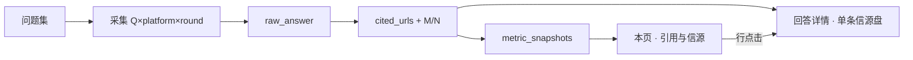
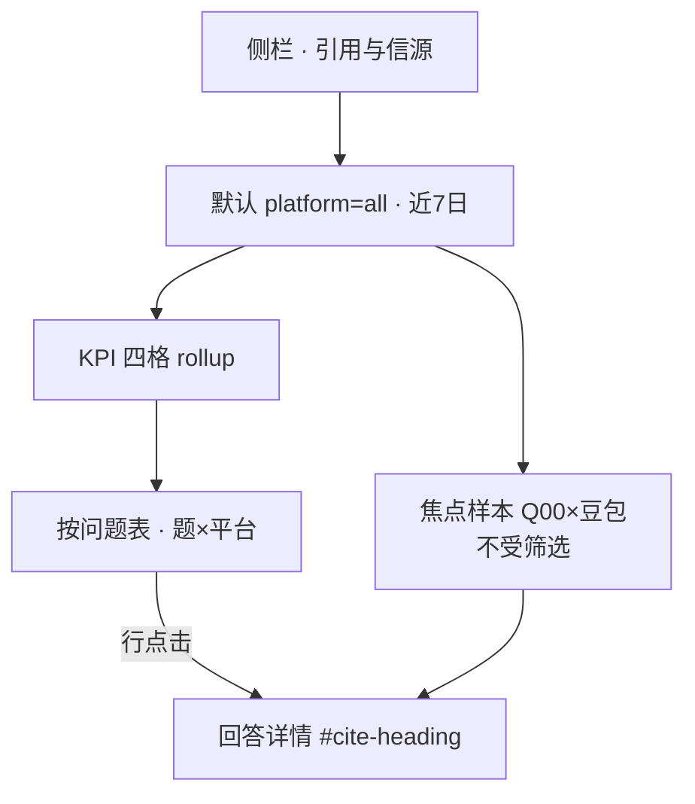

# 用户控制台 · 引用与信源 · 产品需求（PRD）

> **配套原型**：[citations.html](../../../../trinity-geo/marketing/console/citations.html)  
> **预览**：`cd apps/trinity-geo && bun run dev` → `/__geo_marketing/console/citations.html`  
> **样本**：Q00×豆包×R1 · [cited_sources.json](../../../../trinity-geo/mvp/data/r1/cited_sources.json)  
> **全景**：[原型页面清单](../v1-prototype-pages) · 数据流 [§0.6.2a](../product-design-analysis#citation-data-pipeline)

## 1. 背景与问题

> 「SOA 在总览上看过了，但不知道 **参考链接里有没有我们**、竞品 docs 占多少。」  
> 「豆包和 ChatGPT 信源结构不一样，能不能 **分开看**？」

**用户问题**：② 有没有被当证据源（CCR）？③ 参考链里有没有我（M/N）？来源结构里竞品 / 第三方 / 我方各占多少？

**固定样本**：Q00 · 豆包 · R1 — N=16 · M=0 · S1+S2+S3 · D1。

---

## 2. 用户故事

作为品牌营销 / SEO 负责人，我想要在一屏看清 CCR、信源命中率与按题×平台的 M/N，以便判断该改官网文档还是争取第三方评测，而不是只看 SOA 一个数。

---

## 3. 功能范围

**做**：跨题 CCR / M/N rollup、按题×平台表、来源结构、焦点样本下钻、平台可提取性说明。

**不做**：SOA 趋势总览（→ [dashboard](../../../../trinity-geo/marketing/console/dashboard.html)）；单条 16 URL 全文列表（→ [answer-detail#cite-heading](../../../../trinity-geo/marketing/console/answer-detail.html#cite-heading)）；R2 验收叙事（→ [verify](../../../../trinity-geo/marketing/console/verify.html)，本页只提供入口）。

---

## 4. 数据与规则

| 指标 | 用户问题 | 分子 / 分母 | 默认 |
|------|----------|-------------|------|
| **CCR** | 提到我时，有没有当证据源？ | 被引次数 / 提及次数 | platform=all · 近 7 日 |
| **信源命中率** | 参考链里有没有我？ | Σ 我方域 / Σ URL | 同上 |
| **可提取样本数** | 多少条能算 M/N？ | count(`citation_extractable=true`) | 同上 |

**rollup 定稿**：

| 区域 | 分 platform？ | 说明 |
|------|:-------------:|------|
| KPI、来源结构条 | 否 | 受页头筛选 |
| 按问题表 | **是** | 一行 = 一题 × 一平台 |
| 焦点 Q00 | **是**（固定） | 不受页头筛选 |

数据流 L0 真源：[§0.6.2a](../product-design-analysis#citation-data-pipeline)。

### 4.1 本页在数据流中的位置（L1）



---

## 5. 功能说明

| 模块 | 说明 | 优先级 |
|------|------|:------:|
| 筛选条 | 平台、时间窗、轮次 | P1 |
| KPI 四格 | §4 指标 | P1 |
| 按问题表 | CCR / M/N / 缺口 S* | P1 |
| 来源结构条 | 竞品官方 / 第三方 / 我方 | P1 |
| 焦点样本 | 固定 Q00 | P1 |
| 平台可提取性 | `citation_extractable` | P1 |

---

## 6. 交互

### 6.1 UI 读路径（L2）



### 6.2 筛选

| 筛选项 | 默认 | 不受筛选 |
|--------|------|----------|
| 平台 / 时间 / 轮次 | all · 7d · 全部 | 焦点 Q00；可提取性表 |

---

## 7. 异常与空态

| 场景 | 行为 |
|------|------|
| 无可提取样本 | M/N 标「—」+ 链可提取性表 |
| 筛选无行 | 空态 + 调整筛选 CTA |
| 部分平台不可提取 | M/N「—」；CCR 仍可展示 |

---

## 8. 验收标准

```
Given Q00 豆包 R1 已入库且 M/N=0/16
When 打开本页 platform=all
Then 按问题表 Q00·豆包 行正确；焦点样本不受筛选影响
```

```
Given 用户点击 Q00·豆包 行
When 进入回答详情
Then #cite-heading 与 cited_sources.json 一致
```

| 区块 | 预期 |
|------|------|
| 按问题 · Q00 | M/N=0/16 · S1+S2+S3 |
| 焦点样本 | 固定豆包 R1 |
| KPI 四格 | 演示数字；页头 ⓘ 说明 Mock |

---

## 关联

- [dashboard](../../../../trinity-geo/marketing/console/dashboard.html) — SOA  
- [answer-detail#cite-heading](../../../../trinity-geo/marketing/console/answer-detail.html#cite-heading) — 单条信源盘  
- [verify](../../../../trinity-geo/marketing/console/verify.html) — R2 Δ  
- [diagnosis](../../../../trinity-geo/marketing/console/diagnosis.html) — D1 + S*

## API（有后端时）

```text
GET /api/console/citations/summary?brand_id=trinity&platform=all&days=7
GET /api/console/citations/by-question?…&citation_extractable=true
GET /api/console/answers/:id/citations
```

## 埋点（商用前）

| 事件 | 触发 |
|------|------|
| `citations_view` | 进入本页 |
| `citations_filter_change` | 改筛选 |
| `citations_row_click` | 点击按问题表行 |

## Mock 真源对照（原型期）

| 模块 | 真源 | 状态 |
|------|------|------|
| Q00 行 / 焦点 | [r1/cited_sources.json](../../../../trinity-geo/mvp/data/r1/cited_sources.json) | 已入库 |
| 标注 | [r1/annotations.json](../../../../trinity-geo/mvp/data/r1/annotations.json) | 已入库 |
| KPI 四格 | 演示数字 | 演示 |

## 修订

| 日期 | 说明 |
|------|------|
| 2026-06-12 | 工程初稿 · `citations.md` |
| 2026-06-08 | v4：§4 L1 + §6 L2 mermaid |
| 2026-06-08 | v3：对齐标配清单 §1–§8 |
| 2026-06-08 | v2：重要内容前置 · 修订放末 |
