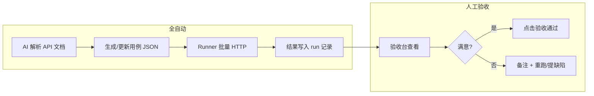

# API 生文验收台 — 实行计划（MVP）

> **状态**：草案 · **验收台落点已确认：`apps/trinity-product`**  
> **关联文档**：[`API对外接口支持参数.md`](./API对外接口支持参数.md)（生文 § 一）  
> **产品手册入口（计划）**：`apps/trinity-product` → 侧栏「运营后台管理平台」→ **API 验收台**  
> **目标读者**：工程、测试、产品验收  
> **MVP 范围**：仅 **生文** `POST /v1/chat/completions`；**示例模型 2 个**；**执行与用例生成全自动（AI + 脚本）**；**人工仅做验收确认**

---

## 1. 背景与目标

### 1.1 背景

- 对外生文接口参数与示例已在 `API对外接口支持参数.md` 收敛。
- 多模型（如 `gpt-5.5`、`claude-opus-4-7` 等）需批量验证：**路由、鉴权、同步/流式、参数契约** 是否与文档一致。
- 纯 curl/Postman 难以支撑「一键跑全量 + 可视化 + 验收签字」；期望 **AI 生成用例 + 自动执行 + 验收页点选确认**。

### 1.2 MVP 目标

| 目标 | 说明 |
|---|---|
| **可复现** | 同一套用例 JSON + 同一 runner，任何人可重复跑 |
| **全自动执行** | 打开验收台或触发「运行全部」后，无需手写请求 |
| **可视化** | 表格展示每条用例 × 模型的状态、耗时、错误、响应摘要 |
| **人工只验收** | 验收人查看结果后，对单条/整组点击「通过 / 不通过」并可选备注 |
| **可扩展** | 架构预留生图、生视频 Tab，MVP 不实现 |

### 1.3 非目标（MVP 不做）

- 不接生产 CI/CD 门禁（可二期 nightly 复用用例 JSON）。
- 不做性能压测、长稳、成本计费对账。
- 不替代 `大模型文本接口.md` 等内部实现文档的维护（仍遵守文档维护强约束）。

---

## 2. MVP 范围

### 2.1 接口

| 项 | 值 |
|---|---|
| 方法 | `POST` |
| 路径 | `/v1/chat/completions` |
| 鉴权 | `Authorization: Bearer xh-...` |

### 2.2 示例模型（仅 2 个）

MVP 以 **2 个代表模型** 跑通全流程；全量模型列表在二期按同一机制扩展。

| 优先级 | `model`（请求体） | 用途 |
|---|---|---|
| P0-A | `gpt-5.5` | 通用旗舰生文代表 |
| P0-B | `claude-opus-4-7` | 第二厂商 / 长推理代表 |

> **注意**：实际上架字符串以运营/网关为准；若与上表不一致，验收台配置中改 `models.json` 即可，不改 runner 逻辑。

### 2.3 用例规模（建议）

| 类型 | 条数（每模型都跑） | 说明 |
|---|---|---|
| 冒烟 | 2 | 最小请求；全参数同步 |
| 流式 | 1 | `stream: true` |
| 消息 | 2 | 多轮；省略 `role` 默认 user |
| 参数 | 2 | `max_tokens` 截断；`modalities` 省略 vs `["text"]` |
| 负例 | 3 | 非法 model、无鉴权、空 `content` |
| **合计** | **约 10 条用例 × 2 模型 = 20 次执行** | 单次全量约数分钟级（视上游延迟） |

用例 ID 命名示例：`T-SMOKE-01`、`T-STREAM-01`、`T-NEG-01`（详见 §5）。

---

## 3. 角色与分工



| 角色 | 职责 |
|---|---|
| **AI（Cursor / 脚本提示）** | 从 `API对外接口支持参数.md` 生成/同步用例 JSON；失败时归纳可能原因（不替代人工签字） |
| **Runner（确定性程序）** | 发 HTTP、断言、记耗时、存响应；**不做** 主观「业务好坏」判断 |
| **验收人** | 看可视化结果；对每条或每组点 **验收通过 / 不通过**；填备注 |

---

## 4. 系统架构

### 4.1 逻辑模块

| 模块 | 职责 | 技术选型（建议） |
|---|---|---|
| **用例库** | 存用例定义、模型列表、断言规则 | `tests/api-acceptance/cases/chat-completions.json` |
| **Runner** | 执行单条/批量用例，输出结构化结果 | Node 脚本（`fetch`）或验收页内调用同一 TS 模块 |
| **结果存储** | 每次 run 的 JSON 报告（本地文件） | `tests/api-acceptance/runs/{runId}.json` |
| **验收台 UI** | 表格、运行按钮、详情抽屉、验收状态 | **`apps/trinity-product`**（VitePress 自定义 Vue 页，见 §4.4） |
| **配置** | `BASE_URL`、`API_KEY`（不入库） | 见 §4.5（内测地址 + 代理） |

### 4.2 内测 BASE_URL 与代理方案（通俗说明）

评审清单里的这两项，指的是：**验收台在浏览器里点「运行」时，请求最终发到哪、怎么发才不被浏览器拦住**。

#### 什么是内测 BASE_URL？

**BASE_URL = 内测阶段 Trinity API 网关的根地址**（不含具体路径）。

| 概念 | 示例 | 说明 |
|---|---|---|
| **BASE_URL** | `http://43.159.57.43` | 文档与 curl 示例里用的内测机/内测域名 |
| **完整生文地址** | `http://43.159.57.43/v1/chat/completions` | = BASE_URL + `/v1/chat/completions` |

- **内测**：给团队联调、验收用，**不是**最终生产域名；以后切预发/生产只改 BASE_URL 配置。
- 验收台顶栏会展示当前 BASE_URL，避免「测错环境」。

#### 为什么需要「代理方案」？

验收台跑在 **产品手册**（例如 `http://127.0.0.1:5206/product/...`），API 在 **另一台机器**（例如 `http://43.159.57.43`）。  
浏览器默认 **不允许** 网页随意跨域调别的域名（**CORS**），直连常会失败；Key 也不适合写死在页面里。

**代理方案** = 浏览器只访问 **同源** 地址，由 **本地/同站的服务端** 转发到真实网关：

```text
验收台页面（127.0.0.1:5206）
    → POST /product/__trinity_api_acceptance/run   （同源，浏览器允许）
         → Vite 开发插件 / 内网 Nginx 转发
              → POST http://43.159.57.43/v1/chat/completions  （真实内测 BASE_URL）
```

| 方式 | 适用 | 说明 |
|---|---|---|
| **开发期 Vite 插件** | `npm run dev -w @trinity/app-trinity-product` | 与现有 `devDocEditorServer` 同模式；**仅 localhost** 可用 |
| **内网静态部署 + Nginx** | 产品手册 build 后挂内网 | Nginx 把 `/__trinity_api_acceptance/*` 反代到内测 BASE_URL |
| **CLI Runner 直连** | 终端 `npm run test:api-acceptance` | 不经过浏览器，**不需要** CORS 代理；与验收台共用用例 JSON |

MVP 建议：**验收台走 Vite 插件代理**；CI/脚本走 **环境变量 BASE_URL 直连**。

#### API Key 放哪？

| 场景 | 做法 |
|---|---|
| 浏览器验收台 | 页内粘贴 Key → 经 **代理** 注入 `Authorization`（或仅存 sessionStorage，由代理读取） |
| CLI Runner | `TRINITY_API_KEY` 写在本地 `.env.local`，**不进 git** |

### 4.3 请求路径（避免 CORS）

| 环境 | 做法 |
|---|---|
| 本地产品手册 dev | Vite 插件：`/__trinity_api_acceptance/*` → 转发至内测 BASE_URL |
| 内网部署验收台 | Nginx 同源反代；Key 在服务端环境变量 |
| 终端 Runner | 直连 `TRINITY_API_BASE_URL`，无代理 |

浏览器 **不** 在仓库中写死 Key。

### 4.4 落点：`apps/trinity-product`（已确认）

产品手册已是 **AI API 聚合平台** 文档真源；验收台与手册、运营模块同站，便于内测时「看文档 → 点验收」。

| 项 | 计划 |
|---|---|
| **访问路径** | `/ai-api-platform/api-test/chat-completions`（侧栏 **API 测试** → 生文验收台，与运营后台同级） |
| **UI 实现** | `.vitepress/theme/ApiAcceptanceConsole.vue` + 对应 CSS |
| **Markdown 壳页** | `docs/ai-api-platform/operations/api-acceptance.md` 嵌入上述组件 |
| **Dev 代理/Runner API** | `.vitepress/plugins/apiAcceptanceServer.ts`（模式对齐 `devDocEditorServer.ts`，仅 localhost） |
| **本地命令** | `npm run dev -w @trinity/app-trinity-product` → 打开验收台页 |

与现有 **Dev 文档编辑器** 同一套路：VitePress 文档站 + 本地专用中间件，不单独再起一个 app。

### 4.5 目录结构（计划）

```text
apps/trinity-product/
  docs/ai-api-platform/api-test/chat-completions.md   # 验收台入口页
  .vitepress/
    plugins/apiAcceptanceServer.ts                    # localhost 代理 + 执行 API
    theme/
      ApiAcceptanceConsole.vue
      api-acceptance.css
  acceptance/                                         # 验收台数据（纳入 git）
    config/
      env.example.json                                # BASE_URL 示例
      models.mvp.json                                 # MVP 两模型
    cases/
      chat-completions.json                           # 用例（AI 生成初稿 + 人审）
    prompts/
      generate-cases.md                               # AI 生成用例提示词
    runs/                                             # .gitignore，本地运行结果

tests/api-acceptance/                                 # 可选：CLI Runner 与 product 共用 acceptance/
  runner/run.ts                                       # npm run test:api-acceptance
```

> Runner 与验收台 **共用** `apps/trinity-product/acceptance/cases/*.json`，避免两套用例漂移。

---

## 5. 用例设计（MVP 清单）

### 5.1 用例 JSON 结构（约定）

```json
{
  "id": "T-SMOKE-01",
  "title": "最小请求-单条 user",
  "category": "smoke",
  "request": {
    "model": "{{model}}",
    "messages": [{ "role": "user", "content": "用不超过50字介绍多云成本优化。" }],
    "stream": false
  },
  "expect": {
    "httpStatus": 200,
    "assertions": ["has_assistant_content", "usage_present_optional"]
  }
}
```

- `{{model}}` 由 runner 按 `models.mvp.json` 展开为矩阵行。
- 流式用例增加 `"stream": true`，断言改为 `sse_completed`、`has_delta_content`。

### 5.2 MVP 用例表

| ID | 类别 | 要点 | 期望 |
|---|---|---|---|
| T-SMOKE-01 | 冒烟 | 仅 `model` + 1 条 `user` | 200，有回复正文 |
| T-SMOKE-02 | 冒烟 | 全参数同步（temperature/top_p/max_tokens/modalities） | 200 |
| T-STREAM-01 | 流式 | `stream: true` | SSE 正常结束 |
| T-MSG-01 | 消息 | system + user + assistant + user | 200 |
| T-MSG-02 | 消息 | 不传 `messages[].role` | 200（默认 user） |
| T-PARAM-01 | 参数 | `max_tokens: 32` | 200，输出较短 |
| T-PARAM-02 | 参数 | 省略 `modalities` | 200 |
| T-NEG-01 | 负例 | `model: "invalid-model-id"` | 4xx |
| T-NEG-02 | 负例 | 无 `Authorization` | 401/403 |
| T-NEG-03 | 负例 | `content: ""` | 4xx |

**矩阵**：上表 10 条 × `gpt-5.5`、`claude-opus-4-7` = **20 条执行记录**。

### 5.3 AI 自动生成用例（流程）

1. **输入**：`API对外接口支持参数.md` 第一章 + 本计划 §5.2 表 + `models.mvp.json`。
2. **提示词真源**：`apps/trinity-product/acceptance/prompts/generate-cases.md`（写明字段约束、禁止编造未文档参数）。
3. **输出**：覆盖写入 `cases/chat-completions.json`（PR 评审）。
4. **触发时机**：文档变更时由负责人 @AI 重新生成 diff，人工扫一眼再合并。

---

## 6. Runner 行为（全自动）

### 6.1 执行命令（计划）

```bash
# 环境：tests/api-acceptance/.env.local
# TRINITY_API_BASE_URL=http://43.159.57.43
# TRINITY_API_KEY=xh-...

npm run test:api-acceptance          # 全量 MVP 矩阵
npm run test:api-acceptance -- --case T-SMOKE-01 --model gpt-5.5
```

### 6.2 每条执行记录

| 字段 | 说明 |
|---|---|
| `caseId` / `model` | 用例与模型 |
| `startedAt` / `durationMs` | 时间 |
| `httpStatus` | HTTP 状态 |
| `pass` | 断言是否通过（机器） |
| `error` | 失败原因摘要 |
| `responsePreview` | 截断后的 content 或 SSE 汇总 |
| `rawPath` | 可选：完整响应落盘路径 |

### 6.3 断言（机器，非验收）

| 断言 ID | 规则 |
|---|---|
| `has_assistant_content` | 同步：解析 `choices[0].message.content` 非空 |
| `sse_completed` | 流式：收到结束事件或 `[DONE]` |
| `http_status` | 与 `expect.httpStatus` 或范围一致 |

**机器 pass ≠ 验收通过**；验收台默认机器 pass 为「待验收」，人工点 ✅ 后才记 `accepted: true`。

---

## 7. 验收台 UI（可视化 + 手动点击）

### 7.1 页面区块

| 区块 | 功能 |
|---|---|
| **顶栏** | 环境（BASE_URL）、Key 状态、**运行全部**、**仅跑失败项**、导出报告 |
| **筛选** | 模型、类别（冒烟/流式/负例）、机器 pass/fail、验收状态 |
| **主表** | 列：用例 ID、标题、model、机器结果、耗时、验收状态、操作 |
| **操作列** | **运行** · **详情** · **验收通过** · **验收不通过** |
| **详情抽屉** | 请求 JSON、响应 JSON/SSE 日志、断言明细、备注输入 |

### 7.2 验收状态机

| 状态 | 含义 |
|---|---|
| `pending` | 未跑或已跑但未人工验收 |
| `accepted` | 人工 ✅ |
| `rejected` | 人工 ❌（需备注） |

可选：**整组验收** — 对「T-SMOKE-* + gpt-5.5」一次通过。

### 7.3 报告导出

- 导出 Markdown / CSV：`runId`、时间、模型、用例、机器结果、验收人、备注。
- 用于内测纪要附件。

---

## 8. 里程碑与排期（建议 5 个工作日）

| 阶段 | 产出 | 负责 | 工期 |
|---|---|---|---|
| **M0** | 本文档评审通过；确认 2 个 model id、BASE_URL | 全员 | 0.5d |
| **M1** | `cases/chat-completions.json` + `models.mvp.json`（AI 生成 + 人审） | 工程 | 1d |
| **M2** | CLI Runner 可跑通 20 条并写 `runs/*.json` | 工程 | 1.5d |
| **M3** | 验收台 UI（`trinity-product` 页 + 插件代理） | 工程 | 1.5d |
| **M4** | 走一遍验收流程；修文档/实现偏差；归档首份报告 | 验收人 | 0.5d |

---

## 9. 验收流程（人工 SOP）

1. 配置 `BASE_URL` 与 Key（本地或验收台粘贴）。
2. 点击 **运行全部** → 等待完成（进度条/条数）。
3. 筛选 **机器 fail** → 打开详情 → 判断是 **用例问题 / 网关问题 / 上游问题**。
4. 对 **机器 pass** 的行抽检 → 看响应是否合理。
5. 逐条或按组点击 **验收通过**；有问题点 **不通过** 并写备注。
6. 导出报告，附在内测纪要；未通过项开缺陷单。

---

## 10. 风险与对策

| 风险 | 对策 |
|---|---|
| model id 与网关不一致 | `models.mvp.json` 可配置；文档变更同步 |
| CORS 阻断浏览器直连 | 必做 dev/prod 反向代理 |
| 流式断言不稳定 | Runner 设总超时；SSE 解析单测 |
| AI 生成用例编造参数 | 提示词约束 + PR 人工 diff 审核 |
| Key 泄露 | 不入 git；`.env.local` + sessionStorage |
| 上游限流 429 | Runner 串行 + 可配置间隔；失败标记 retry |

---

## 11. 二期扩展（不在 MVP）

| 项 | 说明 |
|---|---|
| 模型扩全 | 其余生文 model 仅增配置，不改用例框架 |
| 生图 | 新 `cases/chat-completions-image.json`，`modalities` + `image_config` |
| 生视频 | `POST /v1/video/generations` + 轮询 UI |
| CI | nightly 跑 P0 子集，与验收台共用 JSON |
| 权限 | 验收记录入库、多用户（可选接运营后台） |

---

## 12. 评审检查清单

- [ ] 2 个示例 model id 已与网关/运营确认
- [ ] 内测 **BASE_URL** 已定（默认候选：`http://43.159.57.43`，以运维为准）
- [ ] **代理**：本地 dev 用 `apiAcceptanceServer`；内网部署是否需要 Nginx 反代（若仅 localhost 验收可 MVP 不做）
- [x] 验收台放在 **`apps/trinity-product`**（侧栏 `api-acceptance`）
- [ ] 用例 JSON 纳入 git（`acceptance/cases/`）；`acceptance/runs/` 不纳入
- [ ] 首版验收人名单与 M4 日期

---

## 修订记录

| 日期 | 说明 |
|------|------|
| 2026-05-27 | 初稿：生文 MVP、双模型示例、AI 自动化 + 人工验收 |
| 2026-05-27 | 验收台落点定为 `trinity-product`；补充 BASE_URL / 代理通俗说明 |
