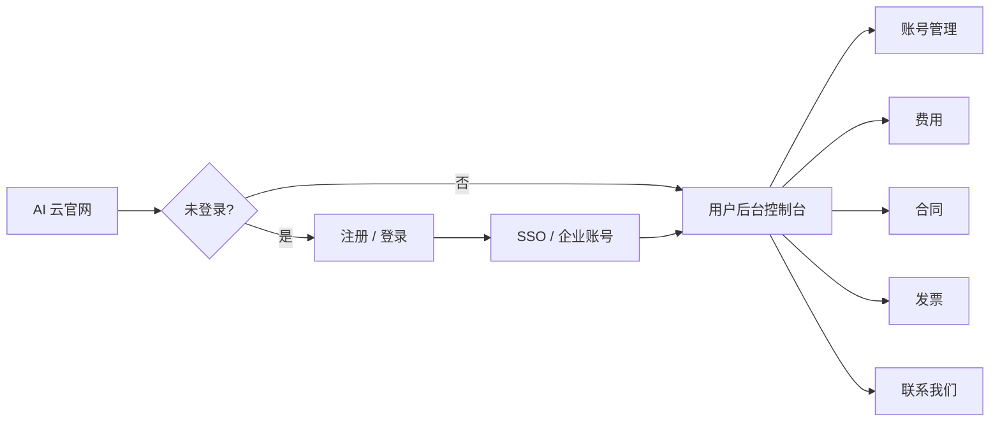

# AI 云 · 用户后台管理 — 需求理解（初稿）

> **状态**：产品/设计对齐稿（2026-05-21）  
> **读者**：产品、设计、前端（`apps/ai-cloud`）  
> **规范母版**：[用户后台管理风格统一规范.md](./用户后台管理风格统一规范.md) · 工程参照 `apps/trinity-ai/src/views/account/`  
> **营销对照**：`TrinityCloud/home.html` Hero 右侧「用户中心 · 账号与费用概览」示意卡

---

## 1. 一句话目标

在 **AI 云** 完成官网注册/登录（含 **SSO**）之后，为 **企业租户** 提供一套 **自助式用户后台**：按 Trinity **用户后台规范**（OpenRouter 式控制台，非运营后台）管理 **多云账号、费用、合同、发票与联系**，与官网叙事（多云代理、渠道优惠、合约与开票）闭环。

---

## 2. 与现有资产的关系

| 资产 | 角色 |
|------|------|
| **`TrinityCloud/home.html`** | 官网落地页；顶栏登录/注册弹层；Hero 已 **预告**「用户中心 · 账号与费用概览 + SSO」——用户后台是该校验卡的产品化实现 |
| **`apps/ai-cloud`** | Vue 原型 app（当前仅骨架 `Home.vue`）；用户后台宜在此按 **account 五件套** 落地 |
| **`apps/trinity-ai/.../account/`** | **DOM / CSS / 交互** 工程母版（`ConsolePage.vue`、`account.css`、`mock.ts`） |
| **`/user-console-spec`** | 设计枢纽打样（布局 + token，非完整业务） |
| **`docs/02` 运营后台** | **平台内部** 用的若依式后台；**不**承接本需求（若将来有 `ai-cloud-admin` 另立项） |

**分轨原则（再次强调）**：本后台面向 **已签约/已开户的企业客户** 自助查看与申请；**不是** Trinity 员工在后台代客改合同、改折扣的运营系统。

---

## 3. 用户旅程（顶部流程）

理解中的 **端到端路径**：



| 阶段 | 说明 | 原型期假设 |
|------|------|------------|
| **官网** | `TrinityCloud/home.html` 或迁入 `apps/ai-cloud` 的营销首页；顶栏 **登录 / 注册** | 登录成功后可跳转控制台或顶栏显示「进入用户中心」 |
| **注册 / 登录** | 企业账号（邮箱/手机 + 密码）+ 可选 **Google / GitHub**（与现网 auth 弹层一致） | 注册与登录 **不在** 控制台壳内重做布局；可 hash 弹层或独立路由，对齐 Trinity AI `account/login` → 首页 `#login` 的 redirect 策略 |
| **SSO** | 单点登录：同一 Trinity 身份可进入 AI 云用户中心（与 Hero 徽章「SSO 单点登录」一致） | 原型阶段可用 **已登录 Mock 态** + 顶栏账户菜单；真 SSO 协议（OIDC/SAML）属后端契约，UI 只预留「当前企业 / 用户」展示位 |
| **用户后台** | 登录后默认进入 **账号管理** 或 **费用概览**（待产品拍板默认 landing hash） | 单路由 `account/console` + hash 分区，与 `@account` 同构 |

---

## 4. 信息架构（侧栏 ↔ 主内容）

### 4.1 侧栏分组（用户中心模块）

按你的描述，左侧导航 **仅保留「用户中心」一条线**（无 Trinity AI 的「API 管理 / 密钥」区）：

| 侧栏项 | 建议 hash | 分组标题 | 职责摘要 |
|--------|-----------|----------|----------|
| **账号管理** | `#accounts` | 用户中心 | 多云 **子账号/项目账号** 列表与详情入口 |
| **费用** | `#billing` | 用户中心 | **各云费用概览** + 分云消耗明细 |
| **合同** | `#contracts` | 用户中心 | 与 Trinity / 云厂商相关的 **合约** 状态与文档 |
| **发票** | `#invoices` | 用户中心 | **开票主体、抬头、可开票金额**、开票申请与记录 |
| **联系我们** | `#contact` | 用户中心 | 顾问、工单或商务联系入口（偏静态 + 表单） |

可选 **「产品」** 分组（与 Trinity AI 控制台一致）：链回 **AI 云官网**、文档、咨询预约等，不占主业务 hash。

> **命名约定**：hash 常量集中在 `mock.ts`（如 `AI_CLOUD_CONSOLE_HASH`），侧栏 `RouterLink` / `<a href="#...">` 与 `data-or-panel` 一一对应，避免硬编码双轨。

### 4.2 与 Trinity AI Account 的差异

| Trinity AI `@account` | AI 云用户后台 |
|----------------------|---------------|
| API 管理：密钥、Preset | **无**（或远期「API 密钥」若云 API 代理另开） |
| 账户：额度、活动、用量 | 替换为 **费用、合同、发票** |
| 开发者 / API 用量叙事 | **多云采购、渠道账期、合约与税务** 叙事 |

**不变**：`.account-console-root` → `.or-shell` → `aside.or-side` + `.or-main`；页内 `or-*-pagehead`、`.btn.btn-gradient`、形式 2 筛选、`or-modal-root` 等（见统一规范 §5–9）。

---

## 5. 各模块内容理解

### 5.1 账号管理（默认区候选）

**用户意图**：看清「我在 Trinity AI 云下挂了哪些云、叫什么、何时接入、谁在用」。

| 字段（列表列 / 卡片） | 说明 |
|----------------------|------|
| **云厂商** | 阿里云、腾讯云、华为云、AWS、GCP 等；带厂商色标或图标（token 色，非随意 hex） |
| **名称 / ID** | 业务可读名称 + 云侧账号 ID / UIN（脱敏展示规则与运营后台无关，按租户自助级别设计） |
| **创建时间** | 开户/绑定 Trinity 代理关系的时间 |
| **身份信息** | 认证主体、企业名称、统一社会信用代码等 **可展示字段**（敏感项脱敏）；状态如「已认证 / 待补充」 |

**交互（原型）**：

- 列表：`table.data-table` 或卡片列表（与 `or-keys-table` 同族密度），支持按云厂商筛选（形式 2）。
- 行操作：查看详情（侧滑或弹窗）、「申请绑定新云」类主 CTA（`btn-gradient`）——具体流程可链到官网「优惠购买流程」五步中的开户步骤说明。

**与 Hero 示意对齐**：`home-preview-row` 行文案（「阿里云 · 电商业务主账号」「已配置优惠」）即本区列表行的 **营销缩写**。

---

### 5.2 费用

**用户意图**：一眼看到 **多云总消费** 与 **各云各自消耗**，支撑成本管控与优惠感知。

建议 **同一 hash 内上下结构**（或子 tab，仍用单页避免多路由）：

| 区块 | 内容 |
|------|------|
| **概览 KPI** | 本月总消费、环比、渠道节省比例/金额（对齐 Hero KPI：¥42.8w、12% 节省） |
| **分布图** | 多云消费占比（堆叠条/图例 — 与 Hero `home-preview-stack` 一致语义） |
| **分云明细表** | 云厂商、账号、账期、消耗金额、优惠后应付、状态 |
| **下钻** | 行点击可进「该云账单明细」占位（原型 Mock 行即可） |

**数据边界（理解）**：数字来自 Trinity 聚合账单/云厂商回传，**非**客户在云控制台原生账单的 1:1 镜像；文案需说明统计口径与延迟（`or-lead` + `details` 帮助）。

---

### 5.3 合同

**用户意图**：查看与 Trinity / 渠道相关的 **合约是否生效、覆盖哪些云、账期与商务条款摘要**。

| 元素 | 说明 |
|------|------|
| 列表 | 合同编号、类型（框架/补充）、关联云厂商、生效/到期日、状态 |
| 详情 | PDF/附件下载占位、关键条款摘要（非律师全文）、 renewal 提醒 |
| 空态 | 无合约时引导「联系顾问签约」→ `#contact` |

Hero 行 `合约生效中` 对应本模块状态标签。

---

### 5.4 发票

**用户意图**：维护 **己方公司开票信息**，管理 **发票抬头**，查看 **可开票金额** 并发起开票。

| 区块 | 内容 |
|------|------|
| **公司信息** | 开票公司名称、税号、地址电话、开户行账号（表单编辑 + 保存） |
| **发票抬头** | 可多条抬头；默认抬头标记 |
| **可开票金额** | 当前账期内已消费且未开票余额（与费用模块对账） |
| **开票记录** | 申请单号、金额、类型（专票/普票）、状态、下载 |

**交互**：编辑公司信息/抬头用 `or-modal-root`；主操作「申请开票」为 `btn-gradient`；弹窗底栏纯文字按钮（规范 §8.3）。

---

### 5.5 联系我们

**用户意图**：已登录客户 **快速找到专属顾问 / 提交咨询**，与官网 CTA「立即咨询优惠」形成闭环。

| 内容 | 说明 |
|------|------|
| 顾问卡片 | 姓名、企微/电话、服务时间（Mock） |
| 表单 | 主题、关联云账号（可选下拉）、描述、附件占位 |
| 其它 | 7×24 支持说明、文档链接 |

本区 **列表密度低**，可不强行套表格页头模板，但仍用 `or-page-title` + `or-lead` 保持节奏一致。

---

## 6. 布局与规范落地（技术理解）

### 6.1 推荐工程结构（`apps/ai-cloud`）

```
src/views/
  shell/                 # AI 云顶栏：品牌、官网导航、登录态、进入用户中心
  account/               # 或 console/ — 五件套
    ConsolePage.vue
    ai-cloud-console.css # 首版可复制 account.css，模块前缀逐步改为 or-cloud-*
    mock.ts              # AI_CLOUD_CONSOLE_HASH、静态 Mock 行
    consoleInteractions.ts
    README.md
```

- 路由：`/ai-cloud/account/console`（门户 `trinity-portal` 挂载时带前缀；独立 dev 时 `createWebHistory(BASE_URL)`）。
- 样式链：`@trinity/tokens` → `trinity-base.css` → 控制台 CSS；**禁止** `admin-theme.css` / Element Plus 业务表。

### 6.2 默认 landing

| 选项 | 理由 |
|------|------|
| **`#accounts`（账号管理）** | 与你描述的「中心主内容区字段」优先一致；先建立「有哪些云账号」心智 |
| **`#billing`（费用）** | 与 Hero 示意 KPI 最强；偏财务角色 |

**建议**：产品确认前，原型可采用 **`#accounts`** 为默认 hash，费用区作为登录后顶栏菜单第二入口。

### 6.3 登录态与壳层

- 顶栏：未登录显示「登录」；已登录显示企业名/头像 + 下拉「用户中心」「退出」。
- 控制台内 **不再** 嵌套第二套顶栏；仅 `header.or-inject`（产品壳）+ 控制台左栏。

---

## 7. 原型阶段 Mock 与 API 边界

| 数据域 | 原型 | 正式期 |
|--------|------|--------|
| 云账号列表 | `mock.ts` 5 条，覆盖 3～4 家厂商 | 租户云账号 API |
| 费用汇总 | 固定 KPI + 静态分布 | 账单聚合 API |
| 合同 / 发票 | 各 3～5 条假数据 | 商务/财务系统 |
| SSO | `localStorage` 或 query `?mockLoggedIn=1` | 统一身份服务 |

交互：hash ↔ `data-or-panel` `hidden` 切换；形式 2 筛选、弹窗可先复用 `adm-form2-dd.js` 注入顺序（与 `@account` 一致）。

---

## 8. 明确不在本期（避免范围漂移）

- **平台运营后台**：代客改价、审核合同、人工开票 — `docs/02` + `trinity-ai-admin` 轨道。
- **云厂商原生控制台**：仅外链或说明，不做 iframe 全嵌入。
- **Trinity AI API 密钥 / 模型用量**：属 `trinity-ai` Account，不并入 AI 云侧栏（除非产品 later 统一「Trinity 账户中心」 mega-console，需另开 IA 议题）。
- **完整 SSO 协议实现**：UI 只表达登录态与跳转；协议由后端定义。

---

## 9. 产品确认（2026-05-21）

| 项 | 结论 |
|----|------|
| **默认首页 hash** | **账号管理**（`#accounts`） |
| **费用 / 合同 / 发票 / 联系** | **以简单为主**（KPI/列表占位，不接复杂表单与 legacy 脚本） |
| **官网** | 已迁入 **`apps/ai-cloud/src/views/home/HomePage.vue`**（单文件 1:1）；`TrinityCloud/home.html` 仅保留跳转 `/ai-cloud` |
| 身份信息粒度、多主体、币种、工单、SSO | **后续迭代**再定；原型用单企业 Mock |

工程入口：`apps/ai-cloud/src/views/account/` · 门户 `/ai-cloud/account/console#accounts`

---

## 10. 实现状态与后续

**已完成（原型）**

- `apps/ai-cloud`：壳层 + `account/console` 五区；默认 `#accounts`；复用 `account.css`
- 门户：`/ai-cloud/account/console#accounts`
- 官网：`HomePage.vue` 单文件（`npm run gen:home` 可从静态再生成）

**后续可选**

- 官网登录成功后跳转用户中心；SSO / 真 API
- 费用/合同/发票区加深（形式 2 筛选、弹窗、对账口径文案）
- 对照 `/user-console-spec` 走查

---

## 11. 修订记录

| 日期 | 说明 |
|------|------|
| 2026-05-21 | 初稿：基于用户需求 + `docs/03` 规范 + `TrinityCloud/home.html` Hero 示意整理 |
