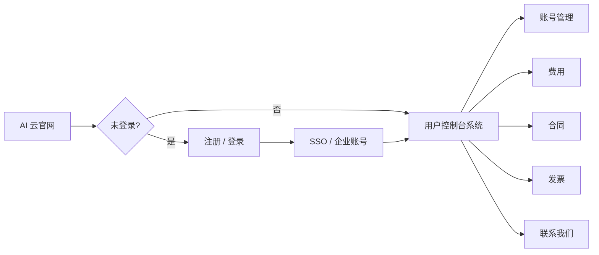

# AI 云 · 用户控制台系统 — 需求理解

> **产品需求真源（本文件）**：业务字段、交互、分期范围写在此；**勿**把 PRD 整段抄进 `apps/ai-cloud/src/views/account/README.md`（五件套 README 仅工程索引，链到本文 §5.x）。  
> **状态**：产品/设计对齐稿（2026-05-21）；§5.1 账号管理已定稿  
> **读者**：产品、设计、前端（`apps/ai-cloud`）  
> **规范母版**：[用户控制台系统-风格统一规范.md](./用户控制台系统-风格统一规范.md) · 工程五件套 `apps/ai-cloud/src/views/account/README.md`  
> **营销对照**：`TrinityCloud/home.html` Hero 右侧「用户中心 · 账号与费用概览」示意卡

---

## 1. 一句话目标

在 **AI 云** 完成官网注册/登录（含 **SSO**）之后，为 **企业租户** 提供一套 **自助式用户控制台系统**：按 Trinity **用户控制台系统规范**（OpenRouter 式控制台，非运营后台）管理 **多云账号、费用、合同、发票与联系**，与官网叙事（多云代理、渠道优惠、合约与开票）闭环。

---

## 2. 与现有资产的关系

| 资产 | 角色 |
|------|------|
| **`TrinityCloud/home.html`** | 官网落地页；顶栏登录/注册弹层；Hero 已 **预告**「用户中心 · 账号与费用概览 + SSO」——用户控制台系统是该校验卡的产品化实现 |
| **`apps/ai-cloud`** | Vue 原型 app（当前仅骨架 `Home.vue`）；用户控制台系统宜在此按 **account 五件套** 落地 |
| **`apps/trinity-ai/.../account/`** | **DOM / CSS / 交互** 工程母版（`ConsolePage.vue`、`account.css`、`mock.ts`） |
| **`/user-console-spec`** | 设计枢纽打样（布局 + token，非完整业务） |
| **`docs/02` 运营后台** | **平台内部** 用的若依式后台；**不**承接本需求（若将来有 `ai-cloud-admin` 另立项） |

**分轨原则（再次强调）**：本后台面向 **已签约/已开户的企业客户** 自助查看与申请；**不是** Trinity 员工在后台代客改合同、改折扣的运营系统。

---

## 3. 用户旅程（顶部流程）

理解中的 **端到端路径**：



| 阶段 | 说明 | 原型期假设 |
|------|------|------------|
| **官网** | `TrinityCloud/home.html` 或迁入 `apps/ai-cloud` 的营销首页；顶栏 **登录 / 注册** | 登录成功后可跳转控制台或顶栏显示「进入用户中心」 |
| **注册 / 登录** | 企业账号（邮箱/手机 + 密码）+ 可选 **Google / GitHub**（与现网 auth 弹层一致） | 注册与登录 **不在** 控制台壳内重做布局；可 hash 弹层或独立路由，对齐 Trinity AI `account/login` → 首页 `#login` 的 redirect 策略 |
| **SSO** | 单点登录：同一 Trinity 身份可进入 AI 云用户中心（与 Hero 徽章「SSO 单点登录」一致） | 原型阶段可用 **已登录 Mock 态** + 顶栏账户菜单；真 SSO 协议（OIDC/SAML）属后端契约，UI 只预留「当前企业 / 用户」展示位 |
| **用户控制台系统** | 登录后默认进入 **账号管理** 或 **费用概览**（待产品拍板默认 landing hash） | 单路由 `account/console` + hash 分区，与 `@account` 同构 |

---

## 4. 信息架构（侧栏 ↔ 主内容）

### 4.1 侧栏分组（用户中心模块）

按你的描述，左侧导航 **仅保留「用户中心」一条线**（无 Trinity AI 的「API 管理 / 密钥」区）：

| 侧栏项 | 建议 hash | 分组标题 | 职责摘要 |
|--------|-----------|----------|----------|
| **账号管理** | `#accounts` | 用户中心 | 多云 **子账号/项目账号** 列表与详情入口 |
| **费用** | `#billing` | 用户中心 | **各云费用概览** + 分云消耗明细 |
| **合同** | `#contracts` | 用户中心 | 与 Trinity / 云厂商相关的 **合约** 状态与文档 |
| **发票** | `#invoices` | 用户中心 | **开票主体、抬头、可开票金额**、开票申请与记录 |
| **联系我们** | `#contact` | 用户中心 | 顾问、工单或商务联系入口（偏静态 + 表单） |

可选 **「产品」** 分组（与 Trinity AI 控制台一致）：链回 **AI 云官网**、文档、咨询预约等，不占主业务 hash。

> **命名约定**：hash 常量集中在 `mock.ts`（如 `AI_CLOUD_CONSOLE_HASH`），侧栏 `RouterLink` / `<a href="#...">` 与 `data-or-panel` 一一对应，避免硬编码双轨。

### 4.2 与 Trinity AI Account 的差异

| Trinity AI `@account` | AI 云用户控制台系统 |
|----------------------|---------------|
| API 管理：密钥、Preset | **无**（或远期「API 密钥」若云 API 代理另开） |
| 账户：额度、活动、用量 | 替换为 **费用、合同、发票** |
| 开发者 / API 用量叙事 | **多云采购、渠道账期、合约与税务** 叙事 |

**不变**：`.account-console-root` → `.or-shell` → `aside.or-side` + `.or-main`；页内 `or-*-pagehead`、`.btn.btn-gradient`、形式 2 筛选、`or-modal-root` 等（见统一规范 §5–9）。

---

## 5. 各模块内容理解

### 5.1 账号管理（核心纳管模块 · `#accounts` 定稿）

**用户核心诉求**：统一管理名下 **阿里云 / 腾讯云 / 华为云 / AWS / GCP** 等多云账号；查看接入信息、企业认证状态、关联权限摘要；掌控账号安全与归属（**非**运营后台代客改价）。

**视觉/DOM**：对齐 **`trinity-user-console`** + `/user-console-spec#spec-sample-main`（页头 UC-MAIN-HEAD-01、扁平左对齐表 UC-TBL-*、操作 &lt;4 横排）。工程五件套见 `apps/ai-cloud/src/views/account/README.md`。

#### 列表列（原型建议 7 列；完整字段可在详情补全）

| 列 | 字段 | 说明 |
|----|------|------|
| 云厂商 | 厂商名 + 官方色标 | 区分 **国内 / 海外**（badge 或筛选维度）；色用 token / `data-vendor`，禁止随意 hex |
| 账号名称 | 业务备注 | 用户自定义，如电商 / 办公 / 算法 |
| 云账号 ID | UIN / 原始 ID | **脱敏**展示（如 `1234****8901`） |
| 接入创建时间 | 绑定时间 | 与 Trinity 平台签约/绑定时间 |
| 企业认证 | 主体 + 认证状态 | 企业名称；认证：**已认证 / 待补充 / 审核中**；信用代码等敏感项 **详情** 展示 |
| 账号状态 | 纳管状态 | **正常 / 过期 / 冻结**（与「已配置优惠」「合约生效中」等 **商务标签** 分离；后者放详情或链 `#billing` / `#contracts`） |
| 操作 | 行内按钮 | 见下「核心交互」 |

**详情弹窗 / 侧滑（`or-modal-root`）补全**：统一社会信用代码（脱敏）、接入方式（**平台代理绑定** / **自主开户绑定**）、绑定记录时间线、权限角色摘要（Mock；完整 1C 体系 **后续**）、关联优惠/合约一句摘要。

#### 页头与工具（UC-MAIN-*）

```text
header.or-keys-pagehead
  .or-keys-title-row     左 h1「账号管理」 / 右 形式2筛选 + CTA
  .or-keys-lead-row      说明 + 小标题句后 ⓘ（非贴 h1、非说明行最右）
.or-keys-toolbar         SearchForm1Fixed（按名称/ID 搜索，可选）
```

| 区域 | 内容 |
|------|------|
| 右侧工具 UC-MAIN-02 | 形式 2：**云厂商**、**账号状态**（接入时间筛选 **后续** 或简化为预设区间） |
| 主 CTA | **申请绑定新云账号**（`btn-gradient`） |
| 次 CTA | **升级企业认证**（`or-btn-outline`，页头右侧） |
| 搜索 UC-MAIN-04 | `@trinity/ui` **SearchForm1Fixed** |
| ⓘ UC-MAIN-03 | 字段说明、接入方式、**打开云控制台 = 外链官方登录页（非 Trinity SSO 代登）** |

#### 核心交互（原型）

| 类型 | 行为 |
|------|------|
| 筛选 | 云厂商、账号状态（形式 2）；前端 filter Mock 行 |
| 搜索 | 名称 / 云账号 ID |
| 行操作 UC-TBL-OPS-01 | **查看详情**（弹窗）+ **打开 ×× 控制台**（外链，2 个线框横排） |
| 绑定 / 认证 CTA | 申请绑定、升级认证：原型可 alert / 跳官网流程锚点 |

**与 Hero 示意对齐**：`home-preview-row`（「阿里云 · 电商业务主账号」「已配置优惠」）→ 列表 **名称 + 厂商**；优惠/合约语义 **不进**「账号状态」列，避免与正常/过期/冻结混用。

#### 本期不做（避免范围漂移）

- 真 **SSO / OIDC** 代登云厂商（UI 仅外链 + 文案边界，见 §8）
- 权限 / 1C 体系完整配置（仅详情 Mock 段落）
- 运营侧代客改账号、改价（`trinity-ai-admin` 轨道）

---

### 5.2 费用（`#billing` 定稿）

**用户核心诉求**：直观感知 **平台渠道价格优势**，看清总消费、厂商分布、**优惠节省金额**，完成 **月度 / 季度对账**。

**视觉/DOM**：对齐 `trinity-user-console`（页头 UC-MAIN-*、表 UC-TBL-*）；结构固定为四段，**同一 hash 内纵向排列**（无子路由）：

```text
header.or-keys-pagehead
  → KPI 概览（应付 / 节省 / 环比 / 同比）
  → 多云消费占比（堆叠条 + 图例）
  → 工具行 SearchForm1Fixed + 形式 2 筛选
  → 分云明细表（or-keys-table）
  → 行操作「账单详情」→ or-modal-root 下钻
```

#### KPI 概览（Mock 字段）

| 指标 | 说明 |
|------|------|
| **应付金额（优惠后实付）** | 当前统计账期 Trinity 侧应付合计；副文案展示 **原厂原价** 对比 |
| **渠道优惠节省总金额** | 核心营销数据：原价合计 − 应付合计 |
| **综合折扣比例** | 节省占原价百分比（可与单行「X 折」并存） |
| **环比 / 同比** | 应付金额口径；带符号百分比 |

#### 分布图

| 元素 | 说明 |
|------|------|
| 横向条形 | 固定高度列表区，**超出纵向滚动**；顶栏标注（色块/长度/排序）+ 底栏图例；各行：色标 + 占比长度 + **% / 金额**（按占比降序） |

#### 分云明细表（列）

| 列 | 字段 |
|----|------|
| 云厂商 | 厂商名 + 色标 |
| 账号 | 名称 + 脱敏 ID（与 `#accounts` Mock 对齐） |
| 账期类型 | **自然月** / **合约账期** |
| 账期 | 如 `2026-05`、`2026-Q2` |
| 原厂原价 | 删除线对比展示 |
| 渠道折扣 | **X 折** + 节省金额 |
| 应付金额 | 优惠后实付（强调） |
| 环比 | 行级环比 % |
| 对账状态 | **待对账 / 已对账 / 有差异**（徽章） |
| 操作 | **账单详情**（线框，UC-TBL-OPS-01） |

#### 页头与工具

| 区域 | 内容 |
|------|------|
| 形式 2 | 统计账期（如 2026-05 / 2026-Q1）；工具行：**账期类型**、**对账状态** |
| 次 CTA | 导出对账明细（`or-btn-outline`） |
| 主 CTA | 联系顾问续签（`btn-gradient`） |
| 搜索 | `SearchForm1Fixed`（云厂商 / 账号 / 账期） |
| ⓘ | 统计口径、T+1 延迟、非云厂商原生账单 1:1 |

#### 账单下钻弹窗

原价 / 应付 / 折扣对比条 + 账号、账期、对账状态、明细摘要列表；底栏「关闭」「下载对账单（演示）」。

**数据边界**：数字来自 Trinity 聚合账单/云厂商回传，**非**云控制台原生账单镜像；原型数字 **独立 Mock**，不要求与官网 Hero 示意一致。

**工程**：`mock.ts` → `MOCK_BILLING_*`；`ConsolePage.vue` `#billing`；`CloudReconcileBadge.vue`；`ai-cloud-console.css`。

---

### 5.3 合同

**用户意图**：查看与 Trinity / 渠道相关的 **合约是否生效、覆盖哪些云、账期与商务条款摘要**。

| 元素 | 说明 |
|------|------|
| 列表 | 合同编号、类型（框架/补充）、关联云厂商、生效/到期日、状态 |
| 详情 | PDF/附件下载占位、关键条款摘要（非律师全文）、 renewal 提醒 |
| 空态 | 无合约时引导「联系顾问签约」→ `#contact` |

Hero 行 `合约生效中` 对应本模块状态标签。

---

### 5.4 发票（`#invoices` · P0 定稿）

**用户意图**：财务自助 **看额度 → 申请开票 → 查记录**，完成「消费 · 合约 · 开票」闭环的**用户侧**一段；审核/开票/驳回由 **运营后台**处理（§8），本页只展示结果。

**设计原则（全文保留，P0 只落地必要交互）**：数据同源、账票绑定、额度可控、状态可溯。

**页面结构（单 hash 三区，自上而下）**：

```text
header.or-keys-pagehead     标题 + 「申请开票」+ ⓘ（额度规则一句）
① 开票主体（只读）         企业认证主体资料
② 可开票额度（KPI 条）     链 #billing / #contracts 文案即可
③ 抬头（只读列表）+ 开票记录表 + 申请/详情弹窗
```

#### P0 · 必须有的用户交互

| # | 能力 | 说明 |
|---|------|------|
| 1 | **看企业开票主体** | 企业名称、信用代码（脱敏）、地址、电话、开户行、账号、认证状态；**只读**（与租户认证同源）。原型期：**注册不含上述字段**；`#accounts`「升级企业认证」与 `#invoices`「企业认证」打开**演示占位弹窗**，提交后同步 Mock 主体（非运营审核流） |
| 2 | **看本期可开票额度** | 至少展示：**本期账期**、**剩余可开票金额**（主指标）、本期已结算消费（应付口径）、已申请、已开票成功；数字与 `#billing` / 合约 Mock 对齐即可 |
| 3 | **看开票抬头** | 只读列表 1～3 条：抬头名称、税号脱敏、是否默认；申请时默认选中默认抬头 |
| 4 | **申请开票** | `btn-gradient` → `or-modal-root`：选抬头、普票/专票、金额（≤ 剩余额度）、收票邮箱（必填）、固定项目「云服务技术服务费」、合约账期/编号（只读展示）、联系人/备注选填；前端校验超额/空/未完善主体 |
| 5 | **查开票记录** | `or-keys-table`：申请单号、账期、抬头、类型、金额、状态、操作「详情」；成功态可「下载」占位 |
| 6 | **看详情 / 驳回原因** | 详情弹窗：申请信息 + 状态；**已驳回**展示原因（P0 不做「修改重提」） |

**开票状态（用户可见，徽章即可）**：待审核 → 开票处理中 → 开票成功 → 已驳回。

**锁定 / 空态（P0 各一条文案）**：

| 场景 | 行为 |
|------|------|
| 主体未完善 | 禁用「申请开票」+ 引导完善认证资料 |
| 剩余额度为 0 | 禁用申请 + 说明「仅已结算且已支付消费可开票」 |
| 无记录 | 表空态「暂无开票申请」 |

#### P0 · 明确不做（迭代 P1+）

| 项 | 说明 |
|----|------|
| 抬头新增/编辑/删除、默认切换 | P1 |
| 公司主体页内编辑 | 走认证流程，非本页表单 |
| 不可开票金额明细表、按云账号/合约筛选额度 | P1 |
| 驳回后重新提交、批量/跨账期合并开票 | P1+ |
| 纸质发票、红冲/作废操作 | 运营后台；用户侧仅看状态 |
| 记录列表复杂筛选 | P1（P0 可仅 3～5 条 Mock） |

**跨模块（P0）**：额度数字与 **§5.2 费用**、**§5.3 合同** Mock 同一账期/合约编号即可；详情里合约编号可 `href="#contracts"` 占位，不必先做合同详情页。

**DOM**：`trinity-user-console`（`or-keys-pagehead`、`or-keys-table`、`ModalPanel`、弹窗底栏纯文字按钮 §8.3）。

---

### 5.5 联系我们

**用户意图**：已登录客户 **快速找到专属顾问 / 提交咨询**，与官网 CTA「立即咨询优惠」形成闭环。

| 内容 | 说明 |
|------|------|
| 顾问卡片 | 姓名、企微/电话、服务时间（Mock） |
| 表单 | 主题、关联云账号（可选下拉）、描述、附件占位 |
| 其它 | 7×24 支持说明、文档链接 |

本区 **列表密度低**，可不强行套表格页头模板，但仍用 `or-page-title` + `or-lead` 保持节奏一致。

---

## 6. 布局与规范落地（技术理解）

### 6.1 推荐工程结构（`apps/ai-cloud`）

```
src/views/
  shell/                 # AI 云顶栏：品牌、官网导航、登录态、进入用户中心
  account/               # 或 console/ — 五件套
    ConsolePage.vue
    ai-cloud-console.css # 首版可复制 account.css，模块前缀逐步改为 or-cloud-*
    mock.ts              # AI_CLOUD_CONSOLE_HASH、静态 Mock 行
    consoleInteractions.ts
    README.md
```

- 路由：`/ai-cloud/account/console`（门户 `trinity-portal` 挂载时带前缀；独立 dev 时 `createWebHistory(BASE_URL)`）。
- 样式链：`@trinity/tokens` → `trinity-base.css` → 控制台 CSS；**禁止** `admin-theme.css` / Element Plus 业务表。

### 6.2 默认 landing

| 选项 | 理由 |
|------|------|
| **`#accounts`（账号管理）** | 与你描述的「中心主内容区字段」优先一致；先建立「有哪些云账号」心智 |
| **`#billing`（费用）** | 与 Hero 示意 KPI 最强；偏财务角色 |

**建议**：产品确认前，原型可采用 **`#accounts`** 为默认 hash，费用区作为登录后顶栏菜单第二入口。

### 6.3 登录态与壳层

- 顶栏：未登录显示「登录」；已登录显示企业名/头像 + 下拉「用户中心」「退出」。
- 控制台内 **不再** 嵌套第二套顶栏；仅 `header.or-inject`（产品壳）+ 控制台左栏。

---

## 7. 原型阶段 Mock 与 API 边界

| 数据域 | 原型 | 正式期 |
|--------|------|--------|
| 云账号列表 | `mock.ts` 5 条，覆盖 3～4 家厂商 | 租户云账号 API |
| 费用汇总 | 固定 KPI + 静态分布 | 账单聚合 API |
| 合同 | 3～5 条假数据 | 商务系统 |
| 发票 | `MOCK_INVOICE_*`：主体、抬头、额度 KPI、记录 3～5 条 | 财务/开票 API（审核在运营侧） |
| SSO | `localStorage` 或 query `?mockLoggedIn=1` | 统一身份服务 |

交互：hash ↔ `data-or-panel` `hidden` 切换；形式 2 筛选、弹窗可先复用 `adm-form2-dd.js` 注入顺序（与 `@account` 一致）。

---

## 8. 明确不在本期（避免范围漂移）

- **平台运营后台**：代客改价、审核合同、人工开票 — `docs/02` + `trinity-ai-admin` 轨道。
- **云厂商原生控制台**：仅外链或说明，不做 iframe 全嵌入。
- **Trinity AI API 密钥 / 模型用量**：属 `trinity-ai` Account，不并入 AI 云侧栏（除非产品 later 统一「Trinity 账户中心」 mega-console，需另开 IA 议题）。
- **完整 SSO 协议实现**：UI 只表达登录态与跳转；协议由后端定义。

---

## 9. 产品确认（2026-05-21）

| 项 | 结论 |
|----|------|
| **默认首页 hash** | **账号管理**（`#accounts`） |
| **合同 / 联系** | **以简单为主**（列表占位） |
| **发票** | **§5.4 P0**（三区 + 申请/详情弹窗；抬头维护等 P1） |
| **费用** | **§5.2 已加深**（KPI + 明细 + 下钻） |
| **官网** | 已迁入 **`apps/ai-cloud/src/views/home/HomePage.vue`**（单文件 1:1）；`TrinityCloud/home.html` 仅保留跳转 `/ai-cloud` |
| 身份信息粒度、多主体、币种、工单 | **后续**；§5.1 已拆认证状态/账号状态；权限/1C 仅详情 Mock |
| SSO 代登 | **本期不做**；仅外链云控制台 + ⓘ 说明 |

工程入口：`apps/ai-cloud/src/views/account/` · 门户 `/ai-cloud/account/console#accounts`

---

## 10. 实现状态与后续

**已完成（原型）**

- `apps/ai-cloud`：壳层 + `account/console` 五区；默认 `#accounts`；复用 `account.css`
- `#accounts` §5.1、`#billing` §5.2 已按 `trinity-user-console` 落地
- 门户：`/ai-cloud/account/console#accounts`
- 官网：`apps/ai-cloud/src/views/home/HomePage.vue` 单文件直接维护（HTML 已迁移至 Vue）

**后续可选**

- `#invoices` §5.4 **P0** 已落地（见 §5.4 必须交互表）
- `#contracts` §5.3 加深；发票 P1（抬头 CRUD、额度明细筛选）
- 官网登录成功后跳转用户中心；SSO / 真 API
- 对照 `/user-console-spec` 走查

---

## 11. 修订记录

| 日期 | 说明 |
|------|------|
| 2026-05-21 | 初稿：基于用户需求 + `docs/03` 规范 + `TrinityCloud/home.html` Hero 示意整理 |
| 2026-05-21 | §5.1 定稿：合并外部 4.1 纳管字段（认证/账号状态分离、详情、双 CTA、筛选搜索）；SSO/1C 降级 |
| 2026-05-21 | §5.4 P0 定稿：发票三区 + 6 项必须交互；抬头 CRUD/额度明细等标 P1；与完整闭环需求去重 |
| 2026-05-21 | `#invoices` P0 工程落地：`MOCK_INVOICE_*`、公司信息/额度/抬头/记录、申请与详情弹窗 |
