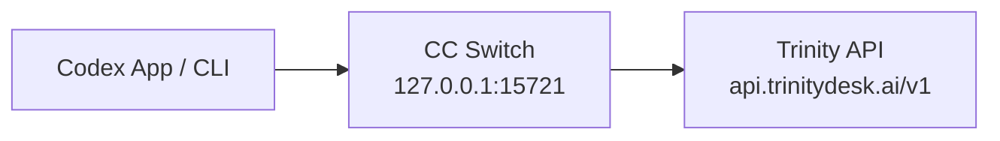
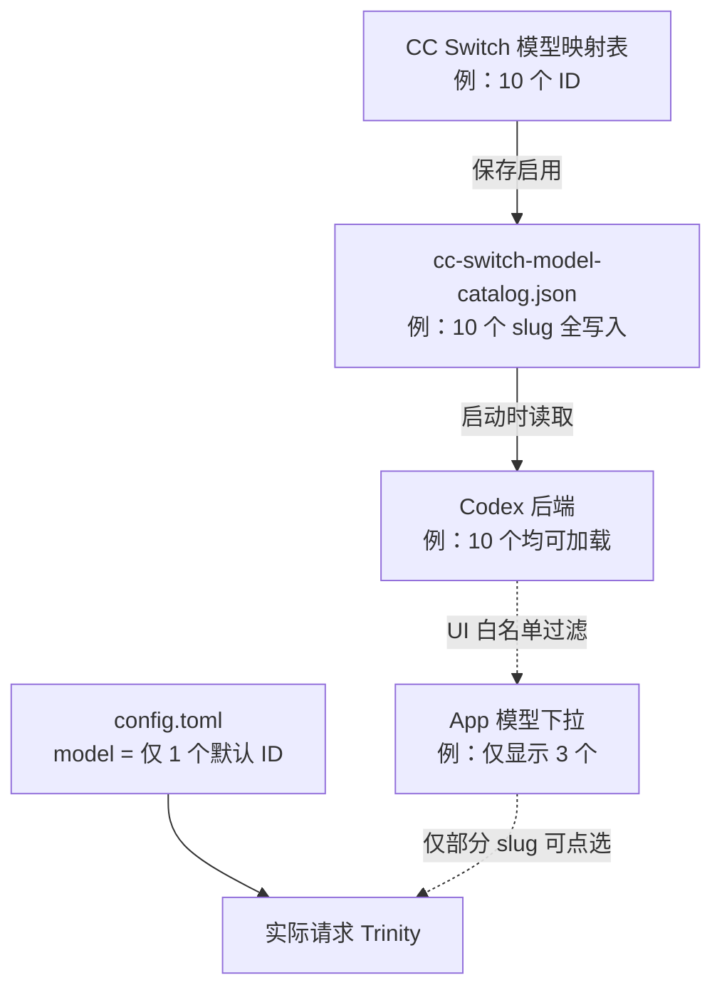
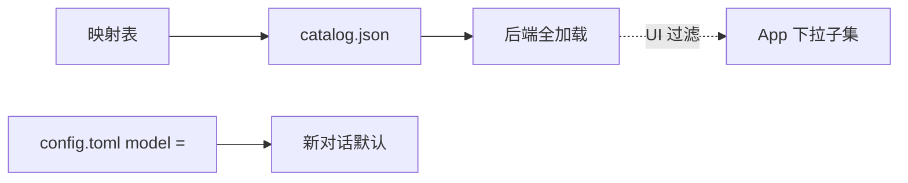

# CC Switch + Codex + Trinity 联调分析（归档）

> **文档状态**：**归档**（2026-06-05）  
> **类型**：内部联调分析 / 排障备忘，**不**发布到对外文档站。  
> **对外真源**：[CC Switch 对接 Codex](http://127.0.0.1:5205/docs/cookbook/coding-agents/codex-cc-switch) · 仓库路径 `apps/trinity-docs/docs/cookbook/coding-agents/codex-cc-switch.md`  
> **关联对外页**：[CC Switch](./../../apps/trinity-docs/docs/cookbook/coding-agents/cc-switch.md) · [Codex CLI](./../../apps/trinity-docs/docs/cookbook/coding-agents/codex-cli.md)

---

## 1. 分析目的

记录在 **CC Switch（本地路由）→ Codex App/CLI → Trinity API** 链路上的实测行为，重点澄清：

1. **模型配置三层**：CC Switch 映射表、`cc-switch-model-catalog.json`、`config.toml` 的 `model =` 各管什么；
2. **catalog 条数 ≠ App 下拉条数** 是否为配置错误；
3. 对外文档应写「客户能做什么」，本归档保留「我们验证过什么」。

---

## 2. 链路架构

```text
Codex App / CLI
    → http://127.0.0.1:15721/v1（CC Switch 本地路由）
    → https://api.trinitydesk.ai/v1（Trinity）
```



**关键文件**（`~/.codex/`）：

| 文件 | 维护方 | 作用 |
| --- | --- | --- |
| `config.toml` | CC Switch 写入 | `base_url` 指向本地路由；`model =` **仅 1 个**默认模型 ID |
| `auth.json` | CC Switch 写入 | CC Switch 模式须为 `{"OPENAI_API_KEY":"PROXY_MANAGED"}` |
| `cc-switch-model-catalog.json` | CC Switch 保存时投影 | 映射表全部模型 → `models[].slug` |

---

## 3. 四层数据流（核心结论）

在 CC Switch 映射表添加 **N 个**模型 ID 并保存启用后：

```text
CC Switch 模型映射表（N 个）
        ↓ 保存
cc-switch-model-catalog.json（N 个，全在）
        ↓ Codex 启动读取
Codex 后端（N 个都能加载，codex debug models 可见）
        ↓ App UI 再过滤
模型下拉（只显示其中一部分，样例为 3 个）
config.toml 的 model =（1 个）→ 新对话默认实际调用谁
```



| 层级 | 数量 | 谁维护 | 作用 |
| --- | --- | --- | --- |
| CC Switch 模型映射表 | 多个 | CC Switch 界面 | 添加/删除可用模型 ID 的**唯一入口** |
| `cc-switch-model-catalog.json` | 与映射表一致 | CC Switch 保存时投影 | 完整 catalog |
| Codex 后端 | 与 catalog 一致 | Codex 启动加载 | `codex debug models` 可见全部 slug |
| App 模型下拉 | **≤ catalog** | Codex Desktop UI | **UI 认可的子集**，非完整列表 |
| `config.toml` → `model =` | **1 个** | CC Switch 默认 / 手改 | 新对话**默认**调用的模型 ID |

**排障口诀**：映射表 N 个、catalog N 个、下拉 M 个（M < N）、Trinity 有用量 → **链路已通**，差异在 Codex Desktop UI。

---

## 4. 实测样例（2026-06 · Trinity 侧验证）

映射表保存 **10** 个模型 ID；`cc-switch-model-catalog.json` 与 `codex debug models` 均为 **10** 个；App 下拉**仅 3 个**（均为 GPT 系列 slug）：

| slug | catalog | App 下拉 |
| --- | :---: | :---: |
| `gpt-5.1` | ✅ | ✅ |
| `gpt-5.4` | ✅ | ✅ |
| `gpt-5.4-mini` | ✅ | ✅ |
| `gemini-2.5-flash` | ✅ | ❌ |
| `gemini-2.5-pro` | ✅ | ❌ |
| `gemini-3.1-flash-lite-preview` | ✅ | ❌ |
| `gemini-3.1-pro-preview` | ✅ | ❌ |
| `gpt-4o` | ✅ | ❌ |
| `gpt-5.5` | ✅ | ❌ |
| `gpt-5.4-pro` | ✅ | ❌ |

同期 `config.toml`：`model = "gpt-5.5"`（**1 个默认**），与下拉当前选中项可不一致。

**验收**：Trinity 控制台出现 `POST /v1/chat/completions` 或 `/v1/responses`，`model` 字段与预期一致。

---

## 5. 设计路径 vs 实际路径

**设计（CC Switch v3.16+ 文档预期）**：


**实际（Codex Desktop App，2026-06 验证）**：



外部 issue：[openai/codex#19694](https://github.com/openai/codex/issues/19694)、[#15138](https://github.com/openai/codex/issues/15138)。

---

## 6. catalog 写入条件（检查清单）

`cc-switch-model-catalog.json` **仅由 CC Switch 写入**：

| 步骤 | 要求 |
| --- | --- |
| 1 | Codex → Trinity 供应商 → 编辑 |
| 2 | 模型映射表逐行添加 [模型广场](https://trinity.ai/models) ID |
| 3 | 点击 **保存** |
| 4 | 供应商 **启用** |
| 5 | **Cmd+Q** 完全退出 Codex 后重开 |

**不会写入 catalog**：只改 App 内 `model =`、未保存、未启用、手改 catalog 文件（下次保存会被覆盖）。

**终端自检**：

```bash
python3 -c "import json; print([m['slug'] for m in json.load(open('$HOME/.codex/cc-switch-model-catalog.json'))['models']])"
grep '^model ' ~/.codex/config.toml
lsof -i :15721   # 应有 cc-switch
```

---

## 7. 换模型分流（维护用）

| 目标 | 方式 | 备注 |
| --- | --- | --- |
| App 下拉里有的 | 输入框底部模型菜单点选 | 即时 |
| catalog 有、下拉没有 | 改 `config.toml` 的 `model =` → Cmd+Q → 新对话 | 以 Trinity 用量 `model` 验收 |
| 改新对话默认 | CC Switch 默认模型 或 手改 `model =`（仅 1 个） | 须重启 |
| 让下拉显示映射表全部 | — | ❌ 当前 Desktop 不支持 |

---

## 8. 与「手写直连」勿混用

| 模式 | `base_url` | Key |
| --- | --- | --- |
| CC Switch | `http://127.0.0.1:15721/v1` | `auth.json` = `PROXY_MANAGED`；Key 在 CC Switch 供应商 |
| 手写直连 | `https://api.trinitydesk.ai/v1` | `env_key` / `http_headers` 中的 `Bearer xh-...` |

混配典型故障：`127.0.0.1` + 空 `auth.json`，或 Trinity `base_url` + `PROXY_MANAGED`。

---

## 9. 对外文档维护约定

| 内容 | 归档（本文） | 对外 `codex-cc-switch.md` |
| --- | --- | --- |
| 四层数据流详图 | ✅ 保留 | 摘要 + 客户可操作结论 |
| 10 模型 / 3 下拉样例表 | ✅ 保留 | 改为通用说明 + 少量示例 |
| Trinity 控制台验收 | ✅ 保留 | 写「控制台用量 / model 字段」 |
| `lsof` / `python3` 自检 | ✅ 保留 | 可选 tip |
| GitHub issue 编号 | ✅ 保留 | 保留链出 |

更新对外页时：先改 `apps/trinity-docs/docs/cookbook/coding-agents/codex-cc-switch.md`，本归档仅在联调结论变化时同步。

---

## 10. 相关链接

- [CC Switch 用户手册 · 路由服务](https://github.com/farion1231/cc-switch/blob/main/docs/user-manual/zh/4-proxy/4.1-service.md)
- [Codex CLI 仓库](https://github.com/openai/codex)
- 对外文档站 Cookbook：`apps/trinity-docs/docs/cookbook/coding-agents/`
