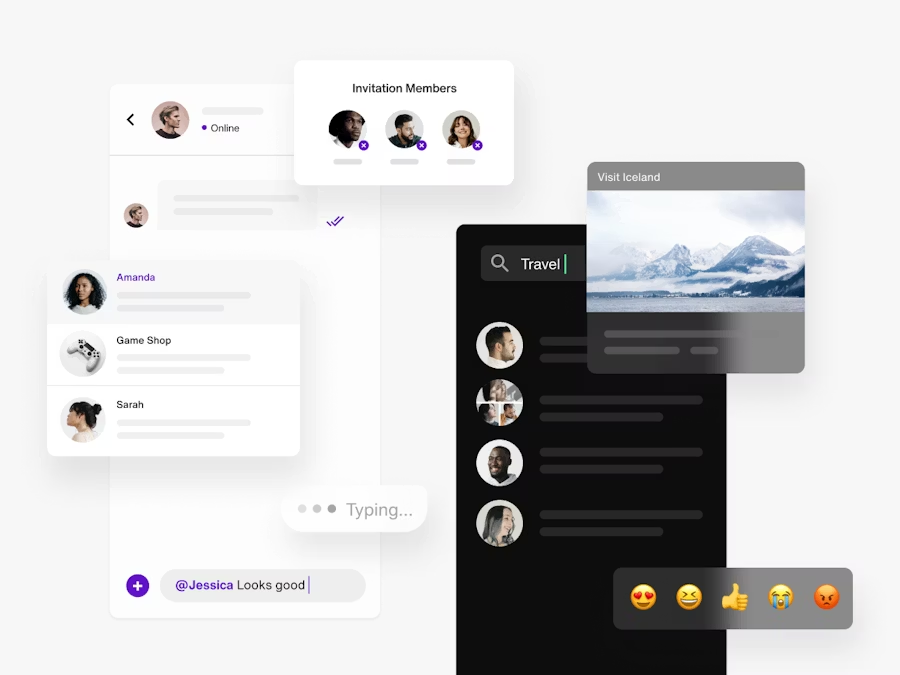
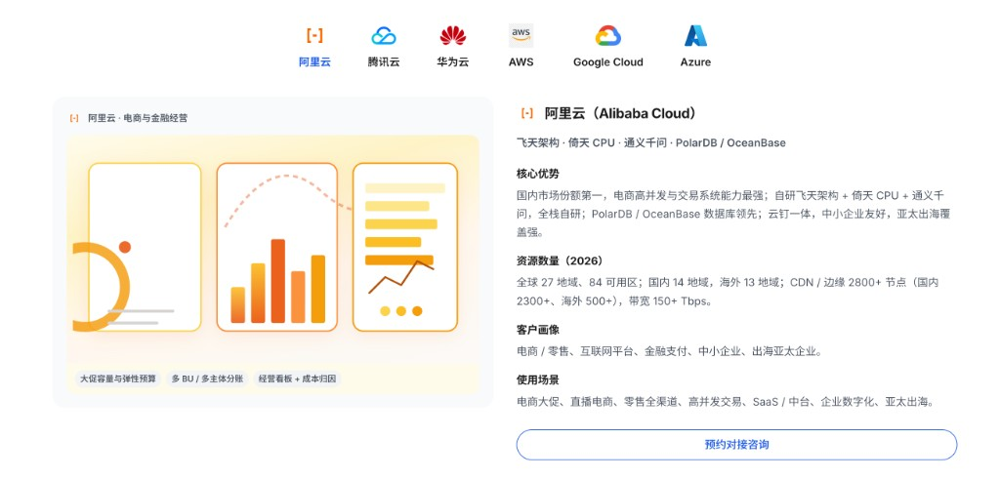

# ToB 官网 · 方案矩阵导览区配图协作方法论

> **文档状态**：方法论（多产品 / 多方案落地页可复用）  
> **文档类型**：AI · 设计 · 前端协作派活  
> **典型形态**：首页或解决方案页中，**Tab（或分段控件）切换多个并列方案**，常见布局为 **左图右文** 或 **上图下文**  
> **落地案例**：[AI云-云介绍左侧配图-派活说明.md](../AI云-云介绍左侧配图-派活说明.md)（六云厂商方案矩阵，真源 `apps/ai-cloud`）

---

## 0. 先说清「叫什么」

口语里的「多产品 Tab」「多云介绍」在 ToB 官网语境下，建议统一称为：

| 推荐术语 | 英文（对内/对外案可选） | 指什么 |
|----------|-------------------------|--------|
| **方案矩阵导览区** | Solution Matrix Navigator | 整块模块：标题 + Tab 条 + 多个可切换的面板 |
| **导览项** | Navigator item / Matrix cell | 单个 Tab 对应的一条方案（一家云、一条产品线、一个行业包） |
| **分区叙事配图** | Segment narrative visual | 该导览项专属的左侧（或上部）场景插图 |
| **锚点导览项** | Anchored navigator item | 顶栏/页脚带 hash 直达某一导览项（如 `#cloud-aliyun`） |

**不推荐**单独叫「多产品 Tab」——对外偏口语；对内文档、派活单用 **方案矩阵导览区 / 导览项** 更贴近 ToB 官网信息架构。

**与相近模块的区分：**

| 模块 | 区别 |
|------|------|
| 方案矩阵导览区 | 多个**同级**方案并列切换，配图强调**各自场景** |
| 能力卡片栅格 | 多张卡**同时展示**，通常无 Tab、无大图叙事 |
| 架构示意图区 | 一张总览图讲分层，**不是**按方案切换的多套场景 UI |
| Hero 首屏 | 全站主叙事一张图；矩阵区在其后展开细分 |

---

## 1. 适用范围

满足以下多数条件时，适用本方法论：

1. **ToB / 企业级**官网或落地页（SaaS、云、数据、安全、开发者平台等）
2. 用 **Tab、分段按钮、锚点列表** 在 **≥3 个** 同级方案间切换
3. 每个导览项需要 **「像真产品在用的」场景配图**，而不是纯 Logo 墙或抽象图标
4. 配图与 **右侧（或下方）长文案** 配套，改图时往往 **不要动文案区**

**Trinity 现网示例：**

| 产品 | 模块 | 导览项示例 |
|------|------|------------|
| AI 云 | `#cloud-solutions` | 阿里云、腾讯云、华为云、AWS、Google Cloud、Azure |
| （可扩展）Trinity AI | 模型/能力分区 | 旗舰、代码、推理…（若采用同布局） |
| （可扩展）行业方案页 | 行业矩阵 | 金融、制造、政务… |

---

## 2. 一句话公式

**「参考图」定视觉语言 + 「业务场景」定内容 + 「禁止项」定边界 + 「落点」定改哪里**

对 **方案矩阵导览区** 补一句：

**「锚点项」定哪一个导览项 + 「矩阵一致性」定所有导览项共用构图、只换场景**

**示例（通用）：**

> {页面} 的 **方案矩阵导览区** 中，**{导览项名称}** 的 **分区叙事配图**，风格参考附图（叠卡 UI、像真实 SaaS 在用），场景是 **{3～5 个业务名词}**，不要 **{禁止主视觉}**，只改 **该导览项配图**，与 **{锚点样例项}** 同高。

---

## 3. 四要素（权重与说明）

| 要素 | 权重 | 作用 |
|------|------|------|
| **参考图（附图）** | 最大 | 全矩阵共用的 **视觉语言**（叠卡、阴影、营销站 UI 样张等） |
| **业务场景名词** | 第二 | 每个导览项 **画什么**（差异化内容） |
| **禁止项** | 第三 | 防止拓扑图、设备框、矩阵内六套完全不同画风 |
| **落点 + 矩阵一致性** | 第四 | 改哪一页、哪一导览项；**切换 Tab 占位等高** |

无附图时，协作者易默认「架构图 / 信息图 / 单屏深色面板」等，与 **场景化 UI mockup** 目标易偏离。

---

## 4. 参考图：定「长什么样」

> **归档目录**：[方案矩阵配图-参考图/](./方案矩阵配图-参考图/)（附录 A 清单 + 关键信息拆解）  
> 派活时优先附图 **`ref-01-叠卡UI-协作场景-主参考.png`**，并写明「只取经视觉语言，业务场景见 §5」。

### 4.1 ToB 官网推荐视觉范式（本体系默认）

在 Trinity 实践中，**方案矩阵导览区** 的分区叙事配图，优先采用：

**「叠卡 UI 场景 mockup」** — 多层圆角界面卡片漂浮、软阴影、浅色或局部深色面板；含列表/对话/控制台片段/小 KPI，传达 **「客户正在用」**，而非白皮书插图。

自检清单：

- [ ] 多卡片 **重叠漂浮**，非单张满屏信息图
- [ ] **无** 笔记本 / 手机设备外框
- [ ] 界面元素像 **SaaS / 控制台** 片段，非 PPT 架构图
- [ ] 适合 **营销落地页** 信息密度，非高保真全屏截图

其它范式（全团队统一即可，但需写明）：

| 范式 | 适用 |
|------|------|
| 叠卡 UI 场景 mockup | 多云、多产品线、多行业「用法」叙事（**默认**） |
| 单张摄影 + 浮标 | 强品牌、弱控制台 |
| 等距插画 | 偏概念、少界面细节（易与「真实场景」混淆，慎用） |

### 4.2 推荐表述

| 你说 | 协作者会理解为 |
|------|----------------|
| 「风格参考这张图」+ 附图 | 矩阵内统一的构图语言 |
| 「像真实产品界面 / 营销站 UI 样张」 | 非示意图 |
| 「以 {导览项 A} 为样例，其它导览项同风格」 | **矩阵视觉统一**，只换场景 |
| 「分层 / 漂浮 / 多卡片」 | 与拓扑图、单屏导播台区分 |

### 4.3 慎用表述

| 慎用 | 建议 |
|------|------|
| 「每个 Tab 完全不同风格」 | 「矩阵 **同风格**，**不同场景**」 |
| 「做个架构图 / 拓扑」 | 除非该导览项真要示意图；否则 **卡片 UI** |
| 「参考某官网」（无附图） | 截图 + 圈出「方案矩阵」中的 **配图区块** |

---

## 5. 场景：定「每个导览项画什么」

每个导览项提供 **3～5 个具体名词**（中文标签、产品模块名、指标均可），比「高大上」「科技感」有效。

**场景句模板：**

> 内容贴近「{客户类型}在 {产品} 里做 {一件事}」，界面要有 **{元素 A}、{元素 B}、{数字}**，不要做成 **{不要的主视觉}**。

**矩阵内差异化原则：**

- **视觉语言一致**（同一套叠卡构图、字号层级、阴影）
- **业务场景不同**（避免 N 个导览项共用同一套「聊天 + 左侧联系人」除非产品确实同质）
- 指定 **一个锚点样例导览项**（如「以阿里云为样例」），其余只换场景列表

---

## 6. 禁止项（矩阵级）

建议在派活单中写 **2～4 条**，以下为 ToB 官网通用集：

- **不要**外层设备框（MacBook / 手机壳 mockup）
- **不要**无说明的抽象 SVG / 占位折线图作为主视觉
- **不要**每个导览项各用一种信息图类型（组织树、地球网、导播台…）导致矩阵 **画风分裂**
- **不要**在无要求时修改 **其它导览项文案**、Tab 顺序、导航 hash
- **不要**把架构拓扑当 **分区叙事配图** 主视觉（拓扑可放在独立「架构」章节）

若走 AI 生图，可附加 negative：  
`architecture diagram, device frame, watermark, gibberish text, inconsistent UI style across panels`

---

## 7. 落点与验收（矩阵级）

| 说清楚 | 作用 |
|--------|------|
| 页面路径 + 区块 id（如 `#cloud-solutions`） | 定位模块 |
| **哪一个导览项**（Tab 名 / hash） | 避免改错面板 |
| **只改配图区**，文案区不动 | 控制 diff 范围 |
| **矩阵一致性**：与 **样例导览项** 同宽同高 | 切换 Tab 不「跳高」 |
| 验收：切换全部导览项，配图 **高度一致**、风格同属一族 | 可测 |

**实现层常见约定（Vue 原型）：**

- 每导览项一个场景组件（如 `*SceneVisual.vue`）
- 父页用 CSS 变量统一绘图区高度（如 `--segment-art-h`）
- 图下 **能力标签**（chip）可由父页维护，不必全部画进 mockup

---

## 8. 实现方式选型

| 方式 | 适用 | 矩阵级特点 |
|------|------|------------|
| **Vue + CSS 分层 mockup**（默认） | 产品页、要改文案、要响应式 | 多导览项 **风格最稳**、维护成本低 |
| **AI 生图 PNG** | 单张营销、强真人/照片感 | 每张按张计费；**N 项 ≈ N 次**；改字常重出 |
| **混合** | 要真实头像又不整屏生图 | 组件骨架 + 少量切图 |

**结论：** 方案矩阵导览区 **默认 Vue 场景组件**；生图适合物料或混合点缀。成本与效果细表见 [AI云案例 §6](../AI云-云介绍左侧配图-派活说明.md#6-实现方式选型)。

---

## 9. 通用派活模板（复制即用）

```text
【模块】{产品名} 官网 → {页面名} → 方案矩阵导览区 → 导览项「{名称}」
【参考】附图：{视觉范式，如叠卡 UI / 营销站 SaaS 样张}；矩阵与导览项「{样例项}」同风格
【场景】{3～5 个业务名词}
【矩阵】全 {N} 个导览项构图一致，仅场景不同；勿与「{其它项}」共用同一套界面布局（若需区分）
【禁止】{设备框 / 拓扑主视觉 / 抽象示意图 / …}
【落点】仅 {左图|上图}；{hash 或 Tab 名}；与「{样例项}」同高
【实现】优先 Vue 场景组件 + Trinity 色板（trinity-base.css）；不大改文案区
【验收】切换全部导览项，配图区高度与风格一族一致
```

---

## 10. 落地案例与扩展

| 文档 | 关系 |
|------|------|
| [AI云-云介绍左侧配图-派活说明.md](../AI云-云介绍左侧配图-派活说明.md) | **方案矩阵导览区** 在「六云厂商」上的完整派活、名词表、复盘 |
| [Vue原型生成最佳实践-Skill规范页与验收.md](../Vue原型生成最佳实践-Skill规范页与验收.md) | 全站 Vue 原型与 Skill 体系；本方法论只管 **矩阵区配图** 子问题 |
| `apps/ai-cloud/src/views/home/README.md` | AI 云首页锚点与组件路径 |

**新增产品线时建议流程：**

1. 确认该模块属于 **方案矩阵导览区**（而非能力栅格 / 单图架构）  
2. 准备 **一张**参考图 + **一个**样例导览项  
3. 列出全部导览项的 **场景名词表**  
4. 从母模板派活；案例文档可另建 `…-派活说明.md` 挂在本文 §10  

---

## 11. 最小派活清单（PM / 设计 → AI / 前端）

1. **一张**参考图（定义矩阵视觉语言）  
2. **一个**样例导览项 + **其余项**场景名词列表  
3. **2～4 条**禁止项  
4. 页面锚点 + **只改配图区** + **全矩阵等高**  
5. 默认 **Vue 场景组件**；若 PNG 再写路径与尺寸  

---

## 12. 术语速查

| 中文 | 用法 |
|------|------|
| 方案矩阵导览区 | 整块 Tab 切换模块 |
| 导览项 | 单个 Tab / hash 对应方案 |
| 分区叙事配图 | 该导览项的场景图 |
| 锚点样例项 | 矩阵内第一个对齐的导览项 |
| 矩阵一致性 | 同构图、同高度、同视觉家族 |

---

## 附录 A · 参考图清单（本仓库归档）

目录：[方案矩阵配图-参考图/](./方案矩阵配图-参考图/)

| 编号 | 文件 | 类型 | 在派活中的作用 |
|------|------|------|----------------|
| **A1** | [ref-01-叠卡UI-协作场景-主参考.png](./方案矩阵配图-参考图/ref-01-叠卡UI-协作场景-主参考.png) | 视觉语言 | **主参考**：叠卡 UI、真实在用感、营销站样张 |
| A1′ | [ref-01b-叠卡UI-协作场景-同型参考.png](./方案矩阵配图-参考图/ref-01b-叠卡UI-协作场景-同型参考.png) | 视觉语言 | 与 A1 同型，附图备份 |
| **A2** | [ref-02-云介绍左右分栏-版式参考.png](./方案矩阵配图-参考图/ref-02-云介绍左右分栏-版式参考.png) | 版式 / 反例 | Tab 矩阵 + 左图右文 + 底标签 + CTA；左侧为**抽象示意**（旧），对标要换成 A1 画风 |

---

## 附录 B · 从参考图提取的「关键信息」（派活用）

以下是把参考图「拆开」后、写进派活单 / 给 AI 的**可复用要点**（不是照搬聊天产品业务）。

### B.1 视觉 DNA（来自 A1 / A1′ 叠卡 UI）



| 维度 | 从图中读取什么 | 写到派活里怎么说 |
|------|----------------|------------------|
| **构图** | 多张圆角卡片 **前后叠放**，有前后景深；无整屏单图、无设备外框 | 「分层漂浮的多卡片 UI mockup」 |
| **背景** | 大面积浅灰 /  off-white，留白克制 | 「浅色营销页背景，卡片外弱对比」 |
| **卡片** | 白底为主；可有 **一块深色竖卡** 形成对比（不是全屏黑） | 「主区浅色卡 + 可选一块深色浮卡」 |
| **阴影** | 软、扩散、低对比描边 | 「soft drop shadow，轻 elevation」 |
| **人物感** | 圆形 **头像**、在线状态点、成员邀请条 | 「头像 / 协作成员 / 在线状态」（云场景可换成架构师、值班组） |
| **交互暗示** | 对话气泡、@ 提及、输入框、Typing、表情条 | 「对话 / 预警条 / 输入框」或换成 **控制台告警 + 命令行输入** |
| **内容块** | 侧栏列表（联系人/通道）、主区会话、小浮层邀请、**照片+毛玻璃**内容卡 | 「侧栏资源列表 + 主区操作 + 顶部浮条 + 数据/实景小卡」 |
| **强调色** | 紫色用于激活、按钮、@（Trinity 落地时映射 **品牌蓝 / 云厂商色**） | 「强调色跟 Trinity `--blue` 或该云主题色，不要抄死紫色」 |
| **信息密度** | 中等：标签短、列表项清晰，非满屏小字 | 「营销插图密度，非真实全屏截图」 |
| **气质** | 消费级 SaaS 的精致感，但用于 ToB 时偏 **「企业客户在用一个真控制台」** | 「像真实产品界面 / 营销站 UI 样张，非架构图」 |

**一句话给 AI：**

> Style reference attached: layered floating rounded UI cards, light gray background, mix of white and one dark panel, avatars and short labels, chat-like collaboration **or equivalent cloud console scene**, soft shadows, no laptop frame, B2B SaaS marketing illustration — **replace messaging app content with** `{你的 3～5 个业务名词}`.

### B.2 版式与信息架构（来自 A2，左图右文矩阵）



| 维度 | 从图中读取什么 | 派活时怎么用 |
|------|----------------|--------------|
| **模块结构** | 顶栏 **多云 Tab**（Logo + 名称），下列 **导览项面板** | 对应「方案矩阵导览区」术语 |
| **分栏** | **左：分区叙事配图**；**右：标题 + 核心优势 + 资源数 + 画像 + 场景 + CTA** | 改图时 **只动左侧**；右侧文案不动 |
| **配图下标签** | 三个短 tag（能力关键词）贴在图下方 | 可由 `HomePage` 维护，不必画进 mockup |
| **CTA** | 「预约对接咨询」链到 `#consult` | 与配图风格无关，保持页面级 |
| **左图画风（旧）** | 抽象图表 / 占位曲线，**不是**叠卡 UI | 作为 **反例**：新图应对齐 **B.1**，不是延续 A2 左侧画风 |

### B.3 参考图 → 四要素映射（速查）

| 四要素 | 主要来源 | 提取结果示例 |
|--------|----------|----------------|
| 视觉语言 | **A1** | 叠卡、阴影、头像、浅底、控制台片段感 |
| 业务场景 | **派活方补充**（A1 不提供云业务） | 双 11、ECS、费用中心、直播 TRTC… |
| 禁止项 | **A1 + A2 对比** | 不要设备框；不要 A2 式抽象折线主视觉；不要六套画风分裂 |
| 落点 / 矩阵一致性 | **A2** | `#cloud-solutions` 某 Tab 左侧；与样例项同高 |

### B.4 不要从参考图误读的内容

| 参考图里有 | 不要照搬到云方案矩阵 |
|------------|----------------------|
| 聊天 / Travel 搜索 / 表情 reaction | 除非该导览项就是协作 IM 产品 |
| 紫色主色（A1 原图） | 改用 Trinity / 云厂商主题色 |
| A2 左侧三块抽象曲线图 | 这是旧方案；新实现用 **叠卡场景 mockup**（见 AI 云 `*CloudSceneVisual.vue`） |
| 整张图当 PNG 贴上去 | 默认 **Vue 分层 mockup**，便于改中文与矩阵等高 |

### B.5 新增参考图时怎么归档

1. 图片放入 [方案矩阵配图-参考图/](./方案矩阵配图-参考图/)，按 `ref-{序号}-{简述}.png` 命名。  
2. 在 **附录 A** 增加一行（类型：视觉 / 版式 / 反例）。  
3. 在 **附录 B** 用 B.1 / B.2 相同表格补 **3～5 条**可派活要点。  
4. 派活模板【参考】行写明文件名 + 只取哪几列信息。
