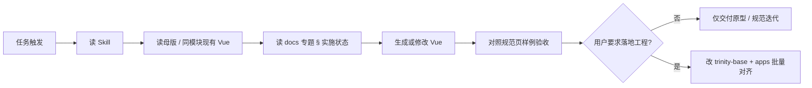

# Vue 原型生成最佳实践 · Skill、规范页与验收

> **文档类型**：方法论（**非单次任务操作手册**）  
> **受众**：产品经理、前端原型负责人、与 AI 协作的工程师  
> **工程操作手册**：`.cursor/skills/*`（Agent 执行清单）  
> **视觉验收页**：设计枢纽 `/user-console-spec`（示例：用户控制台系统）  
> **模块交付总则**：[`01-原型与交付规范/Trinity原型模块目录与交付规范.md`](../01-原型与交付规范/Trinity原型模块目录与交付规范.md)

---

## 0. 设计原则：面向 Agent 优先

Trinity 规范体系**首先服务 Agent**，人通过浏览器验收；不是「给人写文档、顺便给 AI 看」。

| 原则 | 做法 |
|------|------|
| **可判定** | 规则写成 MUST / NEVER、阈值（&lt;4 / ≥4），避免「好看」「类似 OpenRouter」 |
| **规则带 ID** | 如 `UC-TBL-ALIGN-01`，改规范时 Skill 与样例同 ID 同步，减少漂移 |
| **Agent 只必读 Skill** | 执行、类名附录、检查清单集中在 `.cursor/skills/*` |
| **规范页 = 验收** | **一个示范**（§2 主列）代表统一风格；§3 仅为同风格下操作列分支，不另起第二套界面 |
| **docs 默认非 Agent 必读** | `docs/03` 叙事、实施状态给人；Agent 仅读 Skill 内「规范先行」短段 |
| **触发词固定** | 任务写「按 trinity-user-console / 用户控制台系统规范」，比只丢 URL 稳 |

**维护**：行为变更 → 改 Skill 规则表 + 规范页同 ID 行 + 样例；仅视觉微调且 Skill 已覆盖 → 可只改样例。

用户控制台系统示例 Skill：`.cursor/skills/trinity-user-console/SKILL.md`。

**PM 提需求**：自然语言说明范围即可；Agent 读对应 Skill + `/user-console-spec` 锚点验收（用户控制台系统见 `trinity-user-console` 附录 B）。

---

## 1. 核心结论

在 Trinity 里用 AI **标准化生成 Vue 原型**，最优组合不是「只写文档」或「只堆样例代码」，而是三层分工：

| 层级 | 载体 | 给谁用 | 解决什么 |
|------|------|--------|----------|
| **操作手册** | `.cursor/skills/<name>/SKILL.md` | **Agent** | 可判定规则、禁止项、检查清单（少 token、可执行） |
| **视觉真源** | 设计枢纽 **规范页 + 内联样例**（如 `/user-console-spec`） | **人 + Agent 验收** | DOM/CSS 长什么样、避免条文与界面漂移 |
| **叙事与状态** | `docs/0x-…/` 专题文档 | **人** | 为什么这样定、实施进度、产品背景 |

**规范先行**：先定 Skill + 规范页样例（目标态），再批量改 `apps/*` 与 `trinity-base.css`；避免边定规范边改业务页导致半成品。

用户控制台系统已落地示例：Skill **`trinity-user-console`** · 规范页 **`/user-console-spec`** · 文档 **`docs/03/`**。

---

## 2. 为什么需要三层（而不是二选一）

### 2.1 只有 Markdown 文档

| 问题 | 说明 |
|------|------|
| 类名易写错 | 条文写 `or-keys-table`，生成时仍可能写成 `or-preset-table` 旧式 |
| 视觉难对齐 | 「扁平表头」无图时，Agent 易做成渐变表头或列居中混用 |
| Token 浪费 | 长文档散文，Agent 需从段落里提取规则 |

### 2.2 只有规范页样例（Vue 代码）

| 问题 | 说明 |
|------|------|
| 规则难提取 | 样例 200+ 行，含 mock、脚本，Agent 易抄 DOM 却漏对齐/操作列分支 |
| 无执行顺序 | 不知道先读母版还是先读表格 §3 |
| 人难维护 | 改样例忘记改条文，两处漂移 |

### 2.3 只有 Skill

| 问题 | 说明 |
|------|------|
| 缺视觉锚点 | 表头是否真扁平，需对照可渲染页面 |
| 难给非 Agent 读者 | PM 评审仍需浏览器里看样例 |

### 2.4 三层一起

- **Skill** = Agent 的「作业指导书」（生成前读、生成后勾选）  
- **规范页** = 「标准答案长什么样」（内联样例 = 契约测试页）  
- **docs** = 「为什么 + 是否已落地工程」

与「原型即代码 + 五件套」一致：代码是唯一事实来源，但要对 AI **压缩成可执行入口**（Skill），对人 **保留可浏览验收**（规范页）。

---

## 3. 推荐流程（生成 Vue 原型）

> **受众**：PM 阶段划分与验收锚点。**不是** Skill 逐步执行条；Agent 执行见各域 Skill「读盘顺序」与规则 ID 清单。

### 3.1 触发方式（比只丢 URL 更稳）

| 方式 | 示例 | 说明 |
|------|------|------|
| **任务里点名** | 「按 **trinity-user-console** / 用户控制台系统规范做××列表」 | Agent 加载对应 Skill |
| **规则引用** | `.cursor/rules/trinity-design-spec-first.mdc` 已链用户控制台系统 Skill | 改 UI 时提醒读 token / design-spec |
| **设计枢纽入口** | `/user-console-spec`、`/design-spec` | 人审视觉；Agent 用锚点 URL |

不推荐：只发「参考 `/user-console-spec`」而不点名 Skill——Agent 可能只扫页面代码、漏检查清单。

### 3.2 Agent 读盘顺序（用户控制台系统示例）

1. **`.cursor/skills/trinity-user-console/SKILL.md`** — 规则 + §5 检查清单  
2. **母版**：`apps/trinity-ai/src/views/account/ConsolePage.vue`、`account.css`  
3. **叙事/状态**：`docs/03/用户控制台系统-布局与样式规范.md` §4.1（实施状态）  
4. **样例锚点**（浏览器或源码 `console-sample/`）：  
   - `#spec-1-layout` — 壳层  
   - `#spec-2-main` — 主列五步  
   - `#spec-3-table` / `#spec-sample-table-actions-buttons` — 表格与横排按钮  
5. **控件原子**：`trinity-design-tokens` Skill（形式 2、`btn-gradient`、弹窗）

### 3.3 人（PM / 设计）评审顺序

1. 打开 **`/user-console-spec`**，展开 §1–§3，对照截图/产品诉求  
2. 确认 Skill 与样例一致后，再在任务里写「可以落地工程」  
3. 工程阶段：按 Skill §5 与 `docs/03` 检查清单验收 PR

---

## 4. 规范页 + 内联样例：职责与做法

### 4.1 职责

| 职责 | 说明 |
|------|------|
| **人类 + Agent 的视觉真源** | 可渲染、可截图、可硬刷新核对  
| **契约测试页** | 样例 = **目标态**；产品页可滞后，须在 docs 标明「未落地」 |
| **非操作手册** | 样例 Vue 不替代 Skill 里的 if/then 与禁止项 |

### 4.2 页面结构建议（用户控制台系统已采用）

| 区块 | 内容 |
|------|------|
| 顶部说明 | 仅规范、产品未批量改、链到完整原型 |
| §1 布局 | 条文 + 壳层样例 |
| §2 主列 | 五步条文 + 完整主列样例（#keys） |
| §3 表格 | 对齐/操作矩阵 + 密钥表 / 三按钮横排 / ⋮ 示意 |
| 附录 | IA、外链、`docs/03`、工程母版路径 |

**不要**再维护独立「打样全屏页」与规范页双轨；旧路由可重定向到规范锚点（如 `/user-console-preview` → `#spec-2-main`）。

### 4.3 类名策略（已拍板）

- **风格统一即可，类名不必完全一致**（如 `#logs` 用 `or-logs-wide`）。  
- Skill 写清**必达视觉**与**禁止项**；样例用一种推荐 DOM，落地时允许场景前缀不同。

---

## 5. Skill：操作手册写什么

### 5.1 宜写（Agent 优先）

- **触发词**（一行列表，任务可复制）  
- **规则速查表**：`ID | MUST/NEVER`（可判定）  
- **附录 A 类名挂钩**（示例 + 对应规则 ID；写明可替换）  
- **附录 B 验收锚点**（`/user-console-spec#…` ↔ 规则 ID）  
- **§5 检查清单**：每条勾选对应规则 ID  
- **读盘顺序**（4 步以内）  
- **禁止通读** `docs/03` 全文（写进 Skill）

### 5.2 不宜写进 Skill

- 大段产品背景（`docs/03`）  
- 完整 Vue 样例源码（`console-sample/`）  
- 与 `trinity-design-tokens` 重复的控件长文  

### 5.3 规范页（Agent 验收用）

- 矩阵 **两列**：规则 ID + 必达/禁止  
- 样例 caption 标注验收哪条 ID（如 `验收 · UC-TBL-OPS-01`）  
- 一行指向 Skill 附录 A（类名不堆在矩阵里）

### 5.3 存放位置

| 类型 | 路径 |
|------|------|
| 项目 Skill | `.cursor/skills/trinity-user-console/SKILL.md` |
| 运营列表 | `.cursor/skills/trinity-admin-ruoyi-list/SKILL.md` |
| 色板/原子 | `.cursor/skills/trinity-design-tokens/SKILL.md` |
| Monorepo | `.cursor/skills/trinity-vue-prototype-monorepo/SKILL.md` |

`disable-model-invocation: true`：需任务点名或规则触发，避免无关对话误加载。

---

## 6. 文档（docs）写什么

| 放 docs | 不放 docs |
|---------|-----------|
| 产品 IA、需求理解 | 可复制 DOM 清单（放 Skill） |
| 布局叙事、与 OpenRouter 对照 | 检查清单（放 Skill） |
| **实施状态**（已定 / 未改工程） | 内联样例代码 |
| 与工程师交接、迁移计划 | |

用户控制台系统示例：`docs/03/用户控制台系统-布局与样式规范.md` §4.1 + `README.md` 索引。

---

## 7. 改规范 / 样例时，要不要同步 Skill？

**原则：规则变 → 必须同步 Skill；只改样子、规则不变 → 可只改规范页。**

| 你改了什么 | 规范页样例 | `docs/03` 等 | **Skill** |
|------------|------------|--------------|-----------|
| 对齐、操作列分支、主列五步、禁止项 | ✅ | ✅ 建议 | **✅ 必须**（矩阵 + §5 清单 + 读盘锚点） |
| 样例 DOM / 截图级间距、颜色已符合 Skill 条文 | ✅ | 可选 | ❌ 不必改 Skill |
| 仅「实施状态」（已定 / 未落地工程） | 可选 | ✅ | 一行即可（「规范先行」段） |
| 产品背景、IA、需求理解 | ❌ | ✅ | ❌ |
| 新增规范锚点（如 `#spec-xxx`）且希望 Agent 必读 | ✅ | 可选 | **✅** 补进 Skill「读盘顺序」 |

### 推荐同一次提交（避免漂移）

1. 改 `/user-console-spec` 条文 + 内联样例（目标态）  
2. 改 `docs/03` §4.x（叙事 + 实施状态）  
3. 改 `.cursor/skills/trinity-user-console/SKILL.md`（规则表与检查清单与样例一致）  

**自检**：Skill §5 每一条，能否在规范页找到对应样例或条文？反之亦然。

### 谁读哪份

| 角色 | 改完后看 |
|------|----------|
| 你 / PM | 规范页浏览器验收 |
| Agent | **以 Skill 为准**；样例仅验收视觉 |
| 工程师落地 | `docs/03` 实施状态 + Skill + 规范页 |

---

## 8. 规范先行 · 再启动工程（实操）

| 阶段 | 做什么 | 不做什么 |
|------|--------|----------|
| **① 定规范** | 迭代 `/user-console-spec` + Skill + `docs/03` §4.x | 批量改 `ConsolePage.vue`、`trinity-base.css` |
| **② 评审冻结** | PM 对样例截图签字（或 Issue 链锚点） | 混用旧 B 表头渐变 |
| **③ 落地工程** | 按 Skill 检查清单改母版 → 各 app → CSS 真源 | 边定规范边改产品 |

落地顺序建议（用户控制台系统表格为例）：

1. `assets/trinity-base.css`（扁平表头、全表左对齐、操作列分支）  
2. `apps/trinity-ai/.../account/ConsolePage.vue`、`TrinityAI/account/console.html`  
3. `apps/ai-cloud/.../account/`  
4. 全库搜索 `or-keys-th-center`、`or-preset-table` 渐变表头残留  

---

## 9. 用户控制台系统 · 已冻结规则摘要（Skill 副本）

便于本文独立阅读；真源以 Skill 为准。

| 主题 | 规则 |
|------|------|
| 表头 | 扁平 `.data-table th`；禁止渐变 `or-preset-table` 表头 |
| 对齐 | **全部** th/td **左对齐**；禁止 `or-keys-th-center` 混用 |
| 操作 &lt;4 | `or-preset-actions` 内按钮 **横排**、`justify-content:flex-start`；`or-table-th-ops` / `or-table-td-ops` |
| 操作 ≥4 | `or-keys-ops` ⋮；勿并排 4+ 线框 |
| 禁止 | 线框按钮列使用 `or-keys-th-actions`（3.25rem 窄列） |
| 主列 | 面包屑 → 页头（标题行 + 说明行小标题后 ⓘ）→ 搜索（可选）→ 表 → 摘要（可选） |

---

## 10. Agent 交付前检查清单（用户控制台系统 · 可复用到其他域）

生成或修改 Vue 后，Agent 自检：

- [ ] 分轨正确（用户控制台系统非 Element Plus 若依壳）  
- [ ] 已读 `trinity-user-console` Skill  
- [ ] 壳层：`or-shell` + `or-side` + `or-main`  
- [ ] 主列五步顺序与页头工具栏位置正确  
- [ ] 表头扁平；**全表左对齐**  
- [ ] 操作列：&lt;4 横排线框 / ≥4 ⋮；未误用窄列类  
- [ ] `account.css` + `trinity-base`；形式 2 已引 `adm-form2-dd.js`（若适用）  
- [ ] 与 `/user-console-spec` 对应样例块视觉一致（类名允许不同）  

其他域（运营后台）改用 **`trinity-admin-ruoyi-list`** 内清单，勿混用本表。

---

## 11. 与其他方法论的关系

| 文档 | 关系 |
|------|------|
| [原型即代码与五件套-AI协作价值说明.md](./原型即代码与五件套-AI协作价值说明.md) | 宏观：为何代码化原型对 AI 友好 |
| [Trinity原型形态对比与AI友好交付.md](./Trinity原型形态对比与AI友好交付.md) | 形态对比 |
| [Trinity原型模块目录与交付规范.md](../01-原型与交付规范/Trinity原型模块目录与交付规范.md) | 模块五件套、目录、双仓 |
| [Trinity开发枢纽与AI协作流程.md](../00-协作与工作流/Trinity开发枢纽与AI协作流程.md) | 日常协作入口 |

---

## 12. 速查索引

| 用途 | 路径 / URL |
|------|------------|
| 用户控制台系统 Skill | `.cursor/skills/trinity-user-console/SKILL.md` |
| 用户控制台系统规范页 | `/user-console-spec`（`apps/trinity-design/.../UserConsoleSpecHub.vue`） |
| 主列样例锚点 | `/user-console-spec#spec-2-main` |
| 三按钮横排样例 | `/user-console-spec#spec-sample-table-actions-buttons` |
| 用户控制台系统文档 | `docs/03/用户控制台系统-布局与样式规范.md` |
| 设计 token / 形式 2 | `.cursor/skills/trinity-design-tokens/SKILL.md` · `/design-spec` |
| 运营后台 Skill | `.cursor/skills/trinity-admin-ruoyi-list/SKILL.md` · `/admin-ops-spec` |

---

## 13. 修订记录

| 日期 | 说明 |
|------|------|
| 2026-05-21 | 初稿：归纳 Skill + 规范页 + docs 三层、流程、规范先行、用户控制台系统示例与检查清单。 |
| 2026-05-21 | 新增 §7：改规范/样例时与 Skill 的同步约定。 |
| 2026-05-21 | 新增 §0 Agent 优先；规范页矩阵改为规则 ID 两列；类名迁入 Skill 附录 A。 |
