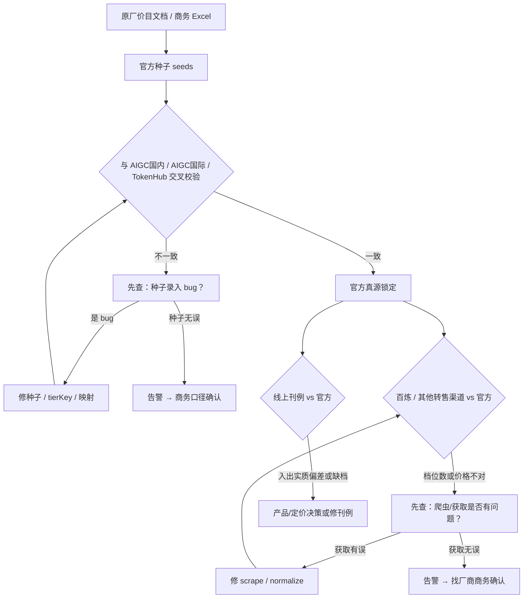
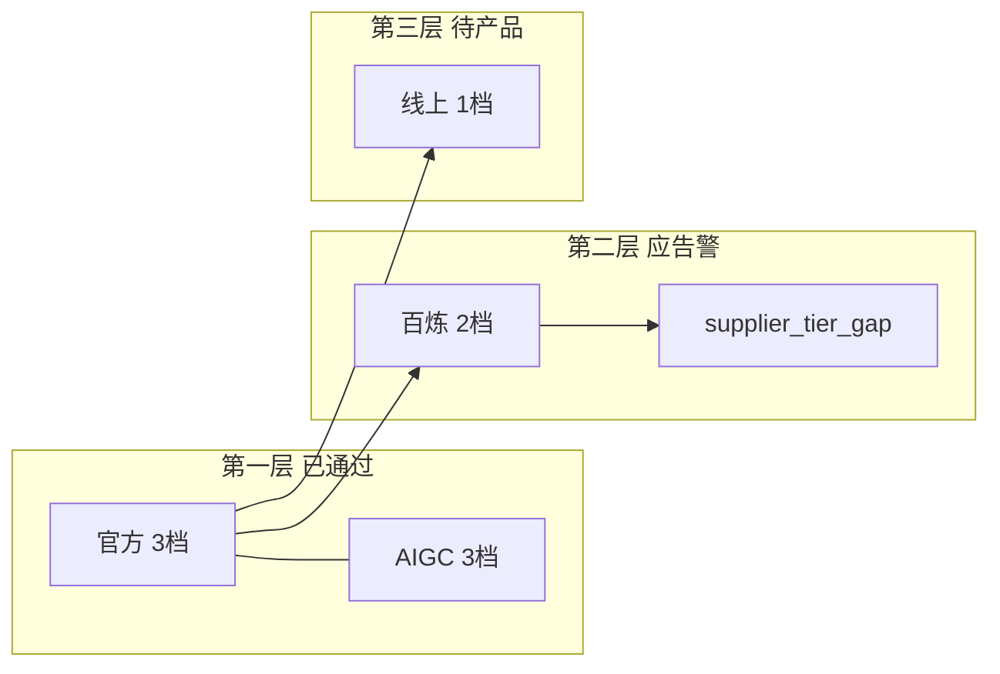

# 价目治理工作流设计

> 状态：设计定稿 · 2026-07-02  
> **产品手册**：[价目全流程](../../apps/trinity-product/docs/ai-api-platform/pricing-sources/workflow.md)  
> 关联：[PRICING-DISCREPANCY-RULES.md](./PRICING-DISCREPANCY-RULES.md) · [OFFICIAL-PRICING-SKILL-DESIGN.md](./OFFICIAL-PRICING-SKILL-DESIGN.md) · [STRUCTURE.md](../STRUCTURE.md)

---

## 1. 目标与原则

Trinity 价目体系需要 **可维护、可交叉验证、可告警** 的分层真源，支撑：

- 刊例（线上 API）是否应对齐厂商官方价；
- 进货渠道（AIGC / TokenHub / 百炼）是否与官方一致；
- 发现差异时 **先查我方录入/抓取**，再 **告警人工找商务**。

### 1.1 核心原则

| # | 原则 | 说明 |
|---|------|------|
| P1 | **官方种子 = 原厂最完整分档** | 来自智谱 / OpenAI / Google 等原厂文档或经商务确认的等价价目；**不得**用百炼等转售渠道的简化分档反推简化官方 |
| P2 | **先锚定、再交叉、再下游** | 第一层证明种子正确；锁定后才用官方比百炼等转售 |
| P3 | **同档对齐** | 比较必须经 `tier-key.mjs` 按 `tierKey` 对齐，禁止仅按「input 价最近」凑档 |
| P4 | **先自查、再告警** | 任何不一致：先查种子 / 映射 / scrape；确认我方无误后再推告警 |
| P5 | **不静默简化** | 供应商档位数少于官方时，必须显式记录（warn/error），不得当作一致 |
| P6 | **刊例对比 ⊇ 线上** | `刊例对比校验` 表内模型 **不得少于** `GET /v1/prices` 同模态返回量；可多加官方补行，**不能少** |

### 1.2 四类价格（层级）

| 层级 | 含义 | 真源位置 |
|------|------|----------|
| **L0 原厂文档** | 厂商官网 / 开放平台价目页 | 外链 + 人工录入依据 |
| **L1 官方种子** | 结构化原厂价（锚） | `suppliers/official/data/seeds/` → `output/{modality}/vendor-pricing.json` |
| **L2 进货参照** | AIGC 国内/国际、TokenHub | `suppliers/aigc/` · `suppliers/tokenhub/` |
| **L3 转售渠道** | 百炼、火山方舟等 | `suppliers/bailian/` · `suppliers/volcengine/` |
| **L4 线上刊例** | Trinity 对用户扣费价 | `GET /v1/prices` → `output/online/prices-api.json` |

**真源锁定顺序**：L0 → L1，经 L2 交叉校验通过后，L1 方可作为对比 L3、L4 的锚。

---

## 2. 总工作流（主流程图）



### 2.1 阶段说明

| 阶段 | 输入 | 输出 | 失败时 |
|------|------|------|--------|
| **A→B** | 原厂 PDF/网页、商务 Excel | `seeds/*.mjs` + `vendor-pricing.json` | 补 catalog / seed / map |
| **B→C** | 官方 + AIGC + TH | 交叉校验报告 | D 或 F |
| **C→G** | 第一层全绿（或已登记例外） | **官方真源锁定** | 不得进入下游对比 |
| **G→H** | 官方 + 百炼等 | 供应商覆盖/价差报告 | I 或 K |
| **G→L** | 官方 + 线上 API | 刊例对比校验表 | 修刊例或登记产品例外 |

---

## 3. 第一层：官方种子 ↔ 进货参照（L1 ↔ L2）

### 3.1 参与方与口径

| 对照 | 币种 | 何时比 | 无数据时 |
|------|------|--------|----------|
| 官方 ↔ **AIGC 国内** | CNY 对 CNY | 国内模型、有国内价 | 跳过国内项 |
| 官方 ↔ **AIGC 国际** | USD（官方 CNY 用 ÷6.5 换 USD） | 有 `international` 块 | 显示 `—`，**不记缺失**（如 hy3-preview） |
| 官方 ↔ **TokenHub** | CNY | 模型在 TH 挂牌 | 记 `no_coverage`，不 fail |

### 3.2 检查项

1. **映射**：`official/trinity-map.json` · `aigc/trinity-map.json` 指向正确 SKU  
2. **档位数**：同族规则 `config/model-family-tiers.mjs`（如 GLM-4.7 ≥3 档）  
3. **tierKey**：`pipeline/lib/tier-key.mjs` 双方档位可归一化到同一 key  
4. **价格**：同 tierKey 下入/出/缓，偏差 ≥0.5% 为实质不一致（见 [PRICING-DISCREPANCY-RULES.md](./PRICING-DISCREPANCY-RULES.md)）

### 3.2 生视频（Trinity 无积分）

进货与刊例均为 **元/秒 · 美元/秒**（AIGC 商务 Excel `AIGC生视频`），不以积分为对外单位。

| 原厂口径 | 示例 | 与 AIGC 对照 |
|----------|------|----------------|
| **积分/秒 = 元/秒** | 可灵 3.0 Turbo：`0.8积分(¥0.8)/秒` | 同分辨率 **直接比** `AIGC国内` |
| **积分/次** | 混元、Vidu | `元/秒(估)=积分/次÷参考秒数`（配置见 `video-reference-conversion.mjs`） |
| **主 gate** | — | **AIGC 国内 vs 国际**（隐含汇率，基准 ÷6.5） |

**刊例对比校验-生视频** 行主键（2026-07-06 起）：

```text
prices-api 全量线上 slug（底线，当前 ~25）
  ∪ 官方 catalog 有、但线上无同 vendor 行的补行（如 hy-video-1.5、豆包 seedance）
```

- **不得**假设 `official/catalog` ⊇ 线上模型（与生图不同；生视频平台 SKU 扩张更快）
- **P6 铁律**：对比表 **⊇** 线上 `prices-api` 全量 slug，只能多官方补行，不能少线上模型
- 映射真源：`config/video-model-registry.mjs`（线上 slug · Trinity · 官方 vendor · AIGC · 火山）
- **治理档位**：`完整`（官方+线上）· `仅刊例`（线上+AIGC，无官方 seed）· `仅官方`（未挂线上刊例）

产出：`npm run pricing:upstream:video` → `trinity-pricing-video.xlsx` · Sheet `刊例对比校验-生视频`

### 3.3 不一致分流（D / F）

```
进货参照有、官方无  →  优先怀疑：seed 漏档 / map 错 / tierKey 未识别
                      →  修 E 后重跑 C
进货参照有、官方有但价不同  →  修 seed 或 AIGC sheet
                      →  两边文档一致仍不同 → F 告警
官方有、进货参照无（且无国内/国际价）  →  info；仅国内模型可只锁国内
```

### 3.4 真源锁定（G）条件

满足以下全部（或例外已写入 `config/pricing-annotations.mjs`）：

- [ ] `pricing:validate:official-aigc` 通过（含国内仅模型、国际 `—` 规则）  
- [ ] `pricing:validate:aigc-excel` 通过（商务 Excel ↔ `pricing-sheet.mjs`）  
- [ ] `pricing:validate:compare` 无未登记假阳性  
- [ ] 同族档位规则无 violation  

锁定后：**本批 `vendor-pricing.json` 的 `fetchedAt` 即真源版本**，下游对比均引用该版本。

---

## 4. 第二层：官方真源 ↔ 转售渠道（L1 ↔ L3）

**前置条件**：第一层已锁定（G）。

### 4.1 渠道定位

| 渠道 | 角色 | 与官方关系 |
|------|------|------------|
| **百炼** | 阿里云转售 | 档位数可 **≤** 官方；价格应为官方子集或等价，不能静默缺档 |
| **火山方舟** | 转售/托管（豆包 + GLM/DeepSeek 等） | 爬 [模型价格页](https://www.volcengine.com/docs/82379/1544106?lang=zh) → `volcengine/output/`；与 official 比 L3↔L1 |
| **OpenRouter** | 国际聚合参考 | 刊例对比辅助列，非国内进货真源 |

### 4.2 检查项（待实现 `validate-official-vs-suppliers`）

| 检查 | 规则 | 严重度 |
|------|------|--------|
| **档位数** | `supplier_tiers < official_tiers` | error（可配置 warn） |
| **档位覆盖** | 官方某 `tierKey` 在供应商无对应 | error |
| **价格** | 同 key 入/出/缓偏差 ≥0.5% | warn/error |
| **供应商无此模型** | — | info |

### 4.3 不一致分流（I / K）

```
百炼 2 档、官方 3 档
  →  I：打开百炼文档 / pricing-api.json 核对是否 scrape 漏行
  →  文档确为 2 档：K 告警（渠道粒度不足，非官方减档）
  →  scrape 漏档：J 修 normalize 后重跑
```

### 4.4 禁止行为

- ❌ 因百炼只有 2 档，将官方 seed 改为 2 档  
- ❌ 不报档位数差异，仅对比「能对上的那一档」并标一致  
- ❌ 用转售价覆盖 official seeds  

---

## 5. 第三层：官方真源 ↔ 线上刊例（L1 ↔ L4）

**前置条件**：第一层已锁定；线上价 **每次对比前** `GET /v1/prices` 拉最新（`refreshOnlinePricesForCompare`）。

### 5.1 产出

- Excel / MD：`刊例对比校验-生文`（官方 · AIGC国际 · TokenHub · OR · 线上刊例 · vs 列）  
- 仅保留进货参照列：官方、AIGC 国际、TokenHub、OpenRouter（不含百炼/火山方舟列）

### 5.1.1 刊例对比覆盖铁律（P6）

**对比表模型集合 ⊇ 线上 `prices-api` 同模态全量 slug**：

| 允许 | 禁止 |
|------|------|
| 对比表 = 线上全量 + 官方 catalog 补行（仅官方、未挂线上） | 线上有刊例、对比表无对应行 |
| 对比表行数 > 线上模型数（多分辨率档、多官方补行） | 用「Phase / 已映射子集」截断线上 SKU |

**按模态行主键**（实现可不同，铁律相同）：

| 模态 | 行主键策略 | 代码校验 |
|------|------------|----------|
| **生视频** | `prices-api` 全量 ∪ 官方补行 | `compare-online-coverage-lib` · `upstream:video` 失败即阻断 |
| **生图** | 官方 catalog 驱动（现状；官方 ≥ 线上） | 待补：线上新增时做 gap 检查 |
| **生文** | 官方 catalog 驱动（线上 ⊆ 已映射 Trinity） | 待补：同上 |

新增模态或改版 compare-hub 时：**先满足 P6，再谈治理档位与 gate**。

### 5.2 与第二层区别

| 维度 | 第二层（百炼） | 第三层（线上） |
|------|----------------|----------------|
| 目的 | 进货渠道是否覆盖官方 | 对用户刊例是否对齐官方 |
| 档位数少 | 告警找商务 | 产品决策：补刊例多档或登记例外 |
| 典型例 | GLM-4.7 百炼 2 档 | Gemini 音频档线上未单独定价 |

---

## 6. 案例：GLM-4.7（`glm-4-7-251222`）

### 6.1 各层档位数（定稿）

| 数据源 | 档数 | 分档维度 |
|--------|------|----------|
| **官方种子（智谱）** | **3** | ≤32k×输出≤0.2k / ≤32k×输出>0.2k / >32k |
| **AIGC 商务** | **3** | 同官方 |
| **百炼爬虫** | **2** | 仅输入长度 ≤32k / 32k–166k |
| **TokenHub** | 0 | 无此模型 |
| **线上刊例** | 1 | legacy 单档 |

### 6.2 工作流落点



- **第一层**：官方 3 档与 AIGC 一致 → **可锁定真源**  
- **第二层**：百炼 2 档 → 查 scrape 无误后 → **K：找阿里云/商务确认是否缺「输出≤0.2k」档**  
- **第三层**：线上 1 档 vs 官方 3 档 → 单独刊例策略，不反向改官方  

---

## 7. 告警设计（机器人统一出口）

### 7.1 告警类型

| type | 阶段 | 含义 | 建议动作 |
|------|------|------|----------|
| `seed_suspect` | L1↔L2 | 进货有、官方无 | 查 seed / map / tierKey |
| `peer_price_mismatch` | L1↔L2 | 同档价格偏 | 查录入；无误 → 商务 |
| `peer_tier_mismatch` | L1↔L2 | 档位数或 key 对不上 | 查 tierKey / 种子 |
| `supplier_tier_gap` | L1↔L3 | 官方 N 档，供应商 < N | 查 scrape → 商务 |
| `supplier_price_gap` | L1↔L3 | 同档价格偏 | 查 scrape → 商务 |
| `listing_tier_gap` | L1↔L4 | 线上档 < 官方 | 产品/刊例 |
| `listing_price_gap` | L1↔L4 | 刊例 vs 官方入出偏 | 修刊例或登记 |

### 7.2 告警载荷（JSON 草案）

```json
{
  "schema": "trinity.pricing.alert/v1",
  "generatedAt": "2026-07-02T12:00:00Z",
  "severity": "error",
  "type": "supplier_tier_gap",
  "trinityId": "glm-4-7-251222",
  "vendorModelId": "glm-4.7",
  "phase": "L1_vs_L3",
  "title": "百炼档位数少于官方",
  "detail": "官方 3 档（智谱输出分档）；百炼 2 档（仅输入长度）。缺 t:in32k-out-le0.2k。",
  "officialTierCount": 3,
  "supplier": "bailian",
  "supplierTierCount": 2,
  "missingTierKeys": ["t:in32k-out-le0.2k"],
  "suggestedAction": "确认百炼 scrape 完整后，联系商务确认渠道价目",
  "refs": {
    "official": "suppliers/official/output/text/vendor-pricing.json",
    "supplier": "suppliers/bailian/output/pricing-api.json"
  }
}
```

### 7.3 推送方式

- 环境变量：`PRICING_ALERT_WEBHOOK_URL`（**钉钉** / 企业微信 / 飞书）  
- 钉钉：使用机器人 Webhook 完整 URL（`https://oapi.dingtalk.com/robot/send?access_token=...`）  
- 钉钉自定义关键词：`PRICING_ALERT_DINGTALK_KEYWORD`（须与群机器人安全设置一致，消息会自动带上）  
- 脚本：`pricing/pipeline/emit-pricing-alerts.mjs`（读取 `output/validate/*.json` 合并推送）  
- 本地门禁：`npm run pricing:gate`（可选自检，无 GitHub CI）  
- **Gate 失败不替代告警**：gate 用于本地阻断；告警用于需人工找商务的项  

---

## 8. 命令与文件映射

### 8.1 维护真源（A→B）

```bash
# 改 seeds / catalog / map 后
npm run pricing:supplier:official:text
npm run pricing:supplier:aigc
npm run pricing:supplier:tokenhub:console   # 可选
npm run pricing:supplier:bailian:doc        # 可选
```

| 文件 | 作用 |
|------|------|
| `suppliers/official/data/seeds/text.mjs` | 官方价录入 |
| `suppliers/official/trinity-map.json` | Trinity ID → vendorModelId |
| `suppliers/aigc/data/pricing-sheet.mjs` | AIGC 价目真源 |
| `suppliers/aigc/trinity-map.json` | Trinity → AIGC SKU |
| `pipeline/lib/tier-key.mjs` | 档位归一化 |

### 8.2 第一层交叉（C）

```bash
npm run pricing:gate                    # official + aigc-excel + official-aigc
npm run pricing:validate:official-aigc
npm run pricing:validate:aigc-excel
npm run pricing:validate:compare
```

| 产出 | 路径 |
|------|------|
| 官方↔AIGC 报告 | `output/validate/official-aigc-cross.{json,md}` |
| Excel↔sheet | `output/validate/aigc-excel-vs-sheet.{json,md}` |

### 8.3 汇总对比（G 之后）

```bash
npm run pricing:fetch                   # 可选；upstream 内会自动拉线上
npm run pricing:upstream                # 刊例对比表 + 供应商分表
npm run pricing:compare:official
```

| 产出 | 路径 |
|------|------|
| 刊例对比校验 | `output/official/text.*` · Excel `刊例对比校验-生文` |
| 供应商分表 | `output/upstream/{tokenhub,bailian,aigc-*,volcengine}/` |

### 8.4 第二层校验与告警

```bash
npm run pricing:validate:official-suppliers   # 官方 vs 百炼/TH/AIGC国内
npm run pricing:alert                         # 合并告警 → webhook
npm run pricing:alert -- --dry-run            # 仅写 output/validate/pricing-alerts.*
```

---

## 9. Gate 与发布清单

### 9.1 当前 `pricing:gate`

```
1. pricing:supplier:official:text
2. validate-aigc-excel.mjs
3. validate-official-aigc.mjs
```

### 9.2 当前 `pricing:gate`

```
1. pricing:supplier:official:text
2. validate-aigc-excel.mjs
3. validate-official-aigc.mjs
4. validate-official-vs-suppliers.mjs
5. emit-pricing-alerts.mjs --dry-run（写告警汇总，不推 webhook）
```

推送机器人：`npm run pricing:alert`（需 `PRICING_ALERT_WEBHOOK_URL`）

### 9.3 发刊例前人工 Checklist

- [ ] 第一层 gate 绿  
- [ ] `output/online/prices-api.json` 为当日 API  
- [ ] 刊例对比无未登记 `listing_price_gap`  
- [ ] 百炼等 `supplier_tier_gap` 已告警跟进或登记 annotation  

---

## 10. 与现有文档关系

| 文档 | 关系 |
|------|------|
| [PRICING-DISCREPANCY-RULES.md](./PRICING-DISCREPANCY-RULES.md) | 偏差判定细则（0.5%、tierKey、FX） |
| [OFFICIAL-PRICING-SKILL-DESIGN.md](./OFFICIAL-PRICING-SKILL-DESIGN.md) | Skill / 加模型脚手架 |
| 本文 | **总工作流、分层真源、告警、Gate 路线图** |

---

## 11. 实现状态（2026-07-02）

| 能力 | 状态 |
|------|------|
| 官方种子 + 同族档位规则 | ✅ |
| 官方 ↔ AIGC 国际/国内交叉 | ✅（国内仅、国际 —） |
| 商务 Excel ↔ pricing-sheet | ✅ |
| 刊例对比（拉 API + 官方锚） | ✅ |
| tier-key（GLM / 混元等） | ✅ 持续扩展 |
| 官方 ↔ 百炼档位覆盖校验 | ✅ `validate-official-vs-suppliers` |
| 告警 webhook | ✅ `emit-pricing-alerts`（`PRICING_ALERT_WEBHOOK_URL`） |
| Gate 含 L3 + 告警汇总 | ✅ |

---

## 12. 修订记录

| 日期 | 说明 |
|------|------|
| 2026-07-06 | 生视频对照：可灵积分/秒直接对 AIGC；混元/Vidu 积分/次折算；`trinity-pricing-video` |
| 2026-07-02 | 初版：分层真源、主流程图、GLM-4.7 案例、告警草案、Gate 路线图 |
| 2026-07-02 | 实现 `validate-official-vs-suppliers`、`emit-pricing-alerts`、Gate 扩展 |
